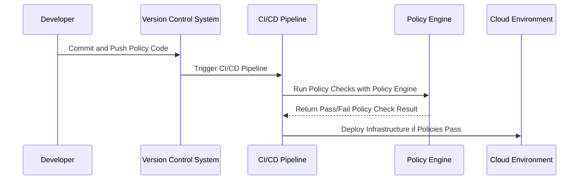

## Policy as Code

Policy as Code is a paradigm that applies software engineering practices such as version control, continuous integration, continuous deployment (CI/CD), and automated testing to the management of security and compliance policies. By treating policies as code, organizations can automate the enforcement of these policies, ensuring compliance across their cloud environments while reducing the reliance on manual processes.

### Detailed Explanation

Traditionally, security and compliance policies were documented and enforced manually, which often led to inconsistencies and human errors. With Policy as Code, these policies are defined in a machine-readable format, which can be automatically tested and deployed in CI/CD pipelines. This approach allows for consistent policy application across distributed cloud environments and quick iteration and refinement as regulations evolve or as security threats change.

Key benefits of Policy as Code include:
- **Automation**: Streamlining the enforcement and monitoring of policies, reducing manual errors.
- **Consistency**: Ensuring uniform policy application across various cloud services and environments.
- **Scalability**: Extending policy enforcement to accommodate large-scale cloud environments.
- **Version Control**: Leveraging tools like Git to track policy changes, audits, and history.
- **Testability**: Automatically test policies for their desired and non-desired outcomes before they are applied in production.

### Architectural Approaches

1. **Infrastructure as Code Alignment**: Integrate Policy as Code with Infrastructure as Code (IaC) solutions to enforce policies as infrastructure is provisioned.
2. **Policy Engines**: Utilize policy engines such as Open Policy Agent (OPA) or AWS CloudFormation Guard to evaluate policies. These engines can integrate with CI/CD pipelines for automated checks.
3. **Continuous Compliance Checks**: Implement continual scanning of cloud resources against policies to detect drift or non-compliance.
4. **Feedback Loops**: Establish mechanisms for feedback and alerts when policy violations occur to enable prompt corrective actions.

### Best Practices

- Define policies clearly in a machine-readable format that can be shared and reused across the organization.
- Store policies in a version control system alongside application and infrastructure code.
- Incorporate policy checks early in the development process, ideally in development and staging environments before production deployment.
- Regularly audit and refine policies to adapt to changing security requirements and compliance regulations.
- Use policy templates and modularize policies for easier maintenance and customization.

### Example Code

Below is an example of a basic Open Policy Agent (OPA) policy written in Rego language, which enforces tagging of all AWS resources:

```rego
package example

deny[message] {
    input.resource.type == "aws_instance"
    not input.resource.tags["Environment"]
    message = sprintf("AWS instance %v is missing 'Environment' tag", [input.resource.id])
}
```

### Diagrams

#### Policy as Code Implementation Sequence



### Related Patterns

- **Infrastructure as Code**: Codifies infrastructure setup and configuration, which can be aligned with Policy as Code.
- **Immutable Infrastructure**: Ensures that infrastructure is not modified after deployment, supporting compliance.
- **GitOps**: Utilizes Git-based version control as the source of truth for operating environments.

### Additional Resources

- [Open Policy Agent Documentation](https://www.openpolicyagent.org/docs/latest/)
- [AWS Policies & Governance Documentation](https://aws.amazon.com/products/management-and-governance/)
- [Microsoft Azure Policy Overview](https://docs.microsoft.com/en-us/azure/governance/policy/overview)

### Summary

Policy as Code is instrumental in the modern cloud landscape, enabling automated, consistent, and efficient enforcement of security and compliance policies. By treating policies as living code, organizations can robustly manage compliance, quickly adapt to new requirements, and improve their overall security posture.
