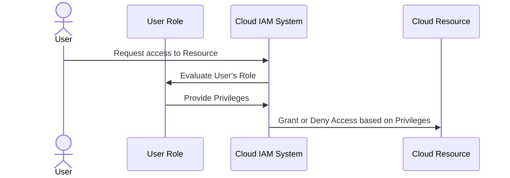

## Introduction

The **Least Privilege Principle** is a security strategy designed to restrict user and process access rights to the bare minimum necessary to perform their legitimate activities. This principle is foundational in creating secure cloud environments, reducing potential attack vectors, and mitigates risk in data breaches and unauthorized access scenarios.

## Detailed Explanation

In cloud computing, the vast number of users and services accessing systems demands sophisticated access management. The Least Privilege Principle ensures that each entity has the minimal level of privilege required to accomplish their tasks and nothing more. This not only strengthens the security posture but aligns with regulatory compliance requirements by limiting permissions.

### Core Concepts:
1. **Role-Based Access Control (RBAC):** Assigning permissions based on the roles within an organization to streamline management.
2. **Policy-Based Access Control (PBAC):** Policies defining access levels adjust over time according to contextual needs.
3. **Fine-Grained Permissions:** Offering more detailed permission levels for various system resources.

## Architectural Approaches

- **Identity and Access Management (IAM):** Implement IAM solutions to effectively enforce the Least Privilege Principle by managing user permissions and ensuring continuous monitoring to adjust privileges as necessary.
  
- **Just-In-Time (JIT) Access:** Temporarily granting elevated access to users for a limited time and revoking the permissions automatically afterward to reduce risk exposure.

- **Audit and Monitoring:** Continuous auditing and monitoring of access patterns help identify and rectify anomalies or excessive permissions.

## Best Practices

1. **Regular Audits:** Conduct periodic access reviews to adjust privileges based on current requirements.
   
2. **Segmentation of Duties:** Divide roles and permissions to ensure no single user has control over all critical systems or processes.

3. **Automation:** Use automated tools where possible to manage permissions and detect unauthorized access attempts.

## Example Code

This represents a simplified example using AWS IAM:

```json
{
  "Version": "2012-10-17",
  "Statement": [
    {
      "Effect": "Allow",
      "Action": [
        "s3:GetObject",
        "s3:ListBucket"
      ],
      "Resource": [
        "arn:aws:s3:::example-bucket",
        "arn:aws:s3:::example-bucket/*"
      ]
    }
  ]
}
```

In this policy, the Least Privilege Principle is applied to allow only the necessary S3 actions on specific resources.

## Diagrams



## Related Patterns

- **Separation of Concerns:** Ensures that responsibilities are separated to minimize errors and enhance security.
- **Defense in Depth:** Employ layered security measures for comprehensive protection.
- **Access Logging:** Keep detailed logs of access to resources for auditing and monitoring purposes.

## Additional Resources

- [AWS IAM Best Practices](https://docs.aws.amazon.com/IAM/latest/UserGuide/best-practices.html)
- [Microsoft Azure Security Best Practices](https://docs.microsoft.com/en-us/azure/security/fundamentals/best-practices-and-patterns)
- [Google Cloud IAM Roles and Permissions](https://cloud.google.com/iam/docs/understanding-roles)

## Summary

The Least Privilege Principle is a cornerstone of modern cloud security strategies, ensuring that entities have no more permissions than necessary. This minimizes risk exposures, supports compliance efforts, and enhances cloud environment security. Implementing robust identity management systems and consistently auditing access controls are crucial components of enforcing this principle effectively.
