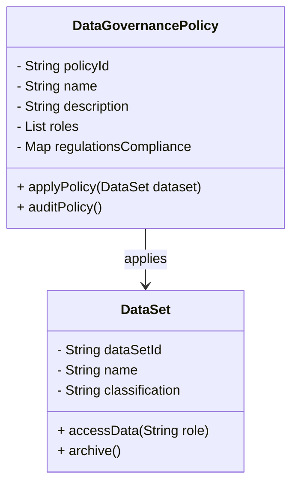
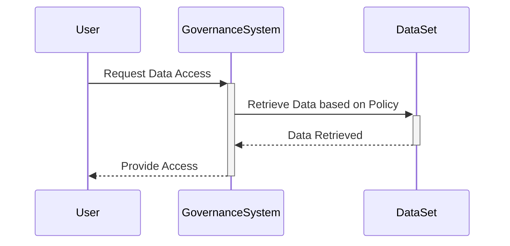

---

linkTitle: "Data Governance Policies"
title: "Data Governance Policies: Defining Policies for Data Handling, Classification, and Lifecycle Management"
category: "Compliance, Security, and Governance in Cloud"
series: "Cloud Computing: Essential Patterns & Practices"
description: "Explore the design pattern that focuses on establishing robust data governance policies to ensure data handling, classification, and lifecycle management in cloud environments are compliant, secure, and effective."
categories:
- Compliance
- Security
- Governance
tags:
- Data Governance
- Cloud Security
- Data Management
- Data Compliance
- Cloud Computing
date: 2024-07-07
type: docs

canonical: "https://softwarepatternslexicon.com/18/17/11"
license: "© 2024 Tokenizer Inc. CC BY-NC-SA 4.0"
---

## Introduction

Data Governance Policies are crucial in providing a structured framework for data handling, classification, and lifecycle management in cloud environments. These policies help ensure data integrity, confidentiality, availability, and compliance with legal and regulatory requirements. 

By implementing robust data governance policies, organizations can mitigate risks associated with data breaches, unauthorized access, and data quality issues, ensuring the secure and efficient management of data assets.

## Design Pattern

### Key Components

1. **Data Classification**: Establish clear guidelines for categorizing data based on sensitivity, criticality, and confidentiality. This helps in applying appropriate security measures and determining access rights.

2. **Data Handling**: Define processes and procedures for the secure collection, storage, processing, and sharing of data. This involves encryption, access control, and audit trails.

3. **Data Lifecycle Management**: Implement policies for data retention, archiving, and disposal, ensuring that data is maintained and discarded according to regulatory and business requirements.

4. **Compliance & Legal Requirements**: Ensure policies are in line with legal standards like GDPR, HIPAA, etc., and regularly updated to adapt to new regulations.

5. **Roles & Responsibilities**: Clearly delineate roles and responsibilities for data stewards, data custodians, and other stakeholders to ensure accountability and governance effectiveness.

### Architectural Approaches

- **Centralized Data Governance Framework**: Establish a centralized framework that provides consistent policy application across all cloud services and data repositories.
  
- **Decentralized Governance with Federated Models**: In large organizations, a decentralized approach with federated governance models might be more effective, allowing flexibility for Different departments or regions while maintaining core governance principles.

- **Automated Governance Tools**: Utilizing tools and technologies that automate policy enforcement, monitoring, and compliance checks to enhance efficiency and effectiveness.

### Best Practices

- **Regular Policy Audits and Updates**: Conduct regular audits of governance policies to ensure they remain relevant and effective, adapting to new threats and regulatory changes.

- **Stakeholder Engagement**: Engage all stakeholders from various departments to ensure comprehensive governance policies that address all business needs and risks.

- **Training and Awareness Programs**: Provide ongoing training and awareness to ensure all employees understand data governance policies and their responsibilities.

- **Integration with Existing Systems**: Ensure data governance policies are integrated with existing data management and security systems for seamless operations.

## Example Code

While data governance largely involves high-level policy definitions and architectural decisions, integrating governance tools might involve code for automation scripts, API integrations, or data pipelines. Here's a basic example using a script to enforce data retention policies:

```typescript
import { DataRetentionService } from 'cloud-service-sdk';

const retentionPolicy = {
    archiveAfterDays: 365,
    deleteAfterDays: 730
};

function enforceRetentionPolicy(datasetId: string) {
    DataRetentionService.applyPolicy(datasetId, retentionPolicy)
        .then(() => console.log(`Policy applied to dataset ${datasetId}`))
        .catch(error => console.error(`Failed to apply policy: ${error}`));
}

// Sample usage
enforceRetentionPolicy('1234-abc-data-set');
```

## Diagrams

### UML Class Diagram



### Sequence Diagram



## Related Patterns

- **Identity and Access Management (IAM)**: Ensures that only authorized users have access to data.
- **Data Encryption**: Techniques for encrypting data both at rest and in transit.
- **Audit Logging**: Captures and stores logs for policy audits and tracking data access.

## Additional Resources

- [The Data Governance Institute](https://datagovernance.com/)
- [NIST Data Management Principles](https://www.nist.gov)

## Summary

Data Governance Policies are essential for maintaining the integrity, security, and compliance of data within cloud environments. By clearly defining policies for data classification, handling, and lifecycle management, organizations can protect their data assets and ensure compliance with legal and regulatory standards. Implementing these policies requires a careful mix of human governance and automated tools, supported by clear roles and responsibilities, regular audits, and stakeholder engagement.

---
