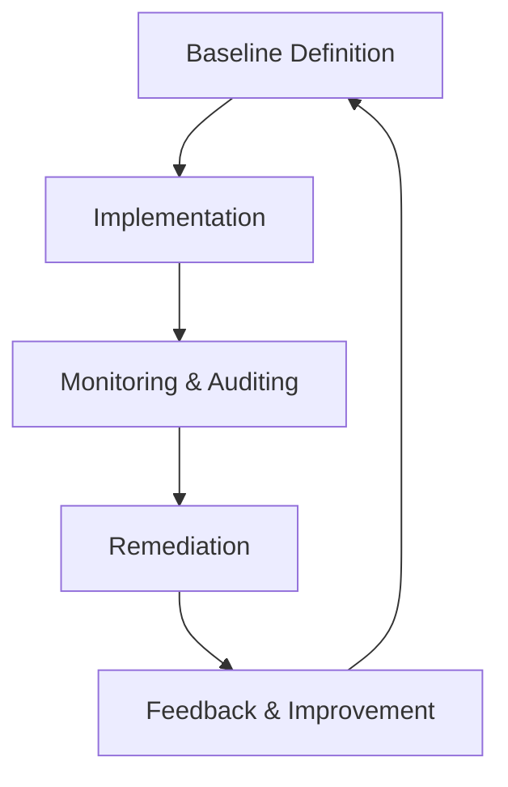

## Introduction

The Secure Configuration Baselines pattern is a crucial element of cloud security that focuses on defining, deploying, and maintaining secure configurations for cloud infrastructure and services. It helps in mitigating the risks of vulnerabilities through misconfiguration and ensures cloud resources are protected against potential threats and attacks.

## Objectives

- **Risk Mitigation**: Reduce the attack surface by configuring cloud resources to be secure by default.
- **Compliance**: Ensure cloud setups comply with organizational policies and industry regulations.
- **Consistency**: Provide a consistent security stance across various environments and deployments.
- **Automation**: Enable automated checks and remediation of configuration drift.

## Architectural Overview

1. **Baseline Definition**: Establish a set of configuration standards or baselines in line with security best practices, compliance requirements, and organizational needs. These baselines act as benchmarks for secure configurations.

2. **Implementation**: Apply these baselines across all cloud resources, ensuring each service or infrastructure component aligns with defined secure configurations.

3. **Monitoring and Auditing**: Continuously monitor configurations for drift from the baseline and audit changes against the intended secure configurations. This can be automated through cloud-native tools (e.g., AWS Config, Azure Policy) or third-party solutions.

4. **Remediation**: Address deviations from the defined baselines through automated or manual remediation processes.

5. **Feedback and Improvement**: Regularly review and update baselines to adapt to evolving security threats and technological advancements.

## Detailed Explanation

### Baseline Definition

- **Security Controls**: Define security controls that need to be enforced in the cloud environment, such as network configuration, identity and access management controls, encryption standards, and logging.
- **Tools and Frameworks**: Utilize security benchmarks and frameworks such as CIS Benchmarks, NIST, or ISO standards to guide baseline creation.

### Implementation approach

- **Configuration Management Tools**: Use infrastructure as code (IaC) tools like Terraform, CloudFormation, or Ansible to codify and deploy secure configurations.
- **Continuous Integration/Continuous Deployment (CI/CD)**: Integrate security configuration checks within CI/CD pipelines to ensure only compliant configurations are deployed.

### Monitoring and Auditing

- **Automated Tools**: Leverage cloud-native tools that offer continuous compliance checks against the defined baselines. Examples include AWS Config, Google Cloud Security Command Center, and Azure Security Center.
- **Regular Audits**: Conduct periodic audits manually or via security-focused tools to identify and rectify configuration drift.

### Remediation

- **Automated Remediation**: Implement tools and scripts that automatically rectify common issues or deviations from established baselines.
- **Manual Intervention**: Ensure critical deviations are reviewed and addressed by IT security teams.

### Feedback and Improvement

- **Incident Response Learning**: Incorporate learnings from incidents to refine and update security baselines.
- **Stakeholder Input**: Regularly gather input from stakeholders to incorporate new requirements or address newly identified risks.

## Example Code

Below is an example of using Terraform to define a security group baseline in AWS:

```hcl
resource "aws_security_group" "baseline_security_group" {
  name        = "secure_sg"
  description = "Baseline security group"

  ingress {
    from_port   = 22
    to_port     = 22
    protocol    = "tcp"
    cidr_blocks = ["10.0.0.0/8"]
  }

  egress {
    from_port   = 0
    to_port     = 0
    protocol    = "-1"
    cidr_blocks = ["0.0.0.0/0"]
  }
}
```

## Diagram



## Related Patterns

- **Infrastructure as Code (IaC)**: Automate deployment of infrastructure using code, ensuring consistency and repeatability.
- **Automated Security Testing**: Integrate security testing into the CI/CD pipeline for continuous security assurance.
- **Continuous Compliance**: Maintain continuous alignment with established security baselines and compliance standards.

## Additional Resources

- [CIS Benchmarks](https://www.cisecurity.org/cis-benchmarks/)
- [NIST Cybersecurity Framework](https://www.nist.gov/cyberframework)
- [AWS Config Documentation](https://docs.aws.amazon.com/config/)
- [Azure Policy Documentation](https://docs.microsoft.com/en-us/azure/governance/policy/)

## Summary

Secure Configuration Baselines play a pivotal role in cloud security by ensuring that all cloud resources adhere to predefined security and compliance standards. By systematically defining, implementing, and auditing these baselines, organizations can significantly reduce security risks and maintain robust cloud security postures. The continuous feedback loop ensures that baselines evolve in response to emerging threats, maintaining their efficacy over time.
