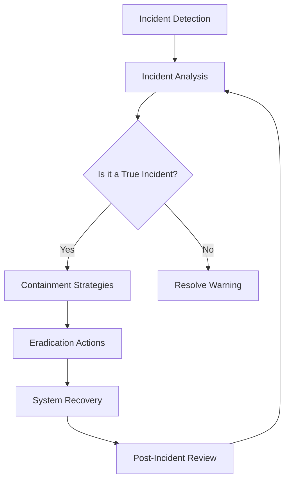

## Introduction

Incident Response Planning is a critical design pattern in cloud computing, focusing on establishing standardized procedures for dealing with security incidents. It helps organizations swiftly minimize damage, recover from attacks, and safeguard sensitive data, ensuring business continuity and compliance with regulations. As cloud environments become increasingly complex, the need for a robust incident response strategy is essential.

## Detailed Explanation

### Key Components of Incident Response Planning

1. **Preparation**: This involves creating an incident response policy, establishing an incident response team, and setting up necessary tools and resources. Preparation ensures that your organization is ready to respond to an incident as soon as it occurs.

2. **Detection and Analysis**: Implement techniques to identify potential security incidents. Use logging, monitoring, and alerting tools to gather data. Analyze the data to confirm and understand the scope of the incident.

3. **Containment, Eradication, and Recovery**: 
   - **Containment** involves isolating affected systems to prevent further damage.
   - **Eradication** refers to removing the threat from your environment.
   - **Recovery** includes restoring and validating system functionality and ensuring normal operations are restored.

4. **Post-Incident Activity**: After handling an incident, it's crucial to conduct a post-mortem analysis to learn from the event. This step includes adjusting strategies to prevent future occurrences and improving the response plan.

### Architectural Approaches

- **Automated Response Systems**: Integration of automated tools to quickly respond to incidents can be crucial in large cloud environments. Examples include AWS Lambda and Azure Functions for automated containment actions.

- **Distributed Team Coordination**: Cloud environments often require coordination across geographically distributed teams. Tools like Slack or MS Teams, integrated with incident management systems such as PagerDuty or JIRA, facilitate this effortlessly.

- **Data-Driven Insights**: Utilize big data analytics to enhance detection and analysis. Cloud-native tools like AWS Athena or Google BigQuery assist in analyzing vast logs and security events efficiently.

## Best Practices

1. **Regular Updates and Testing**: Regularly review and update the incident response plan to cover new threats and changes in the IT environment. Conduct simulated exercises or tabletop tests to ensure readiness.

2. **Role-Based Procedures**: Define clear roles and responsibilities within the incident response team to streamline response efforts.

3. **Communication Protocols**: Establish clear communication lines both internally and with external stakeholders, including legal entities and customers, when necessary.

4. **Comprehensive Documentation**: Maintain detailed documentation of policies, procedures, and incident logs to support analysis and compliance with legal and regulatory requirements.

## Example Code

Here is a simple example showcasing an automated response to a potential threat using AWS Lambda:

```javascript
const AWS = require('aws-sdk');
const sns = new AWS.SNS();
exports.handler = async(event) => {
  const threatAlert = {
    Message: 'Potential threat detected, initiating automated response',
    TopicArn: 'arn:aws:sns:us-west-2:123456789012:ThreatAlerts'
  };
  try {
    await sns.publish(threatAlert).promise();
    return { statusCode: 200, body: 'Alert Successful' };
  } catch (error) {
    return { statusCode: 500, body: 'Alert Failed' };
  }
};
```

## Diagrams

### Incident Response Workflow



## Related Patterns

- **Security Monitoring and Management**: Continuous monitoring for detecting anomalies and potential threats.
- **Disaster Recovery Planning**: Ensures business continuity in case of major disruptions.
- **Access Management**: Controls and manages user access to sensitive systems and data.

## Additional Resources

- [NIST Computer Security Incident Handling Guide](https://nvlpubs.nist.gov/nistpubs/SpecialPublications/NIST.SP.800-61r2.pdf)
- [AWS Incident Response](https://aws.amazon.com/security/incident-response/)
- [Azure Security Incident Management](https://docs.microsoft.com/en-us/azure/security-center/security-center-incident-response)

## Summary

Incident Response Planning is a cornerstone of cloud security strategy. By establishing an organized approach to handle security incidents, organizations can mitigate risks, reduce impact, and ensure swift recovery. A well-designed incident response plan, regularly tested and updated, not only protects assets but also bolsters the confidence of stakeholders in an organization's ability to handle threats efficiently.
