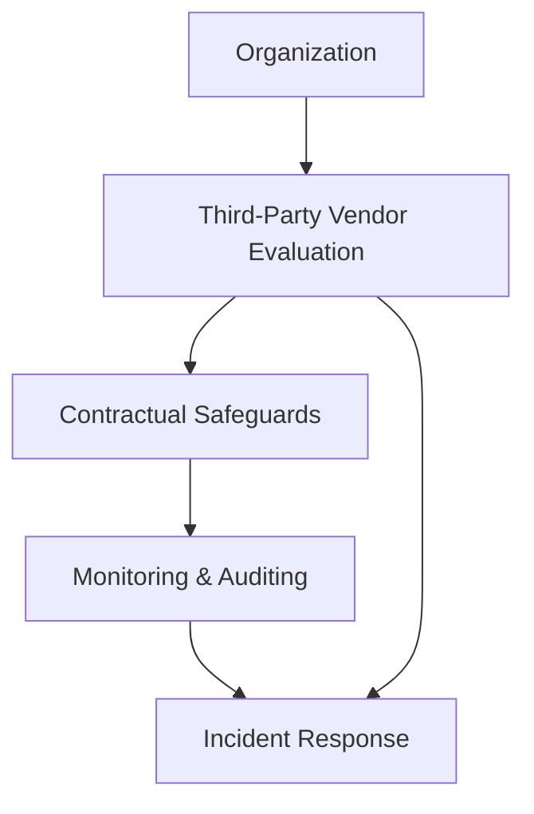
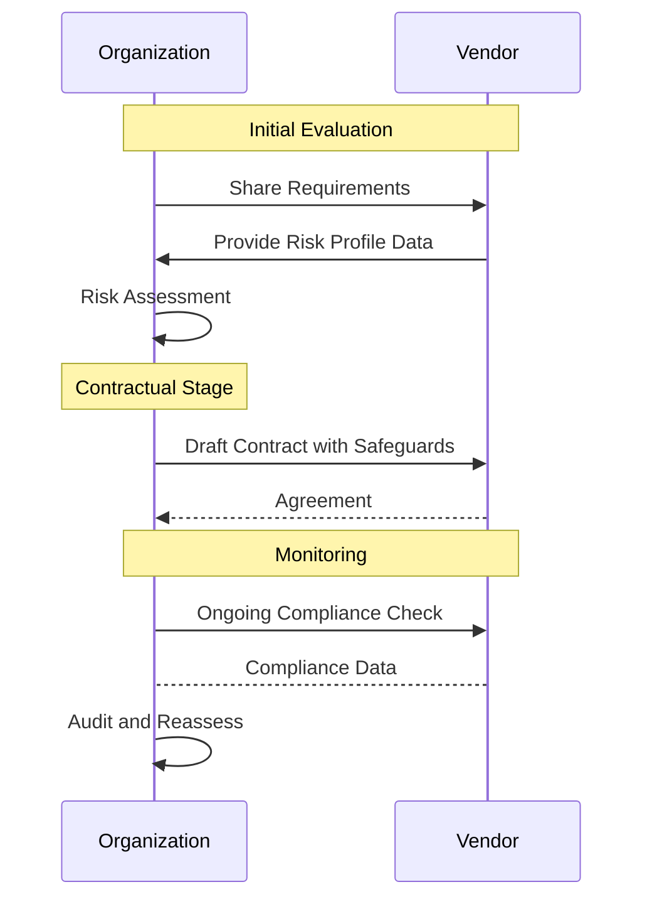

## Introduction

In the complex ecosystem of cloud computing, organizations increasingly rely on third-party vendors to provide a variety of services. While this brings significant advantages, it also introduces potential risks. **Third-Party Risk Management (TPRM)** is a critical discipline focused on identifying, assessing, and mitigating risks that may arise from third-party service providers to ensure that the organization's data and operations remain secure and compliant with applicable regulations.

## Purpose

The primary goal of TPRM is to safeguard an enterprise's interests by effectively assessing risks posed by its partnerships with vendors and suppliers. This involves establishing a risk management framework, integrating security practices, and ensuring compliance with legal and regulatory requirements.

## Best Practices

1. **Thorough Vendor Vetting and Selection**: Evaluate potential third-party vendors based on their risk profile, financial stability, security practices, and compliance history.
   
2. **Contractual Safeguards**: Use contracts to outline security requirements, compliance obligations, and data protection measures, clearly defining roles and responsibilities.

3. **Continuous Monitoring**: Implement systems to regularly monitor third-party activities and evaluate their ongoing adherence to security and compliance standards.

4. **Incident Response and Communication**: Develop a joint incident response plan that includes the third-party, facilitating effective communication and swift resolution in case of security incidents.

5. **Regular Audits and Assessments**: Conduct routine audits and risk assessments to ensure vendor compliance with security policies and standards.

## Example Code

While code per se is not typically used in TPRM, here is an example of how you might automate parts of vendor assessment using a script for querying a vendor risk database:

```javascript
async function assessVendor(vendorId) {
    const riskData = await fetchRiskDataFromVendor(vendorId);
    const complianceCheck = evaluateCompliance(riskData);

    if (complianceCheck.score < threshold) {
        throw new Error('Vendor does not meet compliance requirements');
    }

    return complianceCheck;
}

async function fetchRiskDataFromVendor(vendorId) {
    // Simulated API call to a risk management database
    return await fetch(`https://riskmanagement.api/vendor/${vendorId}`)
               .then(response => response.json());
}

function evaluateCompliance(riskData) {
    // Simulate compliance evaluation
    let score = calculateRiskScore(riskData);
    return { score: score, compliant: score >= threshold };
}
```

## Diagrams

### System Architecture Diagram



### Sequence Diagram



## Related Patterns

- **Continuous Compliance**: Aligning operations with ongoing compliance checks to ensure adherence to regulations.
- **Data Security Management**: Implementing robust data protection measures to secure sensitive information.
- **Incident Management**: Developing protocols to effectively respond to and manage security incidents.

## Additional Resources

1. [ISO 27001: Information Security Management](https://www.iso.org/isoiec-27001-information-security.html)
2. [NIST Cybersecurity Framework](https://www.nist.gov/cyberframework)
3. [CIS Controls](https://www.cisecurity.org/controls/)

## Summary

Third-Party Risk Management is essential for ensuring that vendor relationships do not compromise an organization's security and compliance posture. By implementing effective TPRM strategies, organizations can maintain operational excellence while mitigating potential risks introduced by third-party vendors. Continuous monitoring, rigorous assessments, and strong contractual agreements form the backbone of a successful TPRM strategy.
