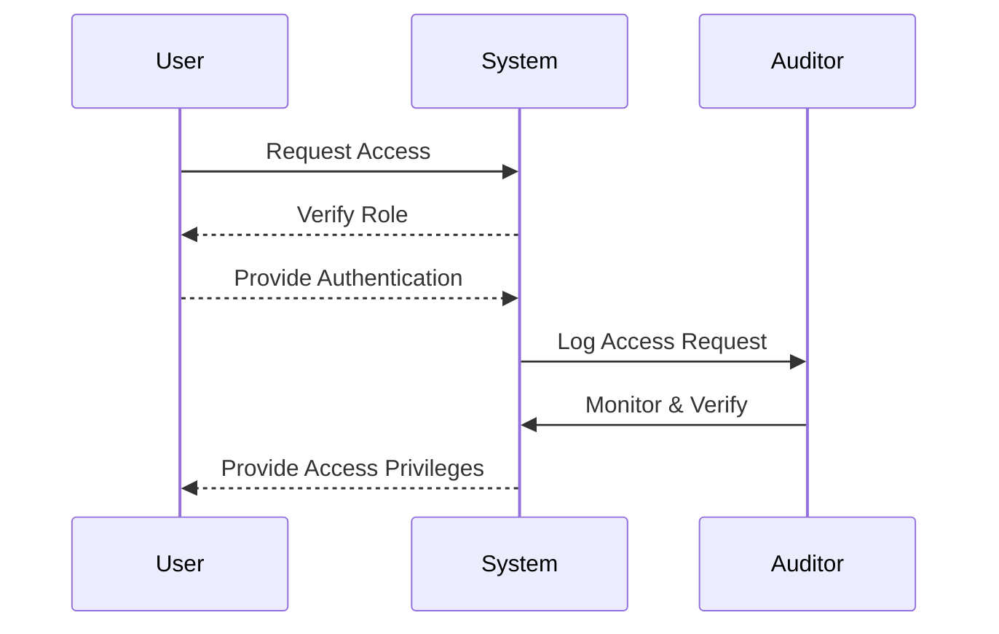

## Introduction

The **Segregation of Duties (SoD)** is a foundational concept in enterprise security and governance, pivotal for minimizing risks related to fraud and errors. This design pattern is particularly crucial in cloud environments where distributed systems and digital identities dominate. By clearly dividing responsibilities and access controls, organizations ensure that no single individual has too much control or access, helping mitigate risks of misuse and criminal activity.

## Detailed Explanation

### Design Pattern Overview

The Segregation of Duties pattern involves categorizing and compartmentalizing roles within an organization to prevent overlaps that might lead to unethical practices or errors. This pattern works under the principle that certain tasks, like transaction authorization, execution, and asset custody, should not all be managed by the same individual or team. 

### Architectural Approaches

1. **Role-Based Access Control (RBAC):** Implement RBAC to assign permissions based on roles rather than individual identities. This approach is efficient for scaling permission management in large organizations.

2. **Multi-Factor Authentication (MFA):** Integrate MFA alongside role divisions to ensure that verification processes require more than one method of authentication.

3. **Audit Trails and Monitoring:** Deploy robust logging and monitoring systems to track actions across the cloud environment, aiding in maintaining transparency and accountability.

4. **Automated Compliance Checks:** Implement tools that periodically evaluate compliance with SoD policies to identify breaches or lapses proactively.

### Best Practices

- **Clearly Define Roles and Responsibilities:** Establish crystal-clear role definitions and responsibilities to avoid ambiguity and overlaps in duties.
- **Regularly Review Access Controls:** Continuously audit and review permission settings and adjust them according to changes in organizational structure or threat landscape.
- **Incorporate Least Privilege Principle:** Ensure users have only those privileges which are absolutely necessary for their roles.
- **Conduct Frequent Training and Awareness Programs:** Educate employees about the importance of SoD and how to adhere to policies effectively.

### Example Code

Below is an example in TypeScript showcasing a simple RBAC implementation:

```typescript
type Role = 'admin' | 'editor' | 'viewer';

interface User {
  id: string;
  role: Role;
}

const canEditContent = (user: User): boolean => {
  return user.role === 'admin' || user.role === 'editor';
};

const canViewContent = (user: User): boolean => {
  return true; // All roles can view content
};

// Example usage
const currentUser: User = { id: '1', role: 'editor' };
console.log(`Can edit: ${canEditContent(currentUser)}`);
console.log(`Can view: ${canViewContent(currentUser)}`);
```

### Diagrams

#### UML Sequence Diagram for SoD Workflow



### Related Patterns

- **Least Privilege:** Ensures that entities only have the privileges necessary for their tasks, aligning closely with SoD for effective security.
- **Identity and Access Management (IAM):** Strongly related to SoD, IAM solutions are used to enforce these roles and access controls across systems.
- **Auditing and Compliance:** Complements SoD by offering mechanisms to verify that duties are segmented correctly.

### Additional Resources

- [NIST SP 800-53: Security and Privacy Controls for Federal Information Systems](https://csrc.nist.gov/publications/detail/sp/800-53/rev-5/final)
- [Cloud Security Alliance (CSA) Guidance](https://cloudsecurityalliance.org/research/guidance)
- [OWASP: Segregation of Duties](https://owasp.org/www-community/controls/Segregation_of_Duties)

## Conclusion

The Segregation of Duties pattern is a strategic necessity for organizations embracing cloud computing. It ensures robust mechanisms are in place to prevent malfeasance and errors, contributing significantly to an organization's overall security posture. By integrating SoD into the cloud architecture, companies can achieve higher levels of compliance and operational integrity, supporting sustainable growth and trust in digital ecosystems.
