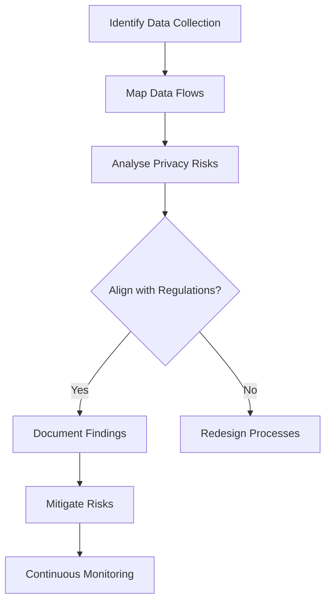

In the evolving landscape of cloud computing, businesses are increasingly reliant on data-driven applications. The promise of cloud infrastructure is expansive, offering scalability, flexibility, and advanced computing capabilities. However, as data processing capabilities grow, so do concerns about privacy and protection of personal data. Privacy Impact Assessments (PIAs) have become a pivotal design pattern in ensuring compliance with privacy regulations like GDPR, CCPA, and others.

## Detailed Explanation of Privacy Impact Assessments

A Privacy Impact Assessment (PIA) is a systematic approach designed to identify the effects that a proposed or existing process might have on individual privacy. The core aim is to ensure that an organization's data handling policies are in line with the relevant privacy regulations and legislation.

### Key Aspects of PIAs:

1. **Evaluation of Risk**: PIAs assess risks to data subjects' privacy and employ strategies to mitigate these risks.
2. **Regulatory Compliance**: Ensures alignment with local and international privacy laws.
3. **Transparency and Accountability**: Helps in documenting processes and making them transparent for auditing purposes.
4. **Stakeholder Engagement**: Involves key stakeholders in identifying and addressing privacy risks.
5. **Lifecycle Integration**: Incorporates privacy considerations throughout the entire data lifecycle from collection to deletion.

## Architectural Approaches

When designing PIAs, an architecture that incorporates:

- **Data Flow Mapping**: Understand the flow of data through systems.
- **Stakeholder Interviews**: Gain insights from users, IT staff, and decision-makers on data use.
- **Risk Assessment Tools**: Use software tools to automate and document risk identification and management.
- **Decision Records**: Maintain clear documentation of processing decisions and impact analysis.
  
These can ensure thorough and effective assessments.

## Best Practices

- **Embed Privacy by Design**: Integrate privacy considerations early in the systems development lifecycle.
- **Regularly Update Procedures**: Regular reviews and updates of PIAs as systems and regulations evolve are critical.
- **Cross-Functional Teams**: Employ a cross-disciplinary team approach, drawing insights from legal, technical, and business units.

## Example Code

Below is a pseudocode illustration of how a simple risk assessment might be implemented:

```python
def assess_privacy_risk(data_flow, privacy_regulations):
    risk_mapping = {}
    for data in data_flow:
        for reg in privacy_regulations:
            if not compliance_check(data, reg):
                risk_mapping[data] = "Non-compliant with " + reg
    return risk_mapping

def compliance_check(data, regulation):
    # Implement specific compliance checks
    return True  # Simplistic compliance
```

## Diagrams

Below is UML diagram illustrating a high-level PIA workflow:



## Related Patterns

- **Secure Data Processing**: Focuses on securing data at all stages of processing through encryption and access control.
- **Data Anonymization**: Ensures personal data is processed in a way that individuals cannot be identified.
- **Access Control Management**: Establishes protocols for who can access data and under what conditions.

## Additional Resources

- [European Commission - Data Protection](https://ec.europa.eu/info/law/law-topic/data-protection_en)
- [NIST Privacy Framework](https://www.nist.gov/privacy-framework)
- [ISO/IEC 27701:2019 Privacy Information Management](https://www.iso.org/standard/71670.html)

## Summary

Privacy Impact Assessments are fundamental for ensuring privacy compliance, fostering trust with stakeholders, and maintaining the integrity and legality of data processing activities in the cloud. Embracing this pattern not only augments privacy protection but also enhances the credibility and adaptability of cloud services in today’s digital landscape. Organizations should embed PIAs in their strategic and operational framework to maneuver through the complexities of privacy protections effectively.
