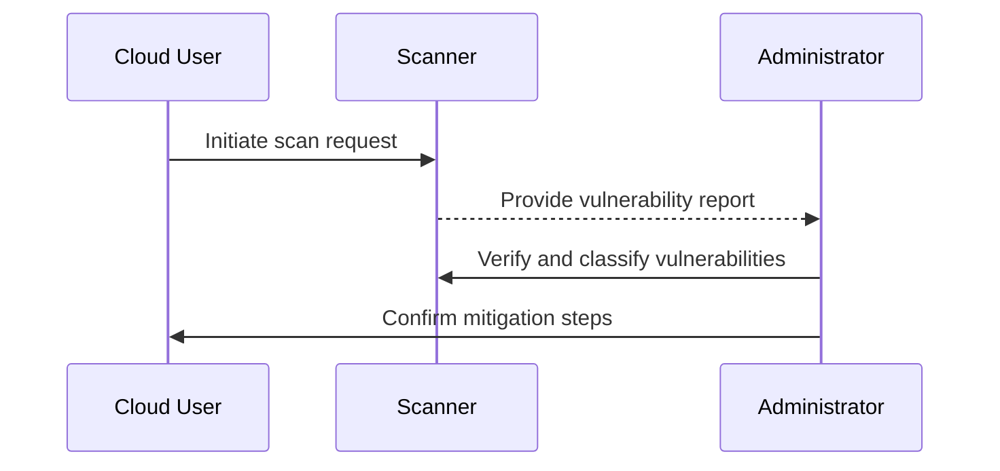
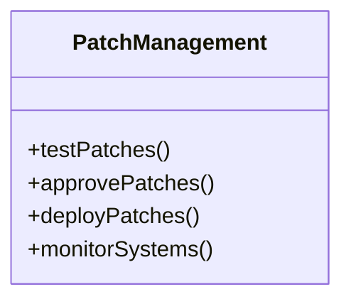

## Introduction

In today’s digital age, cloud computing plays a pivotal role in enterprise operations. With its extensive adoption comes the increased risk of vulnerabilities that could potentially be exploited. Vulnerability Scanning and Patch Management are critical security practices designed to identify and mitigate these risks efficiently.

## Pattern Details

### Vulnerability Scanning

**Vulnerability Scanning** involves systematically reviewing cloud environments to detect security flaws. It is a proactive measure to identify potential weaknesses that can be exploited by attackers. These scans are automated, providing frequent and consistent evaluations of the cloud infrastructure, applications, and services.

#### Best Practices for Vulnerability Scanning
- **Automated Tools**: Utilize tools like AWS Inspector, Azure Security Center, or open-source alternatives such as OpenVAS for continuous scanning.
- **Schedule Regular Scans**: Set up scans at regular intervals aligned with the organization's risk management strategy to ensure ongoing security assessments.
- **Prioritize Findings**: Classify vulnerabilities by their risk level to prioritize and address critical threats.

### Patch Management

**Patch Management** refers to the process of managing a network of computers by regularly performing system updates. It ensures that systems are up-to-date, thereby minimizing the chances of exploitation due to known vulnerabilities.

#### Best Practices for Patch Management
- **Timely Updates**: Develop a consistent patch application schedule and adhere to it to ensure critical vulnerabilities are patched promptly.
- **Test Before Deploying**: Use isolated environments to test patches and prevent disruptions in live systems.
- **Automation**: Leverage automation tools like Ansible, Chef, or Puppet to streamline the patch management process and reduce error rates.

## Example Code

Here's an example of a simple script using Ansible for automating patch management on a Linux server:

```yaml
---
- name: Ensure the system is up-to-date
  hosts: all
  tasks:
    - name: Update APT repository cache
      apt:
        update_cache: yes
        
    - name: Upgrade all packages to the latest version
      apt:
        upgrade: dist
```

## Diagrams

### Vulnerability Management Process Flow



### Patch Management Lifecycle



## Related Patterns

- **Security Monitoring**: Implement continuous monitoring to complement regular vulnerability scans.
- **Incident Response Management**: Have a robust plan in place to address incidents efficiently.
- **Configuration Management**: Maintain consistent system configurations to reduce security risks.

## Additional Resources

- [AWS Vulnerability Scanning Tools](https://aws.amazon.com/inspector/)
- [Azure Security Best Practices](https://docs.microsoft.com/en-us/azure/security-center/)
- [OWASP Foundation](https://owasp.org)

## Summary

Vulnerability Scanning and Patch Management are integral to maintaining cloud security and compliance. By adopting these practices, organizations can proactively identify security gaps and apply necessary patches, thereby mitigating potential threats. Implementing automated tools and adhering to defined best practices enhance the effectiveness of these processes, ensuring reliable and secure cloud operations.
