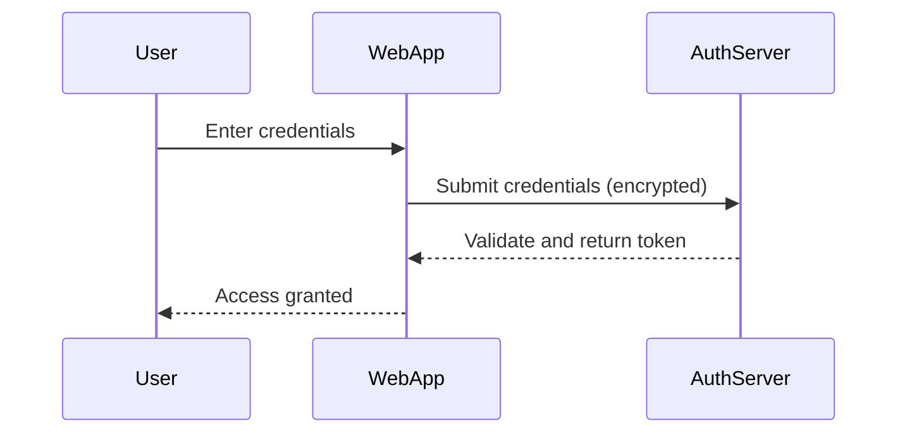

In today's fast-paced digital world, software security has become a top priority for organizations. Vulnerabilities in software can have significant impacts ranging from data breaches to financial losses. Secure coding practices represent a fundamental aspect of mitigating these risks by implementing techniques and methodologies that focus on preventing vulnerabilities during the software development lifecycle.

## Principles of Secure Coding

1. **Input Validity**: Always validate input from untrusted sources to prevent injection attacks such as SQL injection or cross-site scripting (XSS).
   
2. **Least Privilege**: Run software with the minimum level of permissions necessary to function, reducing the potential damage from exploits.

3. **Data Encryption**: Encrypt sensitive data in storage and in transit to protect against unauthorized access and eavesdropping.

4. **Error Handling**: Implement robust error handling and logging mechanisms to manage exceptions and maintain security without revealing sensitive information.

5. **Immutable Infrastructure**: Deploy software in an environment where infrastructure is version-controlled and changes are managed, essential for cloud environments.

6. **Secure Dependencies**: Regularly update and audit third-party libraries and frameworks to ensure that they do not introduce vulnerabilities.

## Techniques and Tools for Secure Coding

- **Static Code Analysis**: Use tools like SonarQube or Fortify to analyze codebases for security vulnerabilities without executing the program.
  
- **Dynamic Analysis**: Tools such as OWASP ZAP and Burp Suite test running applications for vulnerabilities like SQL Injection, XSS, and other threats.

- **Dependency Management Tools**: Tools like npm audit for JavaScript or Snyk can identify vulnerabilities in project dependencies.

- **Secure Coding Guidelines**: Adhere to language-specific security guidelines, such as SEI CERT for C/C++ or OWASP's secure coding practices for web applications.

## Best Practices

- **Regular Security Training**: Invest in regular security training for developers to maintain awareness and understanding of evolving threat landscapes.

- **Code Reviews**: Conduct regular code reviews with a focus on security aspects to catch potential vulnerabilities early in the development process.

- **Security by Design**: Incorporate security considerations from the initial stages of software architecture and design.

- **Continuous Integration and Deployment (CI/CD) with Security**: Integrate security testing into CI/CD pipelines for immediate feedback and remediation.

## Example Code

Here's an example of input validation to prevent SQL Injection in Java:

```java
import java.sql.Connection;
import java.sql.PreparedStatement;
import java.sql.ResultSet;
import java.sql.SQLException;

public class UserService {
    private Connection connection;

    public UserService(Connection connection) {
        this.connection = connection;
    }

    public User getUserById(int userId) throws SQLException {
        String query = "SELECT * FROM users WHERE user_id = ?";
        try (PreparedStatement statement = connection.prepareStatement(query)) {
            statement.setInt(1, userId);
            try (ResultSet resultSet = statement.executeQuery()) {
                if (resultSet.next()) {
                    return new User(resultSet.getInt("user_id"), resultSet.getString("username"));
                }
            }
        }
        return null;
    }
}
```

## Diagrams

Below is a sequence diagram illustrating a secure login process:



## Related Patterns

- **Zero Trust Architecture**: Emphasizes verifying every request as though it originates from an open network.
- **Privacy by Design**: Integrating privacy into system architecture from inception.

## Additional Resources

- [OWASP Top Ten](https://owasp.org/www-project-top-ten/): A list of critical security risks to web applications.
- [NIST Secure Software Development Framework](https://csrc.nist.gov/publications/detail/white-paper/2020/07/09/sp-800-218-ip/final): Guidelines for secure software development lifecycle.

## Summary

Secure coding practices serve as the first line of defense against software vulnerabilities. By incorporating security into the code from the onset, developers can significantly reduce risks, protect sensitive information, and maintain the integrity of software systems. As security threats evolve, continuous learning and adaptation of secure coding practices become crucial for safeguarding digital assets in the cloud era.
