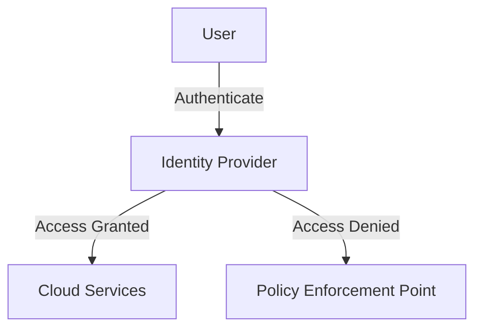

## Overview

Identity and Access Management (IAM) is a fundamental aspect of cloud security, responsible for managing identities and regulating access to various resources and services within a cloud ecosystem. IAM systems define and enforce policies to ensure that only legitimate users have the appropriate access privileges needed to perform their duties. Implementing IAM in cloud computing environments helps maintain security, compliance, and operational efficiency.

## Key Components of IAM

- **User Authentication**: Verifies the identity of users trying to access cloud resources. This process often leverages multi-factor authentication (MFA) to enhance security.

- **Authorization**: Determines the level of access or permissions a verified user should have. This could include defining roles and policies that specify resource access rights.

- **Identity Provisioning**: Involves creating and managing user identities within an organization, ensuring that users have the correct credentials and roles.

- **Access Management**: Manages how identities are granted access to resources. This can involve role-based access control (RBAC) or attribute-based access control (ABAC).

- **Audit and Compliance**: Tracks user activity and access to monitor for unauthorized access and maintain compliance with relevant regulations and policies.

## Architectural Approaches

1. **Role-Based Access Control (RBAC)**: Assigns permissions to roles rather than to individual users. Users are granted roles with specific access rights, simplifying management and enhancing security.

2. **Attribute-Based Access Control (ABAC)**: Provides more granular access control by considering attributes (e.g., user role, resource type, time of access) when determining user access to resources.

3. **Policy-Based Access Control**: Uses explicit policies written in a language like XACML to define who can do what actions on which resources.

4. **Federated Identity Management**: Involves using a common identity provider (IdP) to authenticate users across multiple organizations or domains, enabling single sign-on (SSO) capabilities.

## Best Practices

- **Principle of Least Privilege**: Only grant users the permissions necessary for their roles to minimize potential security risks.

- **Regular Audits and Reviews**: Periodically review and audit access logs and user permissions to ensure compliance and detect anomalies.

- **Automate Provisioning and De-provisioning**: Use automation tools to manage identity life cycles, ensuring that privileges are updated as user roles change.

- **Multi-Factor Authentication (MFA)**: Use MFA to provide an extra layer of security for user authentication processes.

- **Centralized IAM Solution**: Implement a centralized IAM system to streamline identity management processes and policies across multiple cloud environments.

## Example Code

A simple example using AWS IAM to create a user and assign it to a group:

```bash
aws iam create-user --user-name ExampleUser

aws iam attach-user-policy --user-name ExampleUser --policy-arn arn:aws:iam::aws:policy/AmazonS3ReadOnlyAccess

aws iam create-group --group-name ExampleGroup
aws iam add-user-to-group --user-name ExampleUser --group-name ExampleGroup
```

## Diagrams



## Related Patterns

- **Single Sign-On (SSO)**: Promotes ease of access across multiple systems by using a single set of credentials.
  
- **Zero Trust Architecture**: An evolving set of cybersecurity paradigms that move defenses from static, network-based perimeters to focus on users, assets, and resources.

- **Secure Token Service (STS)**: A service that enables you to create and validate security tokens.

## Additional Resources

- [AWS IAM User Guide](https://docs.aws.amazon.com/IAM/latest/UserGuide/)
- [Azure Active Directory Documentation](https://azure.microsoft.com/en-us/services/active-directory/)
- [Google Cloud IAM Overview](https://cloud.google.com/iam/docs/overview)

## Summary

IAM in cloud computing is essential for managing user identities and access controls to secure cloud resources. By implementing robust IAM practices, organizations can protect sensitive data, adhere to compliance regulations, and prevent unauthorized accesses. This pattern emphasizes managing identities effectively, leveraging modern technologies like MFA and federated identity management to enhance security in intricate cloud environments.
