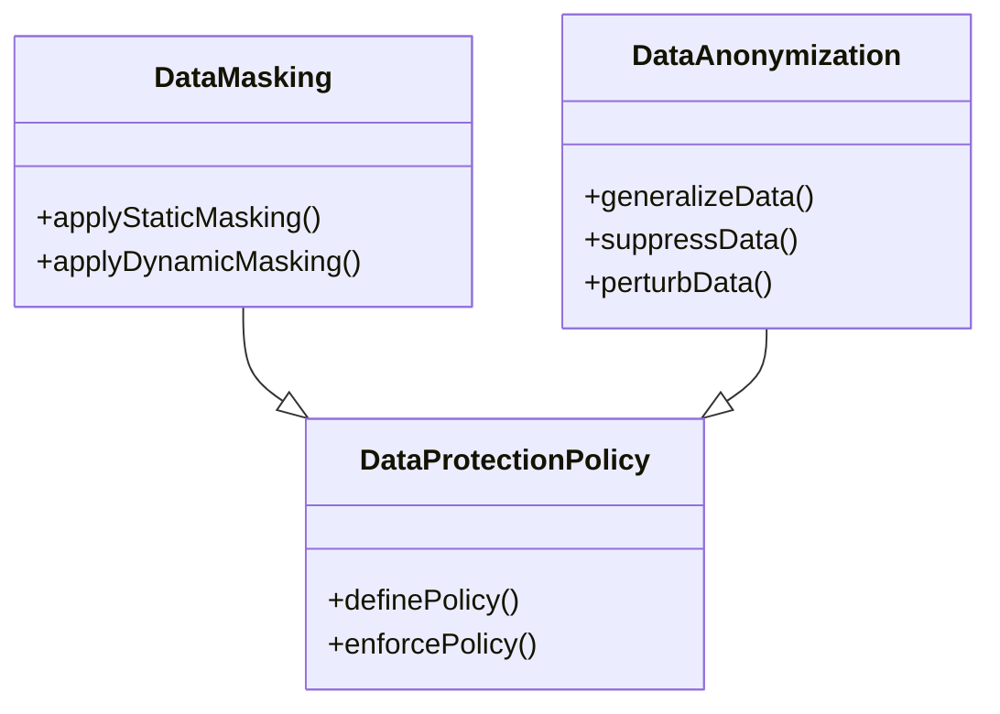

## Introduction

In the cloud computing context, protecting sensitive data is paramount. Data Masking and Anonymization are two effective strategies used to obscure or remove personal identifiers from data sets to prevent unauthorized access or leakage of sensitive information. These methods ensure compliance with data protection regulations such as GDPR and CCPA and maintain a balance between data utility and privacy.

## Detailed Explanation

### Data Masking

Data Masking replaces sensitive data with non-sensitive substitutes without changing the essential structure of the data. This technique involves creating a structurally similar but sanitized version of an organization’s data, allowing it to be used safely in non-secure environments. It is mostly used during software testing and user training to protect actual data.

- **Static Data Masking**: Involves masking data at rest, ensuring that data in development and testing environments does not expose sensitive information. 
- **Dynamic Data Masking**: Applies masking rules in real-time when data is retrieved from a database without altering the original data stored in the database.

### Anonymization

Data Anonymization is the process of removing or modifying personally identifiable information (PII) in data sets with the goal of protecting the privacy of individuals. Anonymization is irreversible, ensuring that the actual identities of data subjects cannot be reconstructed.

- **Generalization**: Reducing the granularity of data to obscure individual information, e.g., replacing a birthdate with an age range.
- **Suppression**: Removing certain segments of data entirely, such as hiding ZIP codes or Social Security numbers.
- **Data Perturbation**: Randomly shuffling data or adding noise to datasets to obscure original values.

## Architectural Approaches

Incorporating Data Masking and Anonymization involves several architectural considerations:

- **Access Controls**: Define who can view or modify unmasked data, integrating with identity management systems to enforce access policies.
- **Policy Definition**: Establish clear guidelines for data masking and anonymization according to relevant compliance requirements.
- **Tools and Platforms**: Utilize platforms that offer built-in masking capabilities, like AWS Macie or Azure Data Lake Analytics, to simplify the application of these patterns across cloud ecosystems.

## Best Practices

- **Evaluate Use Cases**: Assess the specific needs of your application or organization to choose between masking or anonymization.
- **Regular Audits**: Conduct audits to verify data protection techniques are applied correctly and comply with updated regulations.
- **Comprehensive Testing**: Ensure thorough testing of data-masked environments to validate functionality and data integrity.

## Example Code

Here's a simple example in Python for basic static data masking using regular expressions to hide email addresses:

```python
import re

def mask_email_addresses(text):
    masked_text = re.sub(r'([a-zA-Z0-9_.+-]+@[a-zA-Z0-9-]+\.[a-zA-Z0-9-.]+)', '***@***.***', text)
    return masked_text

data = "Please contact John Doe at john.doe@example.com for more information."
masked_data = mask_email_addresses(data)
print(masked_data)
```

## Diagrams

Below is UML class diagram displaying a high-level design of a data masking system:



## Related Patterns

- **Encryption**: Beyond masking and anonymization, encryption provides another layer of security by transforming data into a scrambled format that is only readable with the correct key.
- **Access Control**: Implement strict access policies to enhance data confidentiality and security.

## Additional Resources

- [NIST Guidelines on Data Masking](https://www.nist.gov/publications)
- [European Data Protection Board - Guidelines on Anonymization](https://edpb.europa.eu/)
- [AWS Security Best Practices](https://aws.amazon.com/security/)

## Summary

Data Masking and Anonymization are essential cloud computing patterns for securing sensitive information and ensuring privacy compliance. These techniques not only protect against data breaches and unauthorized access but also enable safe data sharing and utilization across development and testing environments. By implementing appropriate masking and anonymization strategies, organizations can safeguard PII while still extracting meaningful insights from their data.
