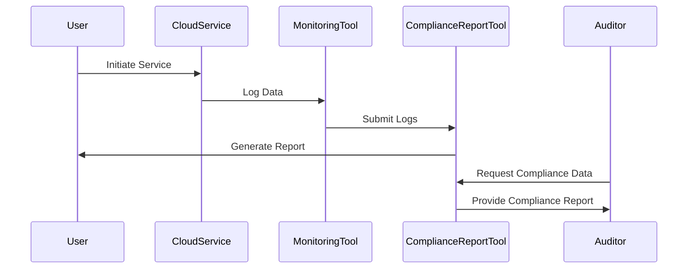

In the realm of cloud computing, maintaining compliance with regulatory requirements is critical for organizations to ensure trust and legality in their operations. The "Compliance Reporting and Documentation" pattern addresses the processes and tools necessary for generating and managing documentation that demonstrates compliance with applicable standards and regulations during audits. This pattern is vital in sectors such as finance, healthcare, and governments, where data handling and security are paramount.

## Detailed Explanation

### Design Patterns and Architectural Approaches

Compliance Reporting and Documentation involves several key components and practices:

1. **Automated Logging and Monitoring**:
   - **Description**: Implement systems that automatically log relevant compliance data across all cloud services used by an organization.
   - **Best Practices**: Use centralized logging services such as AWS CloudTrail, Azure Monitor, or GCP's Operations Suite (formerly Stackdriver) to collect, analyze, and archive logs.

2. **Data Consistency and Integrity**:
   - **Description**: Ensure all data logging and reporting is consistent and tamper-proof.
   - **Technologies**: Utilize blockchain technology or immutable storage solutions to guarantee data integrity.

3. **Customizable Reporting Tools**:
   - **Description**: Deploy tools that can create customized reports tailored to various compliance standards like GDPR, HIPAA, or PCI-DSS.
   - **Examples**: Use services like AWS Audit Manager or Compliance and Security Assessment from Azure.

4. **Regular Audits and Assessments**:
   - **Description**: Conduct frequent audits and self-assessments to proactively identify compliance violations.
   - **Tools**: Tools like AWS Config or Azure Policy can be used for continuous compliance assessment and enforcement.

5. **Role-Based Access Control (RBAC)**:
   - **Description**: Implement RBAC to control access to compliance data and reporting tools, ensuring only authorized personnel can view or manipulate data.
   - **Implementation**: Integrate with IAM services, such as AWS IAM or Azure Active Directory, to enforce stringent access policies.

### Diagrams

Below is Sequence Diagram illustrating the workflow of compliance reporting:



### Best Practices

- **Automation**: Automate as many aspects of the compliance process as possible, from data collection to report generation.
- **Security**: Encrypt all compliance-related data both in transit and at rest.
- **Proactivity**: Regularly update and validate compliance policies and practices to meet evolving regulatory demands.
- **Education**: Train staff on compliance standards and the importance of maintaining robust documentation.

### Example Code

Here's a simplified code snippet showing how automated log data retrieval for compliance auditing might be set up:

```scala
import com.amazonaws.services.cloudtrail.AWSCloudTrail
import com.amazonaws.services.cloudtrail.model.StartLoggingRequest

val cloudTrail: AWSCloudTrail = AWSCloudTrailClientBuilder.standard().build()
val loggingRequest = new StartLoggingRequest().withName("ComplianceTrail")
cloudTrail.startLogging(loggingRequest)
```

### Related Patterns

- **Identity and Access Management**: Ensures secure access to resources and data involved in compliance reporting.
- **Data Encryption**: Protects sensitive data that must comply with confidentiality standards.
- **Centralized Log Management**: Facilitates the collection and analysis of logs from dispersed cloud services.

### Additional Resources

- Official AWS Compliance: [AWS Compliance Programs](https://aws.amazon.com/compliance/programs/)
- Azure Security and Governance: [Azure Security Center](https://azure.microsoft.com/en-us/services/security-center/)
- GCP Compliance Offerings: [Google Cloud Compliance](https://cloud.google.com/security/compliance/)

## Summary

Compliance Reporting and Documentation is a critical pattern in cloud computing, emphasizing the need for systematic data logging, robust reporting tools, and regular audits to ensure compliance. By automating these processes and integrating best practices such as role-based access control and data encryption, organizations can effectively meet regulatory requirements and pass audits with confidence. Through efficient implementation of this pattern, businesses can ensure operational integrity and maintain trust with stakeholders and regulatory bodies.
