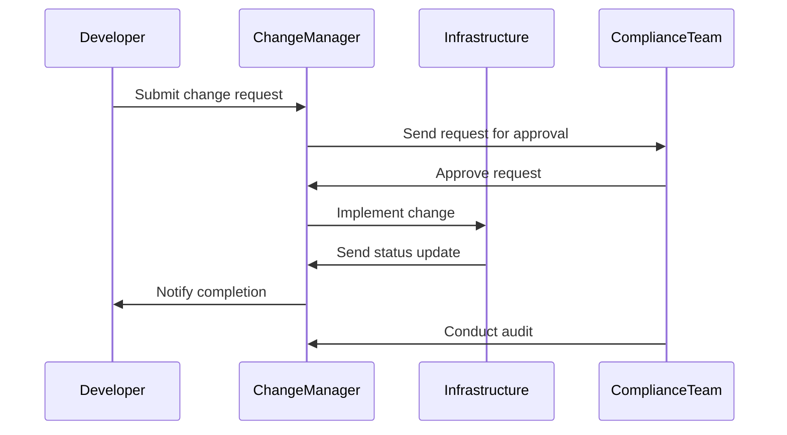

## Change Management Processes: Controlling System Changes

Change management processes are critical for organizations operating in cloud environments to ensure system integrity, compliance, and security. By controlling changes, organizations can prevent unauthorized modifications, maintain service reliability, and adhere to regulatory requirements.

### Detailed Explanation

The purpose of change management is to manage changes systematically, efficiently, and effectively while minimizing risk and impact on system operations. It encompasses planning, implementing, and reviewing changes, ensuring that all stakeholders are informed and that modifications are documented for audit and compliance purposes.

#### Key Components of Change Management Processes:

1. **Change Request Management**: Every change starts with a formal request, which outlines details of the change, its rationale, expected impact, and rollback plans in case of failure.

2. **Impact Analysis**: Before a change is approved, an assessment must be completed to evaluate its potential impact on existing systems and processes.

3. **Approval Workflow**: Changes must go through an approval process, typically involving multiple stakeholders such as IT, security, and business leaders, to ensure alignment with organizational objectives.

4. **Change Implementation Planning**: Detailed plans for implementing the change, including necessary resources, timelines, and communication plans, must be developed.

5. **Testing and Validation**: Changes must be thoroughly tested before and after implementation to ensure that they meet requirements and that there are no adverse effects on the systems.

6. **Documentation and Communication**: All changes must be documented, and relevant stakeholders must be informed about the change and its implications.

7. **Monitoring and Review**: Post-implementation, systems are monitored for unexpected behavior, and a review is conducted to assess the change's success and learn from any issues encountered.

### Architectural Approaches

- **Automated CI/CD Pipelines**: Leverage continuous integration and continuous deployment pipelines to streamline the process of deploying changes, ensuring they are automatically tested and validated.

- **Infrastructure as Code (IaC)**: Use IaC tools such as Terraform and AWS CloudFormation to provision and manage infrastructure changes consistently and repeatably.

- **Policy-based Change Management**: Implement policies using cloud-native tools like AWS IAM or Azure Policy to enforce compliance with organizational guidelines.

### Best Practices

- **Segregation of Duties (SoD)**: Separate development, testing, and production environments to reduce the risk of unauthorized changes being made directly to live systems.

- **Continuous Monitoring and Auditing**: Use cloud-based monitoring tools to continuously track changes and automatically audit trails, providing real-time insights into system modifications.

- **Regular Review and Optimization**: Periodically evaluate change management processes and make necessary adjustments to address evolving business needs and technological advancements.

### Example Code

Below is an example of using Terraform to manage cloud infrastructure changes efficiently:

```hcl
provider "aws" {
  region = "us-west-2"
}

resource "aws_instance" "example" {
  ami           = "ami-12345678"
  instance_type = "t2.micro"
  tags = {
    Name = "ExampleInstance"
  }
}
```

### Diagrams

#### UML Sequence Diagram



### Related Patterns

- **Continuous Integration (CI) and Continuous Deployment (CD):** Automate the build and deployment process to ensure consistency and improve velocity.
- **Policy-Driven Governance:** Ensure compliance using automated policy enforcement mechanisms.

### Additional Resources

- [AWS Change Management](https://aws.amazon.com/architecture/well-architected/change-management/)
- [Azure Change Management](https://learn.microsoft.com/en-us/azure/cloud-adoption-framework/manage/change-management/)
- [Terraform Documentation](https://www.terraform.io/docs/index.html)

### Summary

Change management processes in cloud computing are essential to ensure that changes are properly controlled, documented, and compliant with organizational and regulatory requirements. By leveraging automated tools, best practices, and a rigorous approval process, organizations can achieve a balance between necessary system modifications and maintaining system integrity and security.
