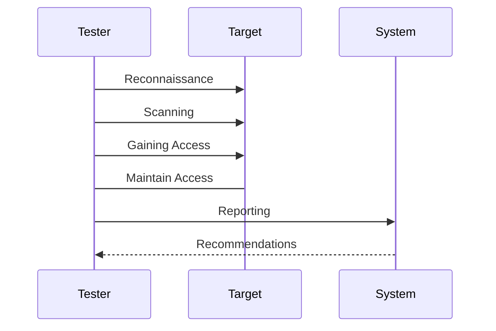

## Introduction

Ethical hacking and penetration testing are essential components of a comprehensive cloud security strategy. These practices involve simulating cyberattacks on a computer system, network, or cloud infrastructure to identify security weaknesses that could be exploited by malicious actors. By proactively discovering and addressing potential vulnerabilities, organizations can fortify their defenses and protect sensitive data from breaches. This article explores the concepts, methodologies, and benefits of ethical hacking and penetration testing within cloud environments.

## Concepts and Methodologies

### Ethical Hacking

Ethical hacking, also known as "white-hat hacking," refers to the authorized practice of bypassing system security to identify potential data breaches and threats. Ethical hackers adhere to the same techniques as malicious hackers but with the permission and cooperation of the system owners.

#### Key Activities:
1. **Reconnaissance**: Gathering information about the target systems.
2. **Scanning**: Identifying open ports and services that could be exploited.
3. **Gaining Access**: Exploiting vulnerabilities to penetrate the system.
4. **Maintaining Access**: Establishing a persistent connection to the target.
5. **Analysis and Reporting**: Documenting findings and recommending remediation strategies.

### Penetration Testing (Pen Testing)

Penetration testing is a controlled and systematic approach to evaluating the security of IT infrastructure by safely exploiting vulnerabilities.

#### Types of Pen Testing:
- **Black Box Testing**: Testers have no prior knowledge of the network.
- **White Box Testing**: Testers have full knowledge of the network's systems.
- **Gray Box Testing**: Testers have limited knowledge of the network.

#### Testing Phases:
1. **Planning and Reconnaissance**: Define objectives, scope, and gather intelligence.
2. **Scanning**: Identify live hosts and vulnerable services.
3. **Exploitation**: Attempt to exploit vulnerabilities.
4. **Post-Exploitation**: Determine the value of the compromised machine.
5. **Reporting**: Summarize findings and suggest fixes.

## Best Practices

- **Define Clear Objectives**: Understand the scope and goals for ethical hacking initiatives.
- **Ensure Legal Compliance**: Obtain necessary permissions and comply with legal requirements.
- **Use Updated Tools and Methods**: Leverage the latest tools and methodologies to ensure thorough testing.
- **Develop a Remediation Plan**: Prepare a plan to address identified vulnerabilities.

## Example Code

An example using a popular penetration testing tool, `Nmap`, to scan a target host:

```bash
nmap -A -T4 scanme.nmap.org
```

This command performs an aggressive scan with OS detection, version detection, script scanning, and traceroute.

## Diagrams

### Sequence Diagram of the Penetration Testing Process



## Related Patterns and Descriptions

- **Defense in Depth**: Layered security strategy to protect systems.
- **Intrusion Detection and Prevention Systems (IDPS)**: Monitor network or system activities for malicious activities.
- **Security Information and Event Management (SIEM)**: Provide real-time analysis of security alerts.

## Additional Resources

- [OWASP Top Ten](https://owasp.org/www-project-top-ten/): Critical web application security risks.
- [NIST Penetration Testing Guide](https://csrc.nist.gov/publications/detail/sp/800-115/final): Provides a penetration testing methodology.

## Summary

Ethical hacking and penetration testing are proactive security practices crucial for identifying and mitigating vulnerabilities within cloud environments. By simulating real-world attacks, organizations can uncover weaknesses before they are exploited by malicious actors. Implementing these practices ensures a robust security posture, safeguarding cloud-based assets and ensuring compliance with regulatory standards. Embracing ethical hacking not only fortifies cloud infrastructure but also fosters a culture of continuous security improvement.
