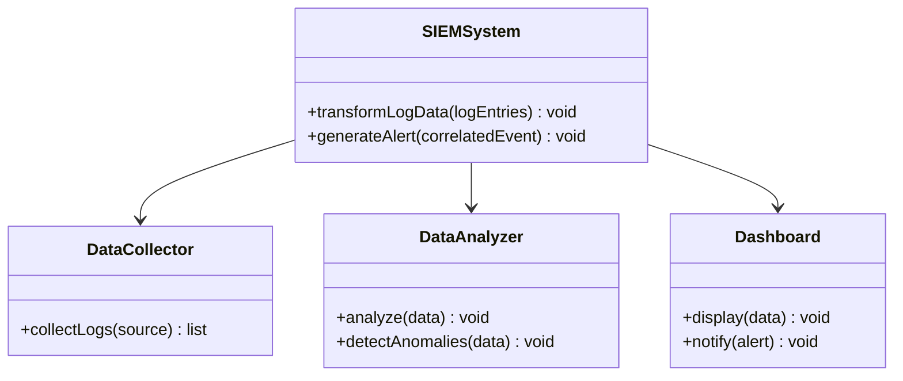
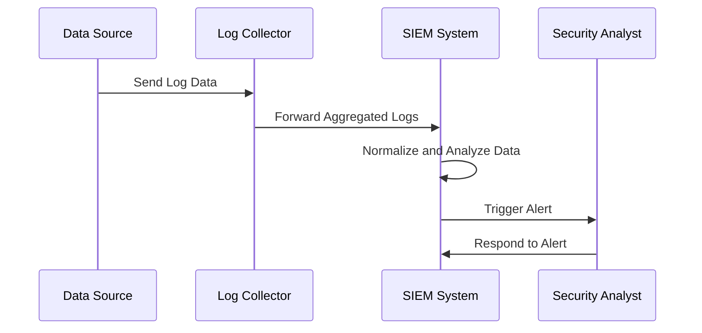

Security Information and Event Management (SIEM) is a crucial design pattern in modern cloud environments. It focuses on the collection, aggregation, and analysis of security events to provide centralized visibility into the IT infrastructure and facilitate threat detection and response.

## Overview

SIEM systems are designed to collect security data from endpoints, network equipment, servers, and other IT infrastructure components in real-time. They aggregate this data into a centralized platform where it is stored, normalized, and analyzed. The goal is to detect anomalies, correlate disparate events, and generate insights for cybersecurity teams to respond to potential threats effectively.

## Architectural Approaches

- **Data Collection and Aggregation**: SIEM systems collect logs, events, and security-related information from a wide range of data sources across the infrastructure.
- **Normalization and Storage**: The collected data is normalized, indexed, and stored in a unified format to enable efficient querying and analysis.
- **Correlational Analysis**: SIEM solutions employ rule-based or machine learning techniques to identify patterns and correlations in security events.
- **Dashboards and Alerts**: Provides real-time monitoring dashboards and generates alerts to inform security teams of potential incidents.
- **Incident Response**: Integrates with incident response workflows to facilitate rapid action based on the insights generated.

## Best Practices

1. **Comprehensive Data Sources**: Include a wide range of data sources such as firewalls, intrusion detection systems, application logs, and user activity reports.
2. **Tailored Correlation Rules**: Develop specific correlation rules that align with the organization's threat landscape and security policies.
3. **Regular Updates and Maintenance**: Continuously update the SIEM rules and algorithms to tackle new and emerging threats.
4. **Scalability**: Ensure that the SIEM solution can scale to handle growing data volumes as the organization expands.
5. **Integrations**: Establish integrations with other security tools for unified threat detection and response capabilities.

## Example Code

Here's a simplified Python code snippet for a log aggregation function that could be part of a SIEM system:

```python
import json
from datetime import datetime

def aggregate_logs(log_entries):
    aggregated_data = {}
    
    for entry in log_entries:
        log = json.loads(entry)
        source = log.get('source')
        timestamp = log.get('timestamp')
        
        if source not in aggregated_data:
            aggregated_data[source] = []
        
        formatted_entry = {
            'time': datetime.fromtimestamp(timestamp),
            'details': log.get('details')
        }
        
        aggregated_data[source].append(formatted_entry)

    return aggregated_data
```

## Diagrams

### Component Diagram



### Sequence Diagram



## Related Patterns

- **Intrusion Detection Systems (IDS)**: For detecting unauthorized access patterns within networks.
- **Security Monitoring**: Offering broader monitoring capabilities beyond event management.
- **Threat Intelligence Platforms**: Aggregating threat data feeds for proactive security measures.

## Additional Resources

- [OWASP SIEM Planning Guide](https://owasp.org/www-community/Project_SIAM)
- [NIST Guide on SIEM Implementation](https://csrc.nist.gov/publications/detail/sp/800-92/final)
- [Gartner Magic Quadrant for SIEM](https://www.gartner.com/en/research/magic-quadrant/security-information-event-management)

## Summary

The SIEM design pattern plays a pivotal role in proactive threat detection and security management, offering organizations the capability to unify their cybersecurity efforts through centralized event logging and analysis. By leveraging SIEM, companies can improve threat detection accuracy, optimize incident response, and maintain robust security postures in their cloud environments. Adopting a SIEM system is essential for organizations that require comprehensive insight and control over their security operations.
