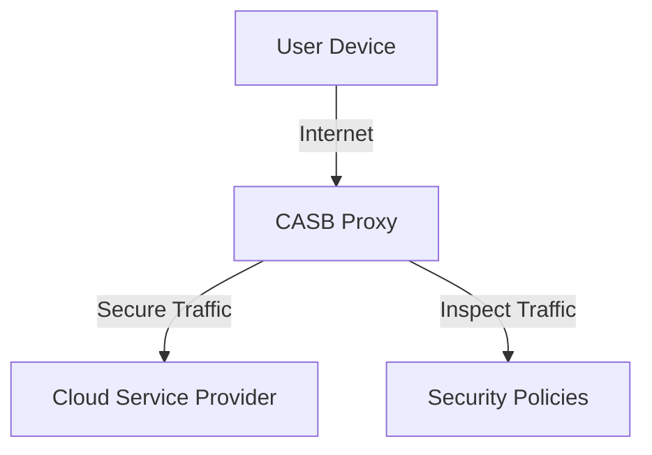

## Introduction

Cloud Access Security Brokers (CASB) serve as a crucial intermediary between cloud service users and cloud service providers. By enforcing enterprise security policies, they help organizations address security and compliance challenges associated with cloud adoption. CASB solutions provide visibility into cloud application use, protect sensitive data, and detect and respond to cybersecurity threats.

## Detailed Explanation

A CASB is a security policy enforcement point positioned between cloud service users and providers. Its primary functions include:

- **Visibility**: CASBs provide detailed visibility into cloud service usage across an organization, which is critical for understanding potential security risks associated with shadow IT.

- **Data Security**: They implement a variety of data security measures such as encryption, tokenization, and data loss prevention (DLP) to ensure that sensitive data is protected both at rest and in transit.

- **Threat Protection**: By leveraging advanced threat protection capabilities, CASBs can detect and mitigate security threats such as account hijacking, malware, and other sophisticated cyber threats in cloud environments.

- **Compliance**: CASBs help organizations comply with regulatory requirements by enforcing consistent security policies across cloud applications and maintaining audit trails.

## Architectural Approaches

1. **API-Based Integration**: Leverages providers' APIs to enforce security policies, offering deep insights into cloud applications with minimal impact on user experience. It is suitable for sanctioned cloud services.

2. **Proxy-Based Deployment**: Operates as a proxy, routing user traffic through the CASB. It can be deployed as a forward proxy (on-premises) or as a reverse proxy (cloud-hosted). This approach is ideal for inspecting traffic transparently, especially for unsanctioned applications.

3. **Agent-Based Installation**: Utilizes agents on endpoints to secure applications and data, ensuring real-time policy enforcement. This method is useful for securing unmanaged devices.

## Best Practices

- **Comprehensive Visibility**: Employ discovery tools to identify all cloud services in use, including unsanctioned applications, and continually monitor usage to detect anomalies.

- **Data Classification**: Understand the sensitivity of your data and apply classification schemes to ensure appropriate protection measures are enforced by the CASB.

- **Policy Customization**: Develop custom policies suited to your organization's security needs and ensure they are consistently applied across all cloud applications.

- **User Education**: Educate your employees about security policies and protocols, as human error remains one of the most significant security threats.

- **Regular Audits**: Conduct regular security audits and compliance checks to ensure that all CASB-stipulated security measures are properly implemented and updated.

## Example Code

Here's a snippet demonstrating an example of integrating a CASB solution using APIs to monitor cloud application usage:

```javascript
// Example: Fetch application usage data through a CASB API
const axios = require('axios');

async function getAppUsage() {
  try {
    const response = await axios.get('https://casb-provider.com/api/v1/app-usage', {
      headers: {
        'Authorization': 'Bearer YOUR_ACCESS_TOKEN'
      }
    });
    console.log('Application Usage Data:', response.data);
  } catch (error) {
    console.error('Error fetching application usage:', error);
  }
}

getAppUsage();
```

## Diagrams

### CASB Architectural Diagram (Proxy-Based)



## Related Patterns

- **Zero Trust Security**: A security model that assumes no trust between any components by default, applicable to CASB for enhancing security measures.

- **Data Loss Prevention (DLP)**: Techniques that CASBs often use to monitor, detect, and prevent data breaches by securing data workflows.

## Additional Resources

- [Gartner's Magic Quadrant for Cloud Access Security Brokers](https://www.gartner.com/en/documents/3875460/magic-quadrant-for-cloud-access-security-brokers)
- [NIST Special Publication 800-210](https://nvlpubs.nist.gov/nistpubs/SpecialPublications/NIST.SP.800-210.pdf): General guidelines on security and privacy in public cloud computing.
- [OWASP Cloud Security Framework](https://owasp.org/www-project-cloud-security-framework/): Best practices for securing applications running in cloud environments.

## Summary

Cloud Access Security Brokers are essential for organizations adopting cloud services to ensure that security, compliance, and governance standards are met. By providing visibility, data security, threat protection, and compliance capabilities, CASBs empower organizations to secure their cloud environments effectively. Understanding and implementing CASBs can significantly enhance an organization's security posture, particularly in mitigating risks associated with shadow IT and unsecured data transfers.
