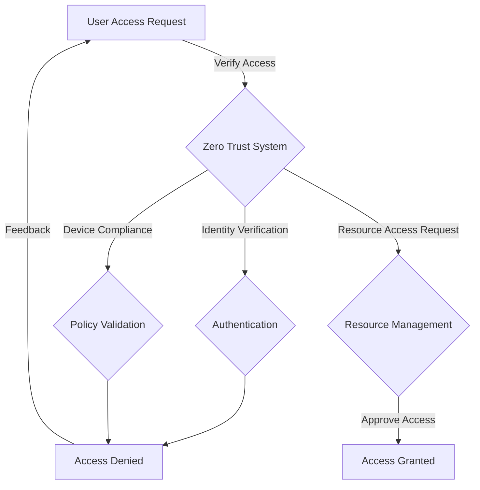

## Introduction

Zero Trust Architecture (ZTA) is an advanced security model centered around the principle of "never trust, always verify." It is designed to protect modern digital businesses by verifying every access request from users, devices, and applications, regardless of their origin. Unlike traditional security models that assume everything within an organization's network is trusted, Zero Trust eliminates the notion of implied trust, treating every entity as a potential threat until verified.

## Core Principles of Zero Trust

1. **Verification of Identity**: Every access attempt must be authenticated through multi-factor authentication (MFA) or similar mechanisms.

2. **Device Health Check**: Continuous validation of device security posture by assessing factors like software updates, compliance status, and malware protection.

3. **Least Privilege Access**: Users and devices only gain access to resources necessary for their function, significantly reducing exposure to sensitive data.

4. **Segmented Access**: Micro-segmentation of networks limits lateral movement within a system, curtailing the impact of potential breaches.

5. **Continuous Monitoring and Validation**: Constantly analyzing access patterns and behaviors, using machine learning and anomaly detection to identify potential security threats.

6. **Dynamic Policy Management**: Employing adaptive policies that respond to the context of each access request and the current security landscape.

## Architectural Approaches

### Implementation of Zero Trust Architecture

- **Identity and Access Management (IAM)**: Central to Zero Trust, IAM platforms manage user identities and regulate access rights across systems by incorporating MFA and Single Sign-On (SSO).

- **Micro-Segmentation**: Networks are divided into logically separated segments to enforce rules and reduce threat impact. Solutions like software-defined networking (SDN) can facilitate this.

- **Endpoint Security and Management**: Ensuring every endpoint complies with security policies; tools like Endpoint Detection and Response (EDR) strengthen threat detection capabilities.

- **Security Information and Event Management (SIEM)**: Aggregates and analyzes security data from across systems to provide critical insights into potential threats.

- **Zero Trust Network Access (ZTNA)**: Builds an "access-per-app" trust model, replacing traditional VPN solutions to provide seamless, secure remote access to specific applications without exposing the entire network.

## Best Practices

- **Prioritize Business-Critical Assets**: Begin implementation by protecting the assets and applications most crucial to your organization's operations.
  
- **Leverage Cloud Security Services**: Utilize cloud provider architectures such as AWS Zero Trust, Microsoft Azure AD Conditional Access, and Google Cloud BeyondCorp to streamline deployment.

- **Regular Security Audits**: Conduct routine evaluations of access controls, monitoring systems, and compliance status to adapt to evolving threats.

- **User Training and Awareness**: Educate users on cybersecurity risks, reinforcing the importance of secure behavior and adherence to security policies.

## Example Code

Implementing Zero Trust often involves configuring security policies and integration scripts. Below is a basic example of setting up an IAM policy using AWS Identity and Access Management:

```json
{
  "Version": "2012-10-17",
  "Statement": [
    {
      "Effect": "Allow",
      "Action": "s3:GetObject",
      "Resource": "arn:aws:s3:::example-bucket/*",
      "Condition": {
        "StringEquals": {
          "aws:username": "${aws:username}"
        }
      }
    }
  ]
}
```

This IAM policy grants users permission to access objects in an S3 bucket only if the request matches a specified username.

## Diagrams



## Related Patterns

- **Defense in Depth**: Employs multiple layers of security controls to protect resources.
- **Microservices-Based Security Architecture**: Focuses on isolating microservices and managing communication through secure channels.

## Additional Resources

- [NIST Special Publication 800-207: Zero Trust Architecture](https://csrc.nist.gov/publications/detail/sp/800-207/final)
- [Google Cloud BeyondCorp: A New Approach to Enterprise Security](https://cloud.google.com/beyondcorp)
- [AWS Building a Zero Trust Architecture](https://aws.amazon.com/architecture/zero-trust-architecture/)

## Summary

Zero Trust Architecture is a fundamental shift in cybersecurity paradigms, emphasizing that trust should be continuously verified across users, devices, and resources. By implementing Zero Trust principles, organizations can significantly reduce the risk of breaches and enhance their overall security posture in multi-cloud and hybrid environments. Through meticulous identity verification, segmenting networks, and continuous monitoring, Zero Trust Architecture offers a robust framework for managing modern security challenges effectively.
