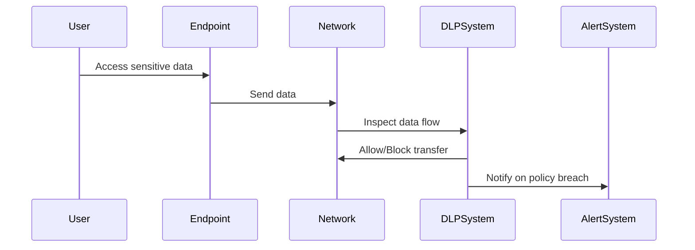

## Introduction

Data Loss Prevention (DLP) is a critical security pattern that aims to prevent unauthorized access to sensitive data and mitigate the risk of data exfiltration. This includes a combination of processes, technologies, and tools designed to detect and block potential breaches, ensuring data integrity and compliance with relevant regulations.

## Goals of DLP

- **Protect Sensitive Data**: Identify and safeguard sensitive data, whether in transit, at rest, or in use.
- **Regulatory Compliance**: Meet compliance requirements such as GDPR, HIPAA, or PCI-DSS by ensuring data security and traceability.
- **Risk Mitigation**: Block unauthorized data transfers to prevent data breaches and intellectual property theft.

## Architectural Approaches

### 1. Data Classification and Identification

Identify sensitive data across the organization using automated tools and manually defined policies. Classify data based on sensitivity level, compliance requirements, and business impact.

### 2. Policy Enforcement

Establish and enforce comprehensive policies to control data access and movement. This includes defining rules for encryption, access controls, and data sharing.

### 3. Monitoring and Discovery

Continuously monitor data activity across all endpoints, networks, and cloud services. Use discovery tools to map data flows and detect anomalies or unauthorized activities.

### 4. Endpoint and Network Protection

Deploy endpoint DLP solutions to monitor data on devices and servers. Use network-based DLP solutions for monitoring data in motion across corporate networks, including email and web traffic.

## Best Practices

- **Unified DLP Strategy**: Implement a cohesive DLP strategy that encompasses cloud, on-premises, and hybrid environments.
- **User Education**: Train employees about security policies and potential data loss threats.
- **Regular Audits**: Conduct regular audits and assessments to ensure DLP strategies remain effective and compliant.

## Example Code

### Example Policy Definition

For software applications that handle sensitive data, example code defining a policy rule might look like the following (using a hypothetical SDK):

```java
DLPService dlpService = new DLPService();

Policy personalDataPolicy = new Policy()
    .setName("Personal Data Protection")
    .setDescription("Policy to protect Personally Identifiable Information (PII)")
    .addRules(new Rule()
        .setCondition("containsPII")
        .setAction("encrypt"));

dlpService.addPolicy(personalDataPolicy);
```

## Diagrams

### Data Flow Monitoring Diagram



## Related Patterns

- **Identity and Access Management (IAM)**: Controls access to resources by managing user identities and permissions.
- **Encryption**: Protects data by converting it into a secure format that is unreadable without a decryption key.
- **Continuous Compliance**: Ensures continuous adherence to compliance regulations through automated tools and processes.

## Additional Resources

- [NIST Data Loss Prevention Guide](https://www.nist.gov/)
- [OWASP DLP Project](https://owasp.org/)
- [CNCF Security Best Practices](https://cncf.io/)

## Summary

Data Loss Prevention (DLP) is an essential pattern for securing sensitive data within organizations. By utilizing tools for data classification, monitoring, and protection, organizations can ensure compliance with regulations and protect against data breaches. Implementing a sound DLP strategy is crucial for maintaining trust and safeguarding intellectual property.
