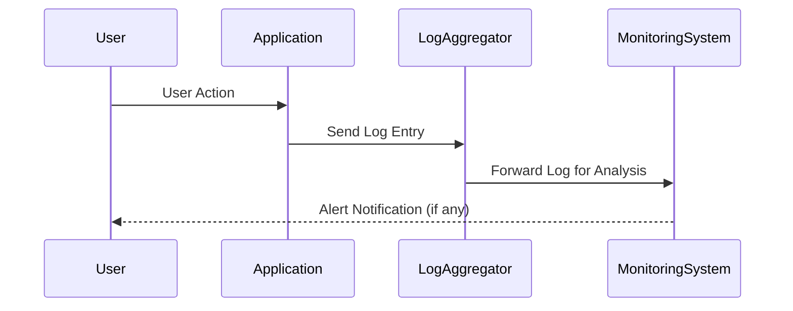

## Introduction

In today's complex cloud environments, maintaining a secure and compliant infrastructure is paramount. Audit logging and monitoring play a crucial role in ensuring that user activities and system changes are tracked effectively. This pattern facilitates compliance with regulations, enhances security posture, and supports forensic investigations after incidents.

## Design Pattern: Audit Logging and Monitoring

### Intent

The audit logging and monitoring pattern is designed to systematically record user activities, system events, and configuration changes within a cloud environment. This information is invaluable for compliance mandates, security auditing, performance monitoring, and troubleshooting purposes.

### Applicability

This pattern is applicable in any cloud environment where there is a need to:
- Ensure compliance with industry regulations (e.g., GDPR, HIPAA).
- Enhance security by detecting unauthorized access and anomalies.
- Provide clear audit trails for forensic analysis.
- Monitor system performance and availability.

### Architectural Approach

An effective audit logging and monitoring system involves several components and strategies:

1. **Centralized Log Aggregation**:
   - Collect logs from various sources (applications, databases, network devices).
   - Use tools like ELK Stack (Elasticsearch, Logstash, Kibana) or cloud-native solutions (e.g., AWS CloudWatch, Azure Monitor).

2. **Structured Log Formats**:
   - Employ JSON or XML for structured logs, enabling easier parsing and analysis.
  
3. **Real-time Monitoring and Alerts**:
   - Implement monitoring solutions to analyze logs in real time.
   - Configure alerts for predefined thresholds or suspicious activities using tools like Prometheus or Grafana.

4. **Access Management and Security**:
   - Secure access to logs and audit trails to prevent tampering.
   - Use encryption and role-based access control (RBAC).
   
5. **Retention Policies**:
   - Define data retention policies to balance compliance needs with storage costs.

### Example Code

Here's a simple example of setting up an audit log entry using Java, leveraging a logging framework like SLF4J:

```java
import org.slf4j.Logger;
import org.slf4j.LoggerFactory;

public class AuditLogger {
    private static final Logger auditLog = LoggerFactory.getLogger("AuditLog");

    public static void logUserActivity(String username, String action) {
        auditLog.info("User: {}, Action: {}", username, action);
    }
}

// Usage
AuditLogger.logUserActivity("john_doe", "Login Attempt");
```

### Diagram

Below is a simplified sequence diagram illustrating the audit logging and monitoring process:



### Best Practices

- **Ensure Consistency**: Use a consistent logging format and level across all components.
- **Protect Sensitive Data**: Mask or tokenize sensitive information in logs.
- **Automate Reports**: Develop automated reports for compliance audits.
- **Regular Audits**: Conduct regular reviews of logs and monitoring systems to identify configuration drift or security loopholes.

### Related Patterns

- **Event Sourcing**: Captures changes to application state as a sequence of events.
- **Circuit Breaker**: Protects services from cascading failures.
- **Health Endpoint Monitoring**: Ensures that the system's operational health is consistently checked.

### Additional Resources

- [AWS Logging and Monitoring Guide](https://docs.aws.amazon.com/general/latest/gr/aws-logging-monitoring.html)
- [Azure Monitor and Logging](https://azure.microsoft.com/en-us/services/monitor/)
- [Google Cloud Operations Suite](https://cloud.google.com/products/operations)

## Summary

The audit logging and monitoring pattern is a fundamental practice in cloud environments, enabling organizations to maintain compliance, enhance security, and conduct effective forensic analysis. By centering on structured log aggregation, real-time monitoring, and stringent access controls, businesses can protect their infrastructure and data integrity while meeting regulatory requirements.
