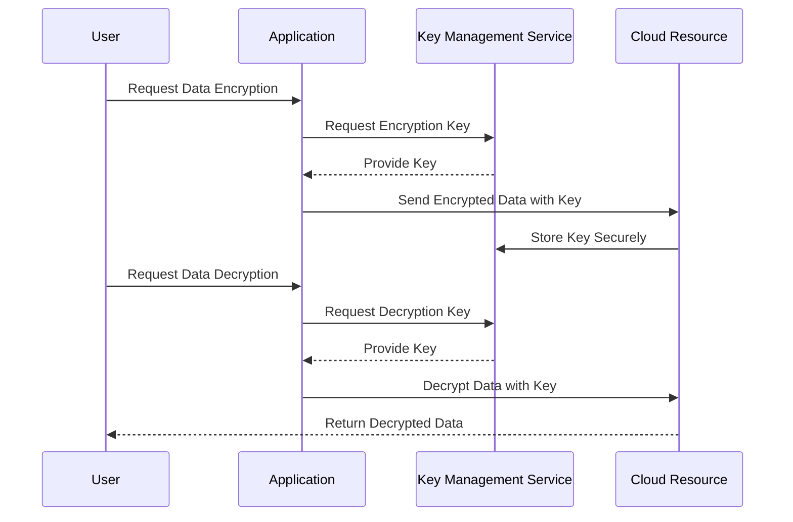

## Introduction

In the realm of cloud computing, **encryption key management** plays a pivotal role in securing data. The process involves managing cryptographic keys used for encryption and decryption, ensuring that data remains confidential and intact. Given the distributed nature of cloud environments, effective key management becomes crucial for compliance, security, and governance.

## Design Pattern Overview

Encryption key management encompasses the creation, distribution, storage, and destruction of cryptographic keys. This pattern ensures that keys are always secure and accessible only to authorized entities. The key management process involves:

- **Key Generation:** Creating secure cryptographic keys using proven algorithms and entropy sources.
- **Key Distribution:** Safely transmitting keys to authorized entities while preventing interception.
- **Key Storage:** Keeping keys in secure storage solutions, such as hardware security modules (HSMs) or key management services (KMS).
- **Key Usage:** Ensuring that keys are used solely for their intended purposes, respecting access controls and policies.
- **Key Rotation:** Regularly updating keys to mitigate risks associated with key compromise.
- **Key Revocation and Destruction:** Safely revoking and destroying keys when they are no longer required to minimize potential security breaches.

## Architectural Approaches & Paradigms

1. **Centralized Key Management Systems (KMS):** Centralized systems, such as AWS KMS or Azure Key Vault, provide a unified interface for managing encryption keys across cloud services, reducing complexity and improving security posture.

2. **Hardware Security Modules (HSMs):** HSMs offer physical and logical protection for cryptographic keys, delivering highly secure environments for key creation and management.

3. **Multi-cloud Key Management:** Employing key management solutions that operate seamlessly across different cloud providers to support multi-cloud strategies.

4. **Access Controls:** Implementing robust access control mechanisms to ensure that only authorized users and applications can manage or use encryption keys.

5. **Lifecycle Management:** Emphasizing the end-to-end management of cryptographic keys from creation to destruction, following best practices and compliance requirements.

## Best Practices

- **Adopt Strong Encryption Standards:** Use up-to-date encryption standards, such as AES-256 and RSA-2048, to safeguard data.
- **Automate Key Rotation:** Automate and regularly rotate keys to reduce the risk of key compromise.
- **Leverage Cloud Provider Services:** Utilize cloud provider security services like AWS Key Management Service (KMS), Azure Key Vault, or Google Cloud Key Management for integrated security.
- **Monitor Key Usage:** Implement logging and monitoring to detect unauthorized access and use of cryptographic keys.
- **Comply with Regulations:** Ensure key management practices comply with relevant regulations such as GDPR, HIPAA, and PCI DSS.

## Example Code

Here is an example of using AWS KMS to encrypt and decrypt data with a managed key:

```javascript
// Install AWS SDK: npm install aws-sdk
const AWS = require('aws-sdk');
const kms = new AWS.KMS();

// Encrypt data
const encryptData = async (plaintext) => {
    const params = {
        KeyId: 'arn:aws:kms:us-west-2:123456789012:key/abcdefg-1234-5678-9101-abcdefg123456', // Your KMS key ID
        Plaintext: plaintext
    };

    try {
        const data = await kms.encrypt(params).promise();
        console.log('Encrypted Data: ', data.CiphertextBlob.toString('base64'));
        return data.CiphertextBlob;
    } catch (err) {
        console.error(err);
    }
};

// Decrypt data
const decryptData = async (ciphertextBlob) => {
    const params = {
        CiphertextBlob: ciphertextBlob
    };

    try {
        const data = await kms.decrypt(params).promise();
        console.log('Decrypted Data: ', data.Plaintext.toString());
    } catch (err) {
        console.error(err);
    }
};

// Usage
(async () => {
    const data = 'My secret data';
    const encryptedData = await encryptData(data);
    await decryptData(encryptedData);
})();
```

## Diagrams

Below is a high-level sequence diagram illustrating the encryption key management process:



## Related Patterns and Descriptions

- **Secure Data Transmission:** Encrypt data in transit to secure communications between systems.
- **Data Integrity Patterns:** Ensure that data remains unchanged or unaltered over its lifecycle.
- **Access Control Security Pattern:** Enforce access restrictions to prevent unauthorized access to sensitive data and keys.

## Additional Resources

- [NIST Special Publication 800-57: Recommendations for Key Management](https://csrc.nist.gov/publications/detail/sp/800-57-part-1/rev-5/final)
- [AWS Key Management Service Documentation](https://docs.aws.amazon.com/kms/index.html)
- [Azure Key Vault Overview](https://docs.microsoft.com/en-us/azure/key-vault/general/overview)
- [Google Cloud Key Management](https://cloud.google.com/kms)

## Summary

Effective encryption key management is critical in safeguarding data against unauthorized access and ensuring compliance in cloud environments. By adhering to strong practices surrounding key creation, storage, rotation, and destruction, organizations can enhance their security posture. Leveraging cloud provider services for managing encryption keys simplifies operations and ensures robustness against potential threats and compliance violations.
