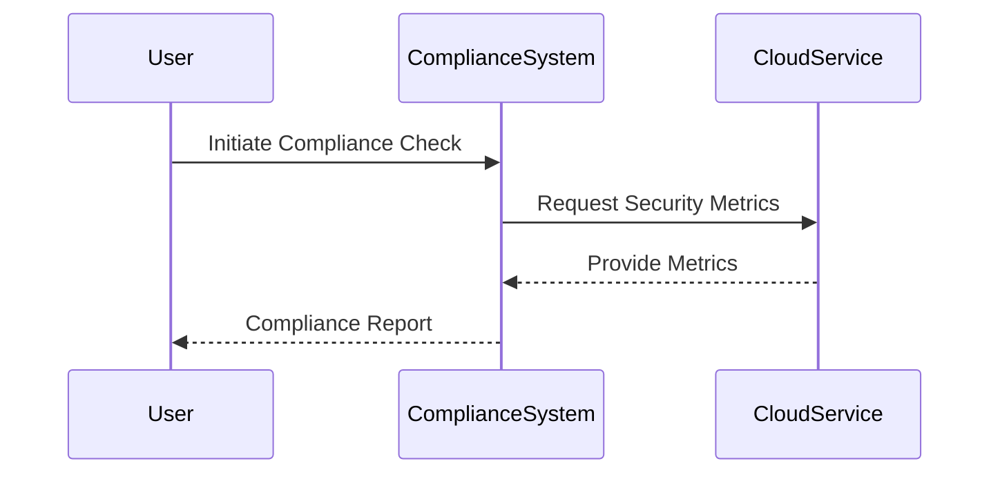

## Introduction

In today's dynamic cloud computing landscape, ensuring compliance with established security and governance standards is paramount. **Cloud Compliance Frameworks** provide a structured approach to adhering to prevalent standards such as ISO 27001, SOC 2, and NIST. These frameworks help organizations maintain robust security postures, manage risk effectively, and demonstrate accountability, thus facilitating trust with clients and stakeholders.

## Design Pattern: Cloud Compliance Frameworks

### Overview

Cloud compliance involves conforming to various regulations, standards, and best practices designed to protect data and ensure security in cloud environments. The compliance frameworks mentioned—ISO 27001, SOC 2, and NIST—serve as cornerstones for building secure, compliant cloud architectures.

#### ISO 27001

ISO 27001 is an international standard for managing information security. It enables organizations to manage the security of assets like financial information, intellectual property, employee details, and information entrusted by third parties. Implementing ISO 27001 within cloud environments ensures a systematic approach to managing sensitive company information, thereby preserving confidentiality, integrity, and availability (CIA).

#### SOC 2

SOC 2 (System and Organization Controls 2) is an auditing procedure that ensures service providers manage data securely to protect the privacy interests of an organization's clients. Compliance with SOC 2 involves adherence to five "trust service criteria": security, availability, processing integrity, confidentiality, and privacy. This framework is particularly relevant for cloud service providers, providing customers with peace of mind that service operations are performed with a stringent security focus.

#### NIST

The National Institute of Standards and Technology (NIST) provides a comprehensive set of guidelines and best practices for enhancing security in cloud environments, most notably through the NIST Cybersecurity Framework. By integrating the NIST guidelines, organizations can manage and reduce cybersecurity risk through a prioritized, flexible, repeatable, and cost-effective approach.

### Architectural Approaches

1. **Security Controls Implementation**:
   - Integrate security controls that align with specific compliance requirements into your cloud infrastructure; automate monitoring and enforcement where possible.

2. **Continuous Monitoring**:
   - Deploy continuous monitoring solutions to ensure ongoing compliance and security posture. Systems like AWS Config, Google Cloud Security Command Center, or Azure Security Center offer tools for automating governance.

3. **Data Encryption and Key Management**:
   - Utilize robust encryption practices and implement effective key management strategies to secure data at rest and in transit.

4. **Access Management**:
   - Implement strict identity and access management (IAM) practices, including using multi-factor authentication (MFA) and least-privilege access principles.

### Best Practices

- **Regular Audits and Assessments**: Conduct regular internal and external audits to ensure compliance with standards and identify areas for improvement.
  
- **Training and Awareness**: Continuously educate employees about compliance requirements and foster a culture of security awareness.
  
- **Documentation and Reporting**: Maintain detailed records of compliance and security efforts to demonstrate accountability and facilitate audit readiness.

### Example Code

Here's an example of implementing IAM policies to enforce least-privilege access in AWS:

```yaml
Version: "2012-10-17"
Statement:
  - Effect: "Allow"
    Action: "logs:*"
    Resource: "arn:aws:logs:us-east-1:123456789012:log-group:/aws/lambda/*"
  - Effect: "Deny"
    Action: "*"
    Resource: "*"
```

### Diagrams



### Related Patterns

- **Cloud Security Posture Management (CSPM)**: A pattern focusing on continuous monitoring and improvement of cloud security posture.
  
- **Data Masking**: Use this pattern to protect sensitive data in use, reducing exposure while ensuring compliance with privacy regulations.

### Additional Resources

- [ISO/IEC 27001 Information Security Management](https://www.iso.org/isoiec-27001-information-security.html)
- [AICPA SOC 2](https://www.aicpa.org/interestareas/frc/assuranceadvisoryservices/sorhome.html)
- [NIST Cybersecurity Framework](https://www.nist.gov/cyberframework)

## Summary

Adopting cloud compliance frameworks like ISO 27001, SOC 2, and NIST is crucial for maintaining a strong security posture in the cloud. By implementing robust security controls, practicing continuous monitoring, and adhering to compliance best practices, organizations can effectively manage risks and build trust with their stakeholders, ensuring a secure and compliant cloud environment.
