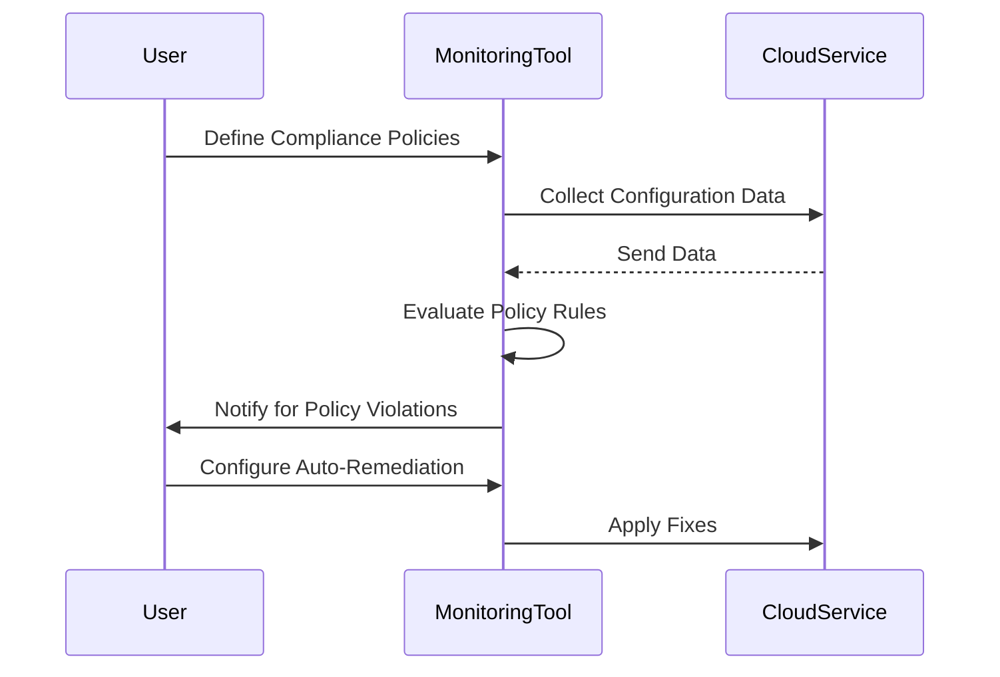

In cloud environments, maintaining compliance with various security and governance standards is a paramount challenge. Continuous Compliance Monitoring is a design pattern that employs automated tools and systems to ensure adherence to regulatory and corporate policies in real-time. This pattern enables organizations to maintain a steady compliance posture by continuously assessing and enforcing compliance requirements.

## Detailed Explanation

Continuous Compliance Monitoring involves utilizing monitoring tools to dynamically assess the compliance status of resources, infrastructure, and operations within a cloud environment. Instead of relying solely on periodic audits and manual checks, this pattern continuously evaluates compliance against predefined policies and regulatory requirements.

### Key Components:

- **Automated Compliance Tools**: Platforms that provide real-time assessments, often integrating with cloud services to track compliance.
- **Policy Definition and Management**: Centralized management of compliance policies, standards, and regulations.
- **Continuous Monitoring and Alerts**: Systems that provide continuous visibility and alerting for potential compliance violations.
- **Remediation Automation**: Capabilities to automatically remediate certain compliance issues, reducing risk and manual intervention.

## Architectural Approach

The architecture of a Continuous Compliance Monitoring system generally consists of:

1. **Data Collection**: Integration with various cloud and on-premises environments to collect data continuously.
2. **Policy Engine**: A rules engine that evaluates configuration and usage data against compliance policies.
3. **Alerting System**: Notification mechanisms that inform stakeholders of compliance breaches.
4. **Dashboard**: A user interface providing real-time visibility into the compliance status across systems.
5. **Integration with DevOps**: Combines with DevOps practices to ensure compliance is integrated into CI/CD pipelines.
6. **Machine Learning Capabilities**: Advanced systems use machine learning to identify patterns and predict potential compliance risks.

### Example Code

Here is a simple example using a monitoring tool API in Python to check for compliance violations:

```python
import requests

API_URL = "https://cloud-monitoring-service/api"
API_KEY = "your_api_key"
POLICY_ID = "compliance_policy_id"

def check_compliance():
    headers = {
        'Authorization': f'Bearer {API_KEY}',
    }
    response = requests.get(f"{API_URL}/compliance/check/{POLICY_ID}", headers=headers)
    if response.status_code == 200:
        result = response.json()
        for violation in result['violations']:
            print(f"Violation: {violation['detail']}")
    else:
        print("Failed to fetch compliance data")

check_compliance()
```

## Diagrams

### UML Sequence Diagram



## Related Patterns and Best Practices

- **Policy-Driven Security**: Establishing centralized policies to enforce security across environments.
- **Infrastructure as Code Compliance**: Integrating compliance checks into IaC tools for automated policy enforcement.
- **DevSecOps**: Embedding security and compliance practices into DevOps pipelines.

## Additional Resources

- [AWS Config](https://aws.amazon.com/config/): A service that allows you to assess, audit, and evaluate the configurations of your AWS resources.
- [Azure Policy](https://azure.microsoft.com/en-us/services/): Enables you to create, assign, and manage policies to enforce different rules over your resources.
- [Google Cloud Security Command Center](https://cloud.google.com/security-command-center): Provides centralized visibility into and control over your security status.

## Summary

Continuous Compliance Monitoring is a critical pattern in modern cloud architectures, enabling organizations to transition from static compliance checks to a dynamic, real-time assessment model. By integrating advanced tools and methodologies, businesses can significantly improve their security posture and compliance adherence, reducing risks associated with non-compliance and facilitating swift remediation of potential issues.
