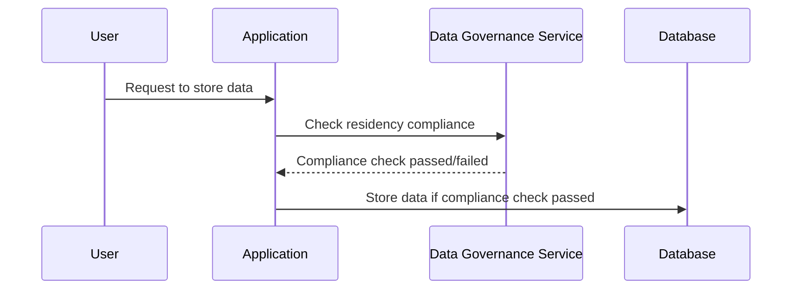

## Introduction

In the globalized cloud computing landscape, organizations often grapple with complex legal requirements regarding where data can reside and be processed. The **Data Residency Controls** pattern is crucial for ensuring that data storage and processing comply with geographic and jurisdictional regulations.

## Design Pattern Overview

Data Residency Controls involve designing systems and application architectures that restrict the geographical location of data based on compliance and regulatory requirements. This includes managing data so that it resides within specific regional boundaries to meet local or international laws.

### Key Considerations
- **Legal Compliance**: Adherence to local laws such as GDPR, CCPA, and other territorial regulations.
- **Data Sovereignty**: Ensuring data is subject to the laws applicable in the domain of the data's residence.
- **Geographic Constraints**: Configuring cloud resources for specific regional availability zones.
- **Data Localization**: Implementing localization policies to strictly dictate data flow and storage.

## Architectural Approaches

### Multi-Region Deployment Strategy

Deploy applications and databases across multiple regions to ensure data residency and redundancy. Each deployment must comply with local data storage laws and regulations.

```plaintext
Region 1           Region 2           Region 3
+----------------+ +----------------+ +----------------+
| User Requests  | | User Requests  | | User Requests  |
|   Regional     | |   Regional     | |   Regional     |
|   Load Balancer| |   Load Balancer| |   Load Balancer|
+-------+--------+ +-------+--------+ +-------+--------+
         |                  |                  |
+--------v--------+ +-------v--------+ +-------v--------+
| Application     | | Application     | | Application     |
| Logic - Region  | | Logic - Region  | | Logic - Region  |
| X               | | Y               | | Z               |
+--------+--------+ +-------+--------+ +-------+--------+
         |                  |                  |
+--------v--------+ +------v---------+ +-------v--------+
| Database -      | | Database -      | | Database -      |
| Region X        | | Region Y        | | Region Z        |
+-----------------+ +----------------+ +-----------------+
```

### Data Segmentation

Divide data storage and processing tasks among systems located within allowable jurisdictions. Techniques like sharding or partitioning can be used to keep sensitive data within specified regions.

### Geofencing

Implement geofencing at network and application layers to prevent data from exiting or entering non-compliant jurisdictions. Fine-grained controls ensure that data requests respect geographic boundaries.

## Best Practices

1. **Understand Legal Requirements**: Fully comprehend the legal landscape of every jurisdiction where the company operates.
2. **Design for Flexibility**: Use flexible architectures that can adapt to changing regulatory requirements.
3. **Leverage Cloud Capabilities**: Use built-in cloud services provided by AWS, Azure, or GCP that offer geographic compliance configurations.
4. **Regular Audits and Monitoring**: Regularly audit data residency compliance and monitor geographical data movement.

## Example Code

For example, in AWS using IAM policies and identity-based policies, you could specify S3 bucket location constraints:

```json
{
  "Version": "2012-10-17",
  "Statement": [
    {
      "Effect": "Deny",
      "Action": "s3:PutObject",
      "Resource": "arn:aws:s3:::my-bucket/*",
      "Condition": {
        "StringNotEquals": {
          "aws:RequestedRegion": "eu-west-1"
        }
      }
    }
  ]
}
```

This IAM policy ensures that any `PutObject` action in `my-bucket` will be denied if requests are made outside of the `eu-west-1` region.

## Diagrams

The following sequence diagram depicts a typical workflow in which data residency is verified before processing a data request:



## Related Patterns

- **Geolocated Data Access**: Focuses on efficiently routing user requests to nearest data location ensuring low latency.
- **Distributed Data Management**: Deals with managing distributed data sets while respecting decentralization and regulatory constraints.

## Additional Resources

- [Cloud Data Residency: A Practical Guide](https://cloud-compliance-resource.com)
- [AWS Regional Data Compliance](https://aws.amazon.com/compliance/regional-data-compliance/)
- [Understanding GDPR and Cloud Data Residency](https://gdpr-info-resource.com)

## Summary

The **Data Residency Controls** design pattern is critical for any organization operating within multiple jurisdictions, helping to enforce legal compliance through strategic data management and technology solutions. By structuring cloud deployments to adhere strictly to diverse regional laws, businesses safeguard themselves against legal infractions while leveraging cloud technologies effectively. 선택하다
