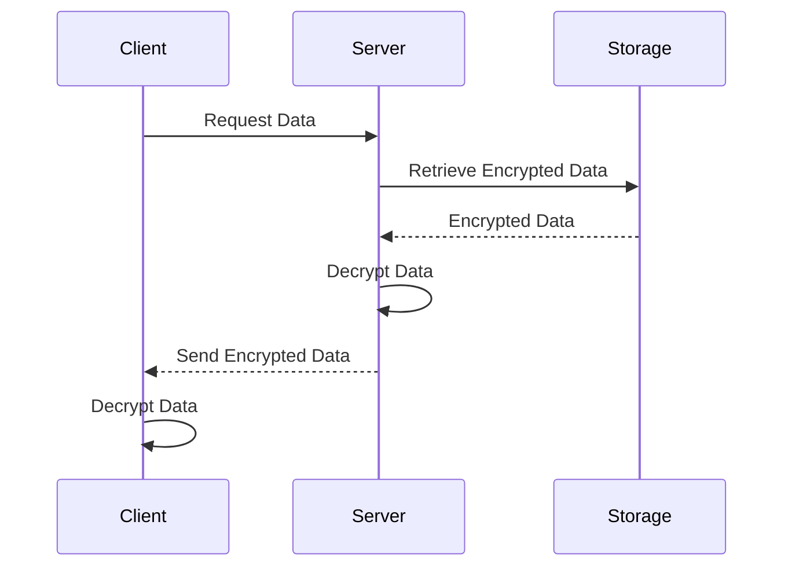

## Overview

In the era of cloud computing, the importance of safeguarding sensitive data cannot be overstated. The **Encryption at Rest and in Transit** pattern is a vital strategy in cloud security, focusing on protecting data both when it is stored (at rest) and when it is being transferred across networks (in transit). Using encryption as a method of securing data helps ensure confidentiality and compliance with numerous regulatory standards.

## Detailed Explanation

### Encryption at Rest

Encryption at rest refers to the protection of data stored in any digital format. This includes files on disk, databases, backup media, etc. The goal is to prevent unauthorized access to the unencrypted data. Various techniques are applied, such as:

- File/Folder Level Encryption: Encrypt specific files or folders to protect the data within them.
- Whole Disk Encryption: Utilizes encryption software to encrypt the entire storage disk, offering a broader range of data protection.
- Database Encryption: Techniques to encrypt sensitive fields within databases to ensure their safety.

Common encryption standards include AES (Advanced Encryption Standard) with 256-bit keys, ensuring highly secure encryption levels.

### Encryption in Transit

Encryption in transit involves securing data as it travels from one location to another, preventing interception and unauthorized access during its journey. Techniques commonly used are:

- TLS (Transport Layer Security): Ensures secure connections over networks by encrypting data in transit.
- HTTPS: The secure version of HTTP, which uses TLS to secure the communication between a client (browser) and a server.
- VPN (Virtual Private Network): Provides an encrypted tunnel for data to ensure privacy over public networks.

These measures are critical for securing data as it traverses potentially unsafe environments, such as the internet.

## Architectural Approaches and Best Practices

1. **Use Strong Encryption Algorithms**: Implement industry-standard algorithms like AES for encryption at rest and TLS for encryption in transit to provide strong security assurances.
2. **Key Management**: Employ secure key management solutions to protect and control access to encryption keys. Cloud providers often offer managed key management services.
3. **Automate Encryption**: Wherever possible, automate encryption tasks to ensure consistency and compliance.
4. **Conduct Regular Audits**: Regularly audit your encryption processes and configurations to detect any vulnerabilities or misconfigurations.
5. **Adopt Layered Security**: Implement additional security measures alongside encryption, such as access controls and intrusion detection systems, to strengthen overall security.

## Example Code

Here’s a simple example using Java to encrypt and decrypt data using AES:

```java
import javax.crypto.Cipher;
import javax.crypto.KeyGenerator;
import javax.crypto.SecretKey;
import javax.crypto.spec.SecretKeySpec;
import java.util.Base64;

public class EncryptionExample {

    public static String encrypt(String plainText, SecretKey key) throws Exception {
        Cipher cipher = Cipher.getInstance("AES");
        cipher.init(Cipher.ENCRYPT_MODE, key);
        byte[] encryptedBytes = cipher.doFinal(plainText.getBytes());
        return Base64.getEncoder().encodeToString(encryptedBytes);
    }

    public static String decrypt(String encryptedText, SecretKey key) throws Exception {
        Cipher cipher = Cipher.getInstance("AES");
        cipher.init(Cipher.DECRYPT_MODE, key);
        byte[] decryptedBytes = cipher.doFinal(Base64.getDecoder().decode(encryptedText));
        return new String(decryptedBytes);
    }

    public static void main(String[] args) throws Exception {
        KeyGenerator keyGen = KeyGenerator.getInstance("AES");
        keyGen.init(256);
        SecretKey key = keyGen.generateKey();

        String encrypted = encrypt("Hello, Cloud!", key);
        System.out.println("Encrypted: " + encrypted);

        String decrypted = decrypt(encrypted, key);
        System.out.println("Decrypted: " + decrypted);
    }
}
```

## Diagrams

### Encryption Workflow Sequence Diagram



## Related Patterns and Resources

- **Identity and Access Management**: Ensures that only authorized users are able to access sensitive data.
- **Data Masking**: Anonymizes real data for protection while maintaining the usability for testing and development.
- **TLS Termination**: Handles the overhead of encrypting and decrypting data closer to the data source, often at a reverse proxy level.

### Additional Resources

- [NIST Guidelines on Cryptography](https://csrc.nist.gov/publications/sp)
- [Cloud Security Alliance - Best Practices for Securing Cloud Applications](https://cloudsecurityalliance.org/)
- [AWS Encryption SDK](https://docs.aws.amazon.com/encryption-sdk/latest/developer-guide/)

## Summary

The **Encryption at Rest and in Transit** pattern plays a crucial role in ensuring data security and compliance in cloud environments. By employing strong encryption techniques and best practices, organizations can protect sensitive data from unauthorized access and potential breaches. Embracing these strategies not only fortifies security but also builds trust and compliance in the emerging landscape of cloud computing.
