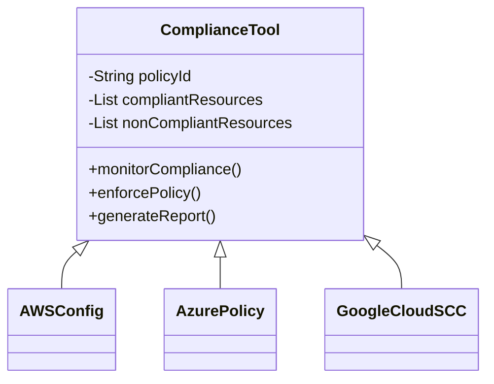
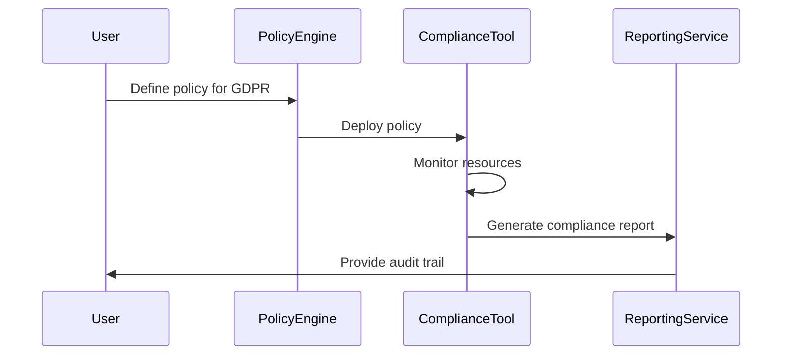

## Overview

In modern cloud environments, the necessity to comply with various international and local regulations is becoming increasingly critical. Regulations like the General Data Protection Regulation (GDPR) and the Health Insurance Portability and Accountability Act (HIPAA) set strict guidelines on data protection and privacy. Adhering to these regulations manually can be labor-intensive, prone to errors, and not scalable for large systems. **Compliance Automation** offers a solution by employing tools and processes to automatically monitor, verify, and enforce compliance requirements.

## Design Pattern Explanation

### Key Concepts

1. **Automated Monitoring:** Continuously checks cloud environments for compliance with regulatory requirements.
2. **Policy Enforcement:** Automatically applies and enforces policies that align with compliance standards.
3. **Audit and Reporting:** Generates reports and audit trails that are essential for demonstrating compliance during inspections.
4. **Risk Assessment:** Identifies and evaluates compliance risks proactively.

### Architectural Approach

In a cloud environment, compliance automation can be achieved through a layered approach:

1. **Policy Definition Layer:** Define rules and policies that align with required compliance standards.
   
2. **Automation Layer:** Utilize tools like AWS Config, Azure Policy, or Google Cloud Security Command Center to automate the application of these policies.

3. **Monitoring and Logging Layer:** Implement tools for real-time monitoring and logging for audit trails. These could include Splunk, ELK Stack, or native cloud services.

4. **Alerting and Response Layer:** Set up alert systems using third-party tools or native solutions like AWS CloudWatch to notify stakeholders of non-compliance and trigger automated responses.

### Example Code

Basic pseudocode for implementing a Lambda function in AWS for compliance monitoring:

```javascript
exports.handler = async (event) => {
    const AWS = require('aws-sdk');
    const configservice = new AWS.ConfigService();
    
    const params = {
        ConfigRuleNames: [
            'ec2-instance-managed-by-s3-policy',
        ],
    };
    
    try {
        const data = await configservice.describeComplianceByConfigRule(params).promise();
        console.log('Compliance details:', JSON.stringify(data));
    } catch (err) {
        console.error('Error fetching compliance details:', err);
    }
};
```

## Diagrams

### UML Class Diagram



### UML Sequence Diagram



## Related Patterns

- **Policy Management:** Focuses on the definition and application of policies in an automated manner.
- **Security Monitoring:** Involves tools and processes to detect and respond to security threats and breaches.
- **Audit Logging and Monitoring:** Ensures that comprehensive logs are maintained for all operations, aiding in compliance and security.

## Additional Resources

- [AWS Compliance](https://aws.amazon.com/compliance/)
- [Azure Compliance Offerings](https://azure.microsoft.com/en-us/overview/trusted-cloud/compliance/)
- [Google Cloud Compliance](https://cloud.google.com/learn-more/compliance)

## Summary

Compliance Automation bridges the gap between rapidly evolving cloud infrastructures and stringent regulatory requirements. By automating compliance checks and enforcement, organizations can mitigate the risk of non-compliance, reduce operational costs, and ensure data protection. This pattern is crucial for businesses striving to maintain trust, transparency, and legal integrity while leveraging cloud computing's benefits.
