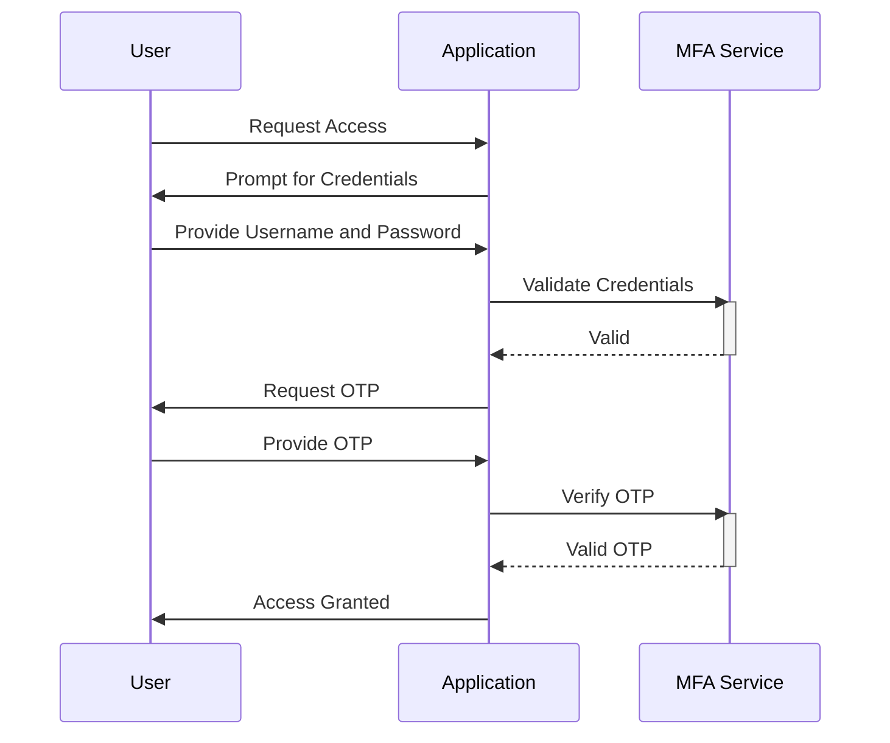

## Overview

Multi-Factor Authentication (MFA) is a security design pattern that requires users to provide two or more verification factors to gain access to a resource such as an application, online account, or a VPN. This security measure leverages something the user knows (password), something the user has (security token), and/or something the user is (biometric verification). MFA provides a critical layer of protection, reducing the likelihood of unauthorized access and potential breaches in cloud-based systems.

## Detailed Explanation

### Architectural Approaches

1. **Knowledge-Based Factors**: Require the user to provide information only they should know, like passwords or PINs.
2. **Possession-Based Factors**: Involve something the user owns, such as a mobile device or a hardware token generating time-based one-time passwords (TOTP).
3. **Inherence-Based Factors**: Use biometric data, such as fingerprints, voice recognition, or facial scans, to verify identity.

### Best Practices

- **User Experience**: Ensure MFA processes are user-friendly to avoid frustrating legitimate users. Implement options like push notifications for ease of use.
- **Fall-back Mechanisms**: Provide alternatives for users who cannot access their secondary authentication method.
- **Real-time Monitoring**: Use AI and ML for monitoring login attempts to quickly detect and analyze dubious sign-in patterns.
- **Role-Based Access Control (RBAC)**: Integrate MFA with RBAC for granular security. High-risk operations should require MFA.

## Example Code

Here's an example of implementing a basic two-factor authentication (2FA) in a Node.js application using TOTP.

```javascript
const speakeasy = require('speakeasy');
const qrcode = require('qrcode');

const secret = speakeasy.generateSecret({ name: "MyApp" });

// Generate QR code for scanning via an authenticator app
qrcode.toDataURL(secret.otpauth_url, (err, data) => {
  console.log(data);
});

// Verify a provided token
function verifyToken(token) {
  const verified = speakeasy.totp.verify({
    secret: secret.base32,
    encoding: 'base32',
    token
  });

  return verified;
}

console.log(verifyToken('123456')); // Example token verification
```

## Diagrams

### MFA Sequence



## Related Patterns

- **Single Sign-On (SSO)**: While SSO allows users to authenticate once and access multiple systems, integrating SSO with MFA further enhances security.
- **Encryption**: Secure data in transit and at rest, often coupled with MFA for securing sensitive transactions.

## Additional Resources

- [NIST Digital Identity Guidelines](https://pages.nist.gov/800-63-3/)
- [OWASP Authentication Cheat Sheet](https://cheatsheetseries.owasp.org/cheatsheets/Authentication_Cheat_Sheet.html)

## Summary

Multi-Factor Authentication is a vital pattern in modern cloud security architectures. It significantly strengthens the authentication process by adding multiple verification layers, thus reducing the risk of unauthorized access. Implementing MFA should consider the balance between security and user convenience, while making sure backup options are in place and monitoring tools are utilized for real-time threat detection.
