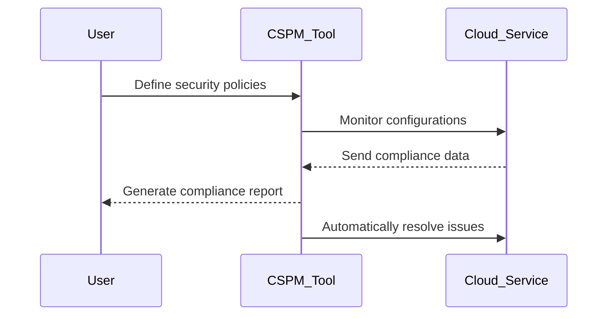

## Introduction

In an increasingly cloud-centric world, ensuring the security and compliance of cloud environments is essential. **Cloud Security Posture Management (CSPM)** addresses this need by providing tools and processes that continuously monitor cloud environments for security threats and compliance risks, taking a proactive approach to securing cloud resources.

## Design Pattern Overview

### Description

Cloud Security Posture Management (CSPM) focuses on enhancing cloud security by:

- **Continuous Monitoring:** Regularly checking the cloud environment for vulnerabilities, misconfigurations, and unauthorized access.
- **Threat Detection:** Identifying and addressing potential security threats in real-time.
- **Compliance Auditing:** Ensuring that cloud infrastructure complies with industry regulations and standards (e.g., GDPR, HIPAA, PCI-DSS).
- **Automated Remediation:** Automatically resolving detected issues to minimize security risks.
- **Reporting and Analytics:** Providing insights and reports that highlight potential vulnerabilities and compliance gaps.

### Architectural Approach

Implementing CSPM involves integrating security tools and practices into the cloud architecture. Key components include:

1. **Cloud Integrations:** Connect CSPM tools with various cloud service providers (CSPs) to gather configuration data and monitor activities.
2. **Security Policies:** Define policies that outline security requirements and compliance standards tailored to the organization's needs.
3. **Automation Workflows:** Use automated workflows to detect and remediate issues, ensuring timely actions.
4. **Alerting Mechanisms:** Configure alerts for stakeholders about potential threats and non-compliance events.

## Best Practices

- **Policy-Based Management:** Establish clear security policies that the CSPM tool can enforce across all cloud assets.
- **Regular Audits:** Conduct consistent audits and assessments to ensure continuous posture improvement.
- **Collaboration:** Foster communication among DevSecOps teams to unify security efforts.
- **Customization:** Tailor CSPM tools to meet organizational requirements, including integration with existing security protocols and policies.

## Example Code

Here's a simplified Python example using Boto3 to check for public access to S3 buckets, a common security concern:

```python
import boto3

def check_s3_buckets_public_access():
    s3 = boto3.client('s3')

    response = s3.list_buckets()
    for bucket in response['Buckets']:
        bucket_name = bucket['Name']
        bucket_acl = s3.get_bucket_acl(Bucket=bucket_name)

        for grant in bucket_acl['Grants']:
            if grant['Grantee']['Type'] == 'Group' and 'AllUsers' in grant['Grantee']['URI']:
                print(f'Bucket {bucket_name} is publicly accessible!')
            else:
                print(f'Bucket {bucket_name} is secured.')

check_s3_buckets_public_access()
```

## Diagrams

### UML Sequence Diagram



## Related Patterns

- **Infrastructure as Code (IaC):** Automate and manage cloud infrastructure using code, ensuring consistent security posture.
- **Zero Trust Architecture:** Ensure that every access request is authenticated and verified, regardless of its origin.

## Additional Resources

- [NIST Cloud Computing Security](https://csrc.nist.gov/Projects/cloud-computing)
- [CIS Cloud Security Benchmarks](https://www.cisecurity.org/cis-benchmarks/)
- [AWS Security Blog](https://aws.amazon.com/blogs/security/)

## Summary

Cloud Security Posture Management (CSPM) plays a critical role in maintaining the security and compliance of cloud infrastructures. By continuously monitoring cloud environments, detecting threats, and automating remediation efforts, CSPM enables organizations to enhance their security posture and ensure adherence to regulatory standards. Implementing CSPM effectively requires integration, vigilance, and cooperation across security and development teams, paving the way for a secure cloud presence.
