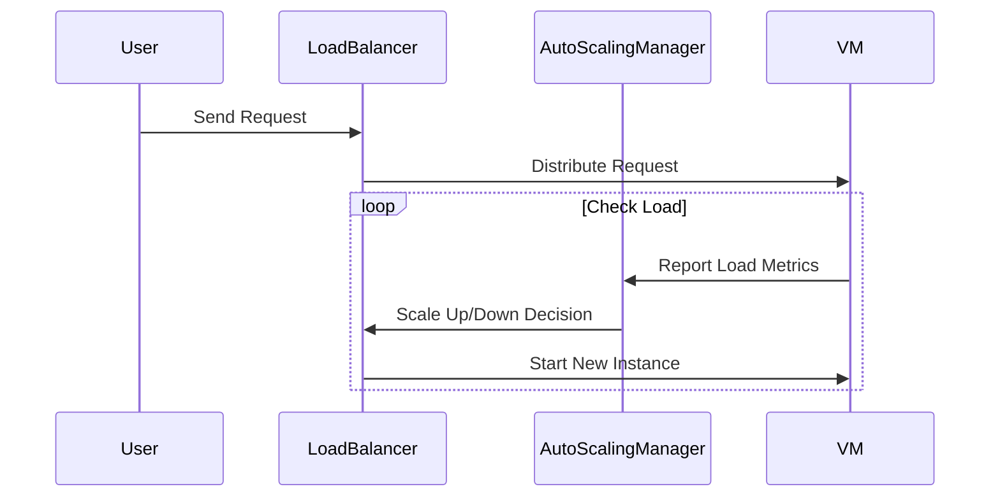

## Introduction

In the realm of cloud computing, **Auto-Scaling Resources** is a critical design pattern that addresses the ever-changing demands on compute resources. By dynamically adjusting these resources based on current demand, this pattern ensures optimal performance and cost-efficiency, providing a responsive and scalable architecture.

## Pattern Explanation

The Auto-Scaling pattern allows systems to automatically increase or decrease the number of compute resources, such as virtual machines or containers, according to the workload's demands. This is important for maintaining performance during peaks and reducing costs during low usage periods.

### Benefits

- **Cost Efficiency**: Reduces expenses by minimizing idle resources.
- **Performance Optimization**: Automatically scales resources to meet demand peaks without manual intervention.
- **Scalability**: Ensures that applications maintain performance even as demand grows.
- **Flexibility**: Supports diverse workloads and can adapt to changes in usage patterns.

### Challenges

- **Configuration Complexity**: Setting up auto-scaling correctly can be complex and requires understanding the application's behavior.
- **Delayed Response**: There may be a delay between the need for additional resources and the time they come online, potentially leading to performance issues.
- **Over-Provisioning Risk**: Incorrectly set thresholds could result in over-provisioning resources unnecessarily.

## Architectural Approach

Auto-scaling is typically implemented using rules or schedules within cloud platforms:

1. **Threshold-Based Rules**: Define rules based on metrics like CPU usage, memory usage, or custom application metrics. When metrics exceed a threshold, scaling actions are triggered.
2. **Predictive Scaling**: Utilizes machine learning algorithms to predict future traffic patterns and scale resources preemptively.
3. **Scheduled Scaling**: Predefine scaling based on known periods of high demand, such as sales events or end-of-month processing.

### Cloud Provider Support

- **AWS Auto Scaling**: Supports automatic scaling of EC2 instances, ECS, DynamoDB, and RDS.
- **Google Cloud Auto Scaling**: Provides automated scaling for Compute Engine instances and Kubernetes Engine.
- **Azure Autoscale**: Manages scaling for Virtual Machines, App Services, and more.

## Best Practices

- **Monitor Continuously**: Use comprehensive monitoring to adjust auto-scaling policies as application usage patterns change.
- **Design for Failover**: Ensure that auto-scaled instances can handle failures without affecting application performance.
- **Set Adequate Cool Down Periods**: Time between scale events should be configured to prevent resource thrashing.
- **Cost Monitoring**: Regularly review billing data to ensure that cost savings from scaling are realized.

## Example Code

Below is a simplified example of setting up an auto-scaling group in AWS using the AWS SDK for Java:

```java
// Initialize the client
AmazonAutoScaling client = AmazonAutoScalingClientBuilder.defaultClient();

// Create Auto Scaling Request
CreateAutoScalingGroupRequest request = new CreateAutoScalingGroupRequest()
    .withAutoScalingGroupName("example-asg")
    .withInstanceId("ami-12345678")
    .withMinSize(1)
    .withMaxSize(10)
    .withDesiredCapacity(2)
    .withVPCZoneIdentifier("subnet-abcde123");

// Execute creation
client.createAutoScalingGroup(request);
```

## Diagram

Here is a simple sequence diagram illustrating the flow of Auto-Scaling using a threshold-based rule:



## Related Patterns

- **Bursting**: Expanding capabilities using resources from a secondary provider.
- **Queue-Centric Workflow**: Buffering requests through a queuing service to manage compute workloads.
- **Service Discovery**: Automatically detecting changes in infrastructure that arise from scaling.

## Additional Resources

- [AWS Auto Scaling Documentation](https://docs.aws.amazon.com/autoscaling/index.html)
- [Google Cloud Auto Scaling Documentation](https://cloud.google.com/compute/docs/autoscaler)
- [Azure Autoscale Documentation](https://docs.microsoft.com/en-us/azure/monitoring-and-diagnostics/insights-autoscale-best-practices)

## Summary

The **Auto-Scaling Resources** pattern is pivotal in creating cloud environments that can efficiently respond to fluctuating demands. By automating the scaling of compute resources, organizations can gain better control over costs while maintaining consistent application performance. With careful configuration and ongoing monitoring, auto-scaling can significantly enhance both operational efficiency and user experience in cloud-based systems.
