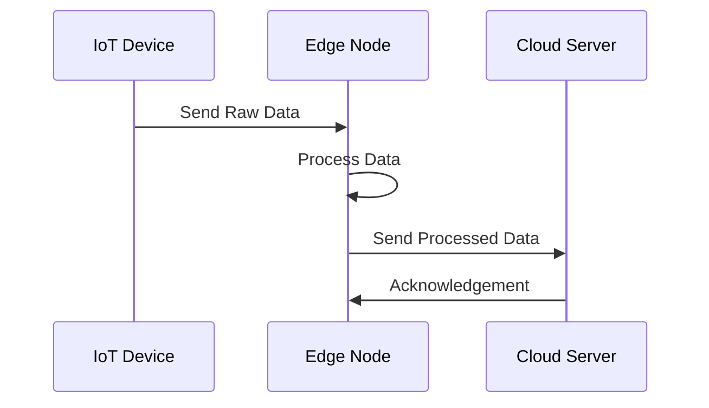

## Introduction

Edge Computing is a paradigm that brings computation and data storage closer to the location where it is needed, to improve response times and save bandwidth. In contrast to the traditional cloud computing approach which centralizes processing in large data centers, edge computing moves these tasks to network edges, where the data is generated or consumed.

## Detailed Explanation

In the age of IoT devices, autonomous vehicles, smart cities, and advanced mobile applications, real-time processing of large volumes of data is crucial. The Edge Computing pattern addresses the need for low-latency data processing by placing resources closer to data generation points.

### Architectural Approach

1. **Proximity to Data Sources**: By placing compute resources at the edge of the network, closer to the data source, edge computing reduces the distance data must travel, thereby reducing latency.
  
2. **Data Filteration**: It enables processing tasks such as data filtering, aggregation, and preliminary analysis at the edge, ensuring only the most relevant data is sent to the central cloud.

3. **Decentralized Processing**: Distributing tasks across multiple edge nodes allows for scalable and reliable systems that are resilient to failure.

4. **Local Data Retention**: Sensitive data can be processed locally, minimizing exposure and improving security.

### Example Code

Below is a simple illustration using Python to simulate an IoT device processing data at the edge.

```python
class EdgeDevice:
    ''' Simulates an edge device that processes sensor data locally '''
    
    def __init__(self, sensor_data):
        self.sensor_data = sensor_data
    
    def process_data(self):
        # Simulate data processing such as filtering out noise
        processed_data = [x for x in self.sensor_data if x > threshold]
        return processed_data
    
    def send_data(self, cloud_endpoint):
        if processed_data := self.process_data():
            # Send only important data to the cloud
            response = requests.post(cloud_endpoint, json={'data': processed_data})
            print(f"Data sent to cloud: {response.status_code}")
        else:
            print("No significant data to send.")

threshold = 10
device = EdgeDevice([5, 13, 4, 17, 9, 15])
device.send_data('https://cloud.endpoint/api/upload')
```

### Diagrams

Below is a simplified UML sequence diagram illustrating the interaction between devices and cloud using edge computing.



### Best Practices

- **Security and Privacy**: Implement encryption and authentication on edge devices to secure communications with the cloud.
- **Scalability**: Design edge nodes to handle varying loads and seamlessly integrate additional nodes.
- **Interoperability**: Ensure that edge computing solutions work across diverse hardware and software environments.
- **Management and Monitoring**: Employ tools that facilitate remote monitoring and management of edge devices.

## Related Patterns

- **Content Delivery Network (CDN)**: Like edge computing, CDNs bring content closer to end-users but focus on replicated static content rather than real-time computing.
  
- **Fog Computing**: An extension of edge computing, with additional layers of processing, storage, and networking at intermediary nodes between the cloud and devices.

## Additional Resources

- [Edge Computing: Vision and Challenges](https://example.com/resource1)
- [Managing The Data Tsunami with Edge Processing](https://example.com/resource2)
- [Securing Edge Devices in a Cloud Ecosystem](https://example.com/resource3)

## Summary

Edge Computing is a transformative approach designed to handle the vast data flow of modern digital applications efficiently. By decentralizing processing and filtering data at the network edge, it minimizes latency and reduces cloud load, which is particularly advantageous for real-time applications. Implementing best practices around security, scalability, and management ensures that the full potential of edge computing is realized within cloud ecosystems.
