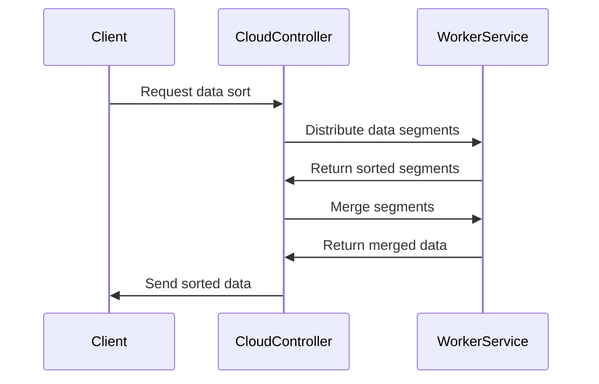

## Introduction

In the realm of cloud computing, performance optimization requires a keen focus on choosing and implementing algorithms that provide the best combination of time and space complexity. The **Efficient Algorithm Implementation** pattern speaks to the strategic use of computational methods that minimize resource consumption and latency across distributed cloud environments. This pattern is crucial in ensuring scalable, responsive, and cost-effective cloud applications.

## Detailed Explanation

Efficient algorithm implementation is not just about choosing the fastest or least memory-hungry algorithm but also about aligning these choices with the unique requirements and constraints of the cloud environment. Cloud resources, while elastic and theoretically limitless, come at a cost, both in terms of performance throttling and monetary expenses. Effective algorithms should thus capitalize on:

- **Time Complexity**: Choosing algorithms that perform tasks in as few steps as possible, usually denoted by Big O notation, such as O(n), O(log n), etc.
- **Space Complexity**: Algorithms should efficiently use memory, ensuring minimal storage overhead, which is crucial in environments with large data sets.
- **Scalability**: Design algorithms that perform efficiently when scaled across multiple servers or data centers.
- **Parallelizability**: Favor algorithms that can be distributed to run concurrently across multiple resources in the cloud.

## Best Practices

1. **Profiling and Benchmarking**: Measure algorithm performance under real-world conditions. Utilizing tools like JMH for Java or py-spy for Python can help understand the bottlenecks.
2. **Latency Consideration**: Minimize network calls and reduce the algorithm's dependency on data that requires frequent retrieval over a network.
3. **Load Testing**: Simulate peak demand scenarios to ensure the algorithm remains performant under stress.
4. **Code Optimization**: Use language-specific optimizations and efficient data structures, e.g., using concurrent data structures in Java’s `java.util.concurrent` package.
5. **Caching Mechanisms**: Implement caching to store frequently accessed data for quick retrieval.

## Example Code

Here is a simple Java example using an efficient implementation of the Merge Sort algorithm, which is known for its O(n log n) time complexity and offers an exemplary balance for cloud-based environments:

```java
public class MergeSort {

    public static void mergeSort(int[] array, int left, int right) {
        if (right <= left) return;
        int mid = (left + right) >> 1;
        mergeSort(array, left, mid);
        mergeSort(array, mid + 1, right);
        merge(array, left, mid, right);
    }

    private static void merge(int[] array, int left, int mid, int right) {
        int[] leftArray = java.util.Arrays.copyOfRange(array, left, mid + 1);
        int[] rightArray = java.util.Arrays.copyOfRange(array, mid + 1, right + 1);
        
        int i = 0, j = 0, k = left;
        while (i < leftArray.length && j < rightArray.length) {
            if (leftArray[i] <= rightArray[j]) {
                array[k++] = leftArray[i++];
            } else {
                array[k++] = rightArray[j++];
            }
        }

        while (i < leftArray.length) {
            array[k++] = leftArray[i++];
        }

        while (j < rightArray.length) {
            array[k++] = rightArray[j++];
        }
    }
}
```

This implementation is memory-efficient, using temporary arrays only during the merge phase, and is suitable for distributed cloud execution when integrated with cloud streaming tools such as Apache Kafka.

## Diagrams

Below is a simple sequence diagram illustrating the data flow during the merge sort of executing the merge phase in a distributed cloud setup:



## Related Patterns

1. **Auto-Scaling**: Leveraging elasticity to dynamically increase or decrease resource allocation as algorithm demand changes.
2. **Load Balancing**: Distributing workloads uniformly across resources to prevent any single point of failure.
3. **Distributed Caching**: Reducing the need for recomputation by storing intermediate results.

## Additional Resources

- [Introduction to Algorithms by Cormen et al.](https://mitpress.mit.edu/9780262046305/introduction-to-algorithms/)
- [Effective Java by Joshua Bloch](https://www.oreilly.com/library/view/effective-java/9780134686097/)
- [Design and Analysis of Algorithms](https://sa2cweb.ssd.hp.com/related_books/design_analysis_of_algorithims.pdf)

## Summary

The Efficient Algorithm Implementation pattern is a cornerstone of designing performance-optimized cloud applications. By employing algorithms with optimal time and space complexity, developers can ensure their applications run efficiently despite the demands of distributed systems and large-scale data processing. Adopting best practices around algorithm selection, optimization, and resource management is vital in leveraging the full potential of cloud capabilities while maintaining cost-effectiveness and responsiveness.
