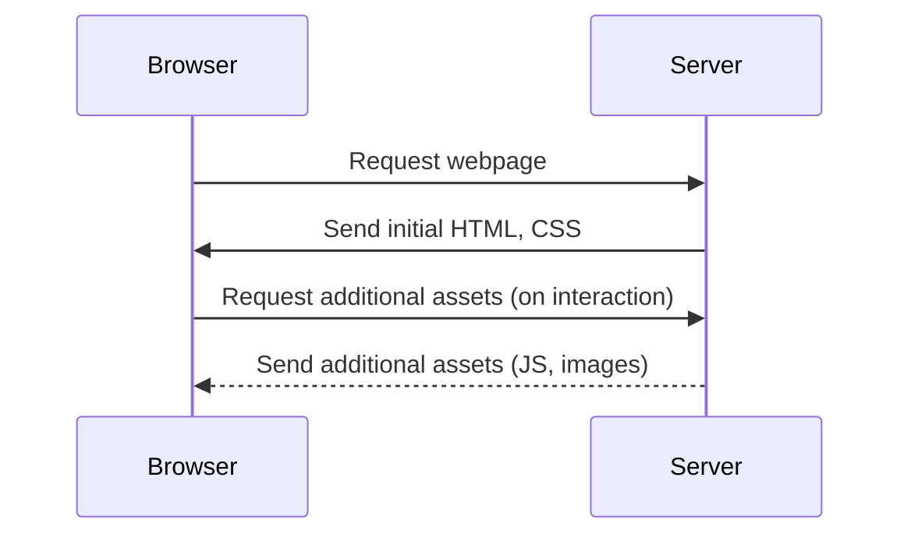

---

linkTitle: "Lazy Loading and Deferred Initialization"
title: "Lazy Loading and Deferred Initialization: Performance Optimization in Cloud"
category: "Performance Optimization in Cloud"
series: "Cloud Computing: Essential Patterns & Practices"
description: "Lazy Loading and Deferred Initialization involves loading resources only when they are needed, optimizing resource usage and performance in cloud computing environments."
categories:
- Performance Optimization
- Cloud Computing
- Design Pattern
tags:
- lazy loading
- deferred initialization
- cloud performance
- resource optimization
- design patterns
date: 2024-07-07
type: docs

canonical: "https://softwarepatternslexicon.com/18/18/12"
license: "© 2024 Tokenizer Inc. CC BY-NC-SA 4.0"
---

## Introduction

The design pattern of **Lazy Loading and Deferred Initialization** is a technique used to enhance performance and resource management in software applications, particularly in cloud computing environments. By loading resources only when they are needed, lazy loading minimizes unnecessary resource consumption, decreases application load time, and optimizes network bandwidth usage.

## Architectural Approach

Lazy Loading and Deferred Initialization focus on postponing the loading or initialization of a resource until the moment it is actually required. This approach can be implemented in various scenarios including web applications, data loading, and even cloud service provisioning.

### Key Architectural Concepts

- **On-Demand Initialization**: Resources such as objects, files, or network connections are created or opened only when a program explicitly requests them.

- **Proxy Objects**: Implement proxy objects that stand in for expensive-to-initialize real objects. These proxies can handle instantiation and initialization when required.

- **Dependency Injection**: Utilize lazy loaders in dependency injection to defer the initialization of a service until it is invoked.

- **Caching**: Combine lazy loading with caching to avoid redundant loading once a resource is initialized for the first time.

## Example Code

Here's an example illustrating lazy loading in Java using the Singleton Design Pattern:

```java
public class LazyLoadedSingleton {
    private static LazyLoadedSingleton instance;

    private LazyLoadedSingleton() {
        // Initialization logic
    }

    public static LazyLoadedSingleton getInstance() {
        if (instance == null) {
            instance = new LazyLoadedSingleton();
        }
        return instance;
    }
}
```

In this example, the Singleton instance is only created when `getInstance()` is called for the first time. Until then, the `instance` remains `null`, ensuring resources are not used unnecessarily.

## Diagrams

Below is UML sequence diagram illustrating lazy loading in the context of a web application asset loading:



## Related Patterns

- **Proxy Pattern**: Often used within lazy loading implementations to act as a placeholder for another object.
  
- **Smart Proxy**: Extends the proxy pattern, embedding additional logic for operations like logging or caching.

- **Virtual Proxy**: Similar to smart proxy but specifically tailored for "virtual" or non-real object representations to manage resource footprints.

## Best Practices

- Use lazy loading strategically to avoid impairing user experience. While it saves resources, it may introduce latency when the user finally needs the resource.
  
- Monitor for commonly used resources, and consider pre-fetching in scenarios where delayed loading causes noticeable latency.

- Balance between lazy loading and eager loading based on application-specific usage patterns and workload characteristics.

## Additional Resources

- [Martin Fowler - Lazy Loading](https://martinfowler.com/eaaCatalog/lazyLoad.html)
  
- [Design Patterns: Elements of Reusable Object-Oriented Software](https://en.wikipedia.org/wiki/Design_Patterns)

- [Java Design Patterns: Proxy Pattern](https://www.journaldev.com/1572/proxy-design-pattern)

## Summary

The Lazy Loading and Deferred Initialization pattern is a powerful tool in optimizing cloud applications by ensuring resources are allocated only when needed, enhancing both performance and resource utilization. Proper implementation can improve application responsiveness and reduce unnecessary operational costs in cloud environments.
