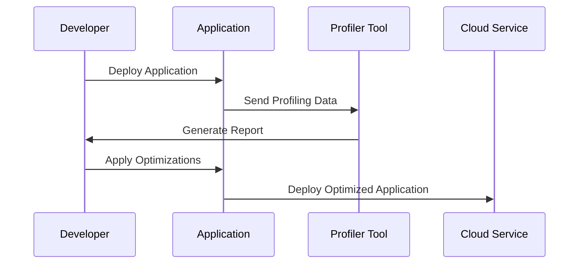

Application Profiling is a critical design pattern used to evaluate the performance of software applications, especially in cloud environments. It involves systematically measuring and analyzing the execution of an application to uncover areas that contribute to inefficient resource utilization or sluggish performance. The goal of application profiling is to optimize the application's responsiveness and scalability by identifying bottlenecks and performance-related issues.

## Detailed Explanation

Application Profiling is a multi-step process that usually involves the following activities:

1. **Instrumentation**: Adding hooks into the application's code to collect data on its execution. This can include measuring time taken by different functions, memory usage, and transaction throughput.

2. **Monitoring**: Observing the application in a production-like environment to gather meaningful metrics about how the application performs under typical load conditions.

3. **Analysis**: Examining the collected data to pinpoint the specific parts of the application that are underperforming. Common areas of focus include CPU usage, memory leaks, I/O operations, and database queries.

4. **Optimization**: Implementing changes to enhance performance. This may involve code refactoring, optimizing algorithms, adjusting resource allocations, or modifying architectural designs.

5. **Validation**: Testing the application after optimization to ensure that performance improvements are realized and that no new issues have been introduced.

### Best Practices

- **Use Lightweight Profilers**: Opt for profiling tools that introduce minimal overhead to ensure that the performance metrics are accurate.
- **Integrate with CI/CD**: Incorporate profiling in your continuous integration and continuous deployment (CI/CD) pipelines to continuously monitor and improve application performance.
- **Focus on Critical Path**: Identify key services or transactions that impact application performance and prioritize their optimization.
- **Leverage Cloud-Native Tools**: Utilize cloud providers’ native profiling tools (e.g., AWS X-Ray, GCP Cloud Profiler, Azure Application Insights) for seamless integration and accurate telemetry.

### Example Code

Here's a simple example using a hypothetical Java profiler:

```java
public class PerformanceProfiler {
    public static void main(String[] args) {
        Profiler.start();
        heavyComputationFunction();
        Profiler.stop();
        Profiler.printReport();
    }

    public static void heavyComputationFunction() {
        // Simulate some heavy computation or IO operation
        for (int i = 0; i < 1000000; i++) {
            compute(i);
        }
    }

    public static long compute(long value) {
        // Simulate resource-intensive operation
        return value * 2;
    }
}
```

### Diagrams

Below is a conceptual Mermaid UML Sequence Diagram illustrating a typical profiling workflow:



## Related Patterns and Descriptions

- **Instrumentation Pattern**: Instrument applications to gather detailed execution metrics.
- **Auto-Scaling Pattern**: Dynamically adjust resources to prevent bottlenecks from resource limitations.
- **Circuit Breaker Pattern**: Prevent failure cascading by managing requests to failing services.

## Additional Resources

- [AWS X-Ray Documentation](https://docs.aws.amazon.com/xray/index.html)
- [Google Cloud Profiler Documentation](https://cloud.google.com/profiler/docs)
- [Microsoft Azure Application Insights](https://docs.microsoft.com/en-us/azure/azure-monitor/app/app-insights-overview)

## Summary

Application Profiling is an essential practice for maintaining optimal performance levels in cloud-based applications. By providing insights into the application's behavior and identifying slow or resource-heavy components, profiling enables developers to make informed decisions about performance improvements. Leveraging cloud-native tools can significantly enhance the efficiency and effectiveness of application profiling efforts.
