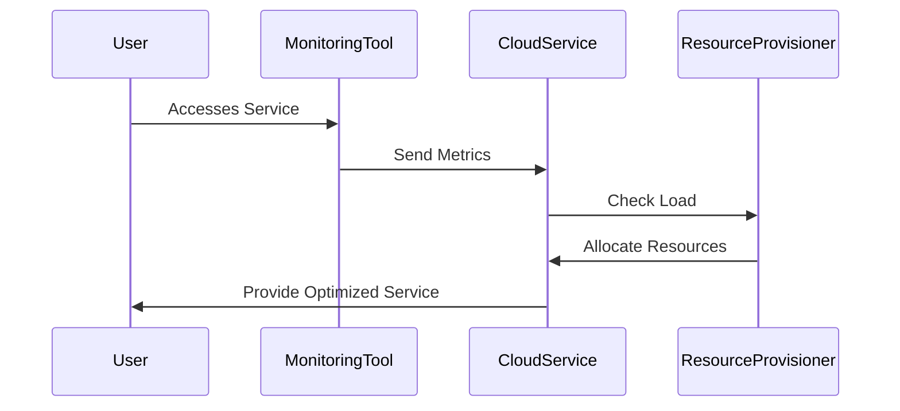

## Introduction

In cloud computing, **Resource Overprovisioning** is a strategy used to ensure system reliability and performance during unexpected spikes in demand. This pattern involves temporarily allocating additional computational resources to manage increased workload efficiently. It is primarily adopted to prevent performance degradation during peak times and to maintain service reliability.

## Detailed Explanation

### Architectural Approach

Resource Overprovisioning is an architectural pattern where systems preemptively allocate more resources than are typically necessary to maintain a buffer for unexpected loads. The key aspects of this pattern include:

- **Elastic Scaling**: Using cloud capabilities to rapidly acquire additional resources in response to demand spikes.
- **Buffer Capacity**: Maintaining a reserve of computational resources that can be easily and quickly utilized.
- **Cost-Benefit Analysis**: Balancing the cost of overprovisioning against potential losses from downtime or degraded performance.

### Paradigms and Best Practices

1. **Predictive Analytics**: Use machine learning models to forecast demand and preemptively scale resources.
2. **Cloud Automation Tools**: Implement automation tools to adjust resources dynamically based on real-time analytics.
3. **Monitoring and Alerts**: Employ comprehensive monitoring and alert systems to anticipate and react to demand trends.

### Example Code

Here is an example of using AWS SDK for Java to implement auto-scaling in response to increased demand:

```java
import com.amazonaws.services.autoscaling.AmazonAutoScaling;
import com.amazonaws.services.autoscaling.AmazonAutoScalingClientBuilder;
import com.amazonaws.services.autoscaling.model.DescribeAutoScalingGroupsRequest;
import com.amazonaws.services.autoscaling.model.DescribeAutoScalingGroupsResult;
import com.amazonaws.services.autoscaling.model.AutoScalingGroup;

public class AutoScalingExample {

    public static void main(String[] args) {
        AmazonAutoScaling autoScaling = AmazonAutoScalingClientBuilder.defaultClient();

        DescribeAutoScalingGroupsRequest request = new DescribeAutoScalingGroupsRequest();
        DescribeAutoScalingGroupsResult result = autoScaling.describeAutoScalingGroups(request);

        for (AutoScalingGroup group : result.getAutoScalingGroups()) {
            System.out.println("Auto Scaling Group Name: " + group.getAutoScalingGroupName());
            System.out.println("Instance Count: " + group.getInstances().size());
            // Logic to scale resources based on demand analytics
            // e.g., increase instances if the current load is near max capacity
        }
    }
}
```

### Diagrams

#### UML Sequence Diagram

Here's a simple sequence diagram illustrating the Resource Overprovisioning process.



## Related Patterns

- **Auto-Scaling Pattern**: Automatically scaling resources up or down based on threshold metrics.
- **Load Balancing Pattern**: Distributing workloads evenly across multiple computing resources to ensure no single resource is overwhelmed.

## Additional Resources

- [AWS Auto Scaling](https://aws.amazon.com/autoscaling/)
- [Google Cloud Managed Instance Groups](https://cloud.google.com/compute/docs/instance-groups)
- [Azure Virtual Machine Scale Sets](https://azure.microsoft.com/en-us/services/virtual-machine-scale-sets/)

## Summary

**Resource Overprovisioning** is a crucial pattern in cloud computing that helps manage unexpected demand spikes by temporarily increasing resource allocation. This approach ensures continuous service performance and reliability while maintaining a balance between costs and computational needs. By leveraging tools for predictive analytics, automation, and real-time monitoring, organizations can effectively manage resource overprovisioning in the cloud.
