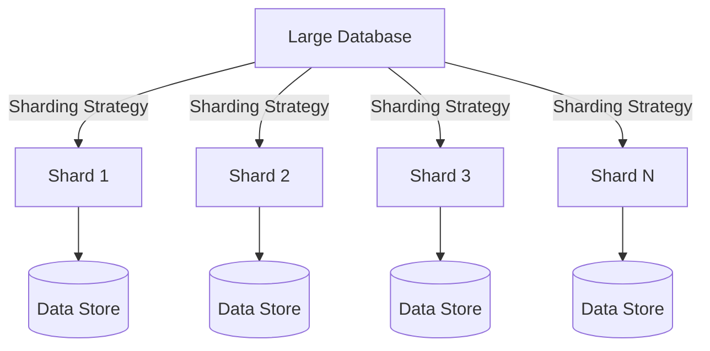

## Introduction to Database Sharding

Database Sharding is a crucial design pattern in modern cloud computing that deals with partitioning a large dataset across multiple database instances, known as shards. Each shard contains a subset of the entire dataset, which enables horizontal scaling by spreading the load across multiple machines. This approach significantly enhances query performance and allows for managing growing data volumes and user loads without sacrificing application responsiveness or availability.

### Key Concepts

- **Shards:** Individual partitions of a database, each functioning as a separate database instance.
- **Horizontal Scaling:** Adding more database instances to handle increased load, as opposed to vertical scaling which involves upgrading the existing hardware.
- **Data Distribution:** Strategically distributing data across shards to ensure balanced loads and efficient query execution.

## Architectural Approach

### Sharding Strategy

Selecting an appropriate sharding strategy is critical for effective implementation. Common strategies include:

1. **Range Sharding:** Distributes data based on key ranges. Suitable for ordered data but may lead to unbalanced shards.
2. **Hash Sharding:** Uses a hash function on shard keys to ensure even distribution, minimizing hotspot risk.
3. **Geographic Sharding:** Data is partitioned based on geographic location, ideal for applications with location-specific data.

### Infrastructure Considerations

- **Consistency:** Achieving data consistency across shards may require complex distributed transactions or eventual consistency models.
- **Fault Tolerance:** Implementing replication strategies can provide redundancy and high availability.
- **Load Balancing:** Distributing queries efficiently among shards to maintain optimal performance.

## Best Practices

- **Shard Key Selection:** Choose shard keys carefully to ensure even data distribution and efficient query processing.
- **Monitoring and Management:** Implement robust monitoring solutions to track shard usage, performance, and anomalies.
- **Scalability Planning:** Anticipate growth and design sharding architecture with flexibility to add more shards seamlessly.

## Example Code

Below is a simplified example showcasing a hash-based sharding mechanism:

```java
import java.util.HashMap;
import java.util.Map;

public class ShardManager {
    private final Map<Integer, DatabaseShard> shards = new HashMap<>();

    public ShardManager(int numShards) {
        for (int i = 0; i < numShards; i++) {
            shards.put(i, new DatabaseShard(i));
        }
    }

    public DatabaseShard getShard(String key) {
        int shardId = key.hashCode() % shards.size();
        return shards.get(shardId);
    }

    public static void main(String[] args) {
        ShardManager shardManager = new ShardManager(4);
        DatabaseShard shard = shardManager.getShard("user123");
        System.out.println("Data for user123 is stored in shard: " + shard.getId());
    }
}
```

## Diagrams

### Sharding Architecture Diagram



## Related Patterns

- **Database Replication:** Often used in conjunction with sharding to enhance data availability and reliability.
- **CQRS (Command Query Responsibility Segregation):** Separates read and write operations, which can be combined with sharding for specialized performance gains.
- **Event Sourcing:** Complements sharded architectures by tracking changes through events, simplifying consistency management across shards.

## Additional Resources

- [Sharding in MongoDB](https://www.mongodb.com/docs/manual/sharding/)
- [Cassandra Sharding](https://cassandra.apache.org/doc/latest/architecture/sharding.html)
- [Pattern: Database Sharding](https://martinfowler.com/bliki/DatabaseSharding.html)

## Summary

Database Sharding is an effective design pattern for improving database performance and scalability in cloud environments. By partitioning your data into smaller, more manageable pieces, you can leverage horizontal scaling, enhance query performance, and maintain system responsiveness as your dataset grows. Understanding the key concepts, choosing the right sharding strategy, and planning for future growth are essential steps to successfully implement this pattern.
