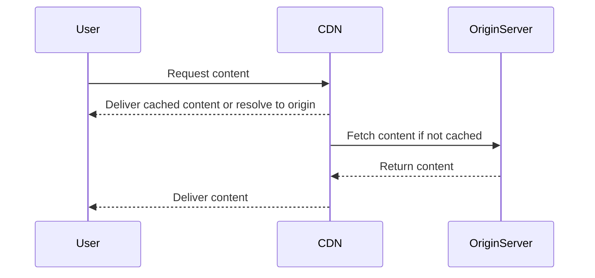

Network Optimization is a vital design pattern in cloud computing that focuses on optimizing network configurations to minimize latency and maximize throughput. It ensures that cloud-based applications can deliver high-performance and reliable services, which is critical in today's fast-paced digital environment.

## Detailed Explanation

### Core Concepts

1. **Latency**: The delay before a transfer of data begins following an instruction for its transfer. Low latency is particularly important for applications like real-time analytics, online gaming, and video conferencing.
2. **Throughput**: The rate of successful message delivery over a communication channel. High throughput is crucial for data-intensive applications.
3. **Bandwidth**: The maximum rate of data transfer across a given path.

### Architectural Approaches

1. **Content Delivery Networks (CDNs)**:
   - Utilize CDNs to cache content closer to the end-user, reducing latency and improving load times for static content such as images and scripts.
   - CDNs distribute data across various geographically dispersed servers.

2. **Load Balancing**:
   - Distribute network or application traffic across multiple servers to ensure no single server becomes a bottleneck.
   - Enables horizontal scaling and optimizes resource utilization.

3. **Traffic Shaping**:
   - Control the volume and timing of traffic into or out of the network to prioritize critical applications, ensuring necessary bandwidth.
   - Helps manage network congestion and maintain performance standards.

4. **Network Protocol Optimization**:
   - Implement modern network protocols such as HTTP/2 or QUIC for faster data transmission.
   - Optimize TCP/IP settings to reduce latency and increase throughput.

### Best Practices

- **Use of VPNs**: Secure and optimize connections between cloud services and on-premises infrastructure.
- **Redundancy & Failover**: Implement redundant network paths to ensure high availability.
- **Monitor & Analyze Traffic**: Regularly monitor network traffic to identify bottlenecks and optimize configurations.
- **Incorporate SD-WANs**: Use Software-Defined Wide Area Networks for improved network management and optimization.

## Example Code

### Implementing a Simple Load Balancer in Go

```go
package main

import (
	"net/http"
	"net/http/httputil"
	"net/url"
)

type Proxy struct {
	target *url.URL
	proxy  *httputil.ReverseProxy
}

func NewProxy(target string) *Proxy {
	url, _ := url.Parse(target)
	return &Proxy{target: url, proxy: httputil.NewSingleHostReverseProxy(url)}
}

func (p *Proxy) handle(w http.ResponseWriter, r *http.Request) {
	r.Host = p.target.Host
	p.proxy.ServeHTTP(w, r)
}

func main() {
	proxy := NewProxy("http://example-backend-server.com")
	http.HandleFunc("/", proxy.handle)
	http.ListenAndServe(":8080", nil)
}
```

## Diagrams

### Network Optimization Sequence Diagram



## Related Patterns

- **Data Replication**: Ensures data consistency across multiple locations, improves data locality.
- **Auto-Scaling**: Dynamically adjusts the number of resources allocated to services based on demand.
- **Geo-Distributed Architectures**: Deploy application resources in multiple geographical regions to optimize latency.

## Additional Resources

- [AWS Global Accelerator](https://aws.amazon.com/global-accelerator/)
- [Azure Front Door Service](https://azure.microsoft.com/en-us/services/frontdoor/)
- [Google Cloud CDN](https://cloud.google.com/cdn/)

## Summary

Network Optimization in cloud computing is imperative for reducing latency and increasing throughput, directly affecting user experience and application performance. By leveraging strategies like CDN usage, load balancing, traffic shaping, and protocol optimization, organizations can significantly enhance network efficiency and reliability. Understanding and applying these patterns effectively allows for robust and scalable cloud architectures.
