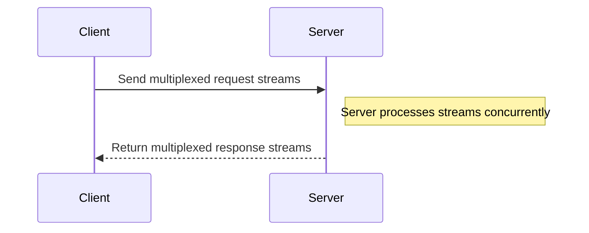

## Introduction

HTTP/2 is an evolution of the HTTP protocol, designed to address the inefficiencies and performance limitations of HTTP/1.1 by introducing features such as multiplexing, header compression, and stream prioritization. HTTP/2 is specifically beneficial for cloud-based applications where the need to optimize bandwidth, reduce latency, and improve resource utilization is paramount.

## Key Features and Benefits

1. **Multiplexing**: HTTP/2 allows multiple requests and responses to be processed concurrently over a single TCP connection. This reduces the need for multiple connections, decreasing network congestion and latency.

2. **Header Compression**: Using HPACK compression, HTTP/2 significantly reduces the header size of HTTP messages, minimizing the amount of data transferred and speeding up communication.

3. **Stream Prioritization**: HTTP/2 supports the assignment of priority levels to different streams, enabling more important resources to be delivered first, enhancing the user experience.

4. **Server Push**: This feature allows servers to proactively send resources to clients before they are requested, potentially reducing load times.

## Architectural Approaches

- **Cloud-native Web Services**: Utilize HTTP/2 in cloud-native applications to handle high-load situations with improved resource utilization and response times.
  
- **API Gateways**: Integrate HTTP/2 support in API gateways to enhance the performance of microservices architectures by reducing overhead.

- **Content Delivery Networks (CDNs)**: Leverage HTTP/2's efficiency in CDNs to serve static assets faster to end-users across the globe.

## Best Practices

- **Enable HTTP/2 on ALL Endpoints**: Make HTTP/2 the default for all communication between services, clients, and APIs to ensure consistent performance gains.

- **Monitor and Optimize Header Compression**: Configure optimal header compression ratios and monitor the performance to prevent potential bottlenecks.

- **Leverage Server Push Carefully**: Use the server push capability judiciously to avoid sending unnecessary data that could clutter client bandwidth.

## Example Implementation

Here's a brief Java-based example using Spring Boot to enable HTTP/2 support:

```java
import org.springframework.boot.SpringApplication;
import org.springframework.boot.autoconfigure.SpringBootApplication;
import org.springframework.boot.web.server.Http2;
import org.springframework.boot.web.server.Ssl;
import org.springframework.boot.web.server.WebServerFactoryCustomizer;
import org.springframework.boot.web.embedded.tomcat.TomcatServletWebServerFactory;

@SpringBootApplication
public class Http2Application {

    public static void main(String[] args) {
        SpringApplication.run(Http2Application.class, args);
    }

    public WebServerFactoryCustomizer<TomcatServletWebServerFactory> serverCustomizer() {
        return server -> {
            Http2 http2 = new Http2();
            http2.setEnabled(true);
            Ssl ssl = new Ssl();
            ssl.setKeyStorePassword("changeit"); // Example SSL configuration
            ssl.setKeyStore("classpath:keystore.jks");
            server.addConnectorCustomizers(connector -> {
                connector.setProperty("protocol", "org.apache.coyote.http11.Http11AprProtocol");
                connector.setScheme("https");
                connector.setSecure(true);
                connector.getProtocolHandler().setSsl(ssl);
                connector.getProtocolHandler().setHttp2(http2);
            });
        };
    }
}
```

## Diagram

Here's a simple sequence diagram illustrating HTTP/2 communication:



## Related Patterns

- **Load Balancing**: HTTP/2 works well with load balancing strategies that efficiently distribute HTTP/2 traffic across multiple server instances.

- **Service Mesh**: Utilizing HTTP/2 in conjunction with service meshes to enhance microservices communication with minimal network overhead.

## Additional Resources

- [HTTP/2 Full Specification](https://httpwg.org/specs/rfc7540.html)
- [Understanding HTTP/2](https://developers.google.com/web/updates/2015/05/http2)
- [Spring Boot HTTP2 Setup](https://docs.spring.io/spring-boot/docs/current/reference/html/howto.html#howto-configure-http2)

## Summary

HTTP/2 is a powerful protocol upgrade for the modern web and cloud computing environments, offering significant performance enhancements through multiplexing, header compression, prioritization, and server push. By leveraging these capabilities, developers can optimize the performance, resource utilization, and responsiveness of cloud-based applications.
