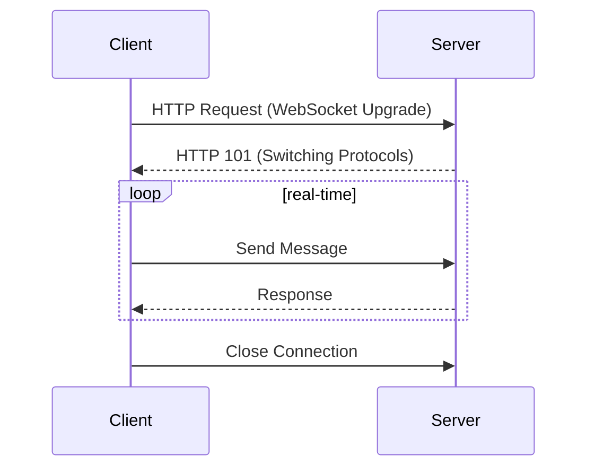

## Introduction

WebSocket Implementation is a cloud design pattern focused on achieving real-time interaction between clients and servers through persistent connections, enabling seamless data exchange. This design is critical in applications requiring low latency and frequent communication updates, such as live chat applications, real-time trading platforms, and collaborative tools. By leveraging WebSocket technology, this pattern supports full-duplex communication channels over a single TCP connection.

## Design Pattern Explanation

### Architectural Overview

The WebSocket protocol provides a way to open a persistent, interactive communication session between the user's browser and a server. With WebSockets, you can send messages to a server and receive event-driven responses without having to poll the server for updates.

- **Connection Establishment**: WebSockets start with an HTTP handshake, transitioning to WebSocket after initial headers, maintaining a single, open connection.
- **Full-Duplex Communication**: Enables simultaneous two-way data flow, reducing overhead caused by traditional HTTP request/response cycles.
- **Persistent Connection**: Once established, stays open with low-latency data transmission until explicitly closed by either the client or server.

### Key Characteristics

- **Low Latency**: Reduces communication delay, providing near instant message delivery.
- **Scalability**: Facilitates handling of a large number of simultaneous connections efficiently.
- **Bandwidth Optimization**: Minimizes data transferred during communication handshakes, reducing overhead.

### Implementation Example

Here's a simple implementation of a WebSocket server using Node.js with the `ws` library:

```javascript
const WebSocket = require('ws');

const server = new WebSocket.Server({ port: 8080 });

server.on('connection', (ws) => {
  console.log('Client connected');

  ws.on('message', (message) => {
    console.log(`Received: ${message}`);
    ws.send(`Echo: ${message}`);
  });

  ws.on('close', () => {
    console.log('Client disconnected');
  });
});

console.log('WebSocket server is running on ws://localhost:8080/');
```

### Integration with Cloud Solutions

Cloud platforms like AWS, GCP, and Azure offer services to optimize WebSocket implementations:

- **AWS**: Amazon API Gateway WebSocket APIs
- **GCP**: Apigee or Firebase Real-time Database
- **Azure**: Azure Web PubSub Service

### Diagram



## Best Practices

- **Resource Management**: Manage connections to prevent leaks and ensure optimal use of server resources.
- **Security**: Implement authentication and encrypt traffic using TLS to secure communication channels.
- **Error Handling**: Plan for stable reconnect strategies and handle unexpected disconnects gracefully.

## Related Patterns

- **Polling and Long Polling**: An alternative for real-time communication lacking inherent efficiency.
- **Server-Sent Events (SSE)**: Another method for establishing real-time server-to-client communication with less interactivity.

## Additional Resources

- [MDN WebDocs on WebSocket API](https://developer.mozilla.org/en-US/docs/Web/API/WebSockets_API)
- [WebSockets in Web Development](https://www.websocket.org/)
- [RFC 6455 - The WebSocket Protocol](https://tools.ietf.org/html/rfc6455)

## Summary

The WebSocket Implementation pattern is pivotal for cloud-based applications requiring real-time communication capabilities. It allows the establishment of efficient, low-latency communication channels, essential for applications like live notifications, streaming data, and collaborative interactions. This pattern, when integrated into cloud environments, maximizes resource efficiency while enabling seamless bidirectional data flow.
