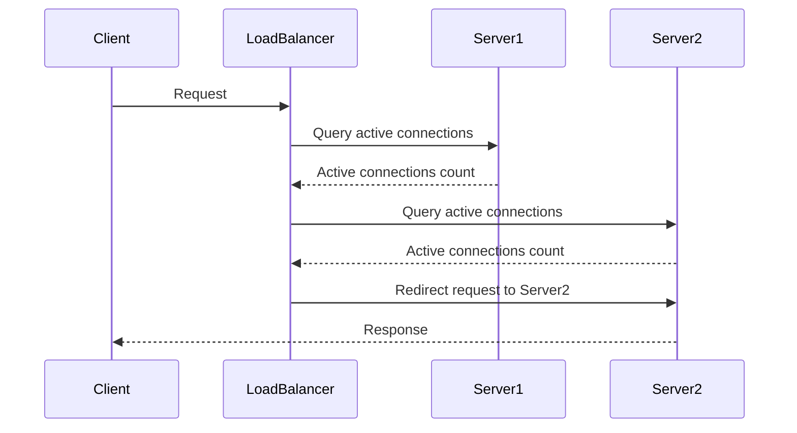

## Introduction

Load balancing optimization is a critical design pattern in cloud computing aimed at distributing incoming network traffic or workload evenly across multiple servers or resources. This approach helps prevent any single server from becoming a bottleneck, ensuring reliable and efficient system performance. By implementing effective load balancing strategies, organizations can enhance the responsiveness and availability of applications, particularly under high-load conditions.

## Architectural Approaches

### 1. **Round Robin**
- **Description**: Distributes requests sequentially and evenly across a list of servers, starting from the top of the list each time.
- **Use Case**: Ideal for servers with similar configurations and performance capabilities.

### 2. **Least Connections**
- **Description**: Directs incoming requests to the server with the least number of active connections, balancing the load based on current server capacity.
- **Use Case**: Useful when servers have different processing capabilities or varying workloads.

### 3. **IP Hash**
- **Description**: Uses a hash of the client's IP address to assign requests to specific servers, ensuring client requests consistently go to the same server.
- **Use Case**: Best for scenarios requiring session persistence.

### 4. **Weighted Round Robin**
- **Description**: Similar to round robin, but assigns additional weight to servers based on their capacity, allowing some servers to handle more load than others.
- **Use Case**: Effective when server resources vary significantly.

### 5. **Random with Two Choices**
- **Description**: Selects two servers at random and assigns the request to the one currently with fewer connections.
- **Use Case**: Provides a balance between simplicity and adaptability across various performance environments.

## Example Code

Here's an example of implementing a basic round-robin load balancer in Python:

```python
class RoundRobinBalancer:
    def __init__(self, servers):
        self.servers = servers
        self.index = 0

    def get_next_server(self):
        server = self.servers[self.index]
        self.index = (self.index + 1) % len(self.servers)
        return server

load_balancer = RoundRobinBalancer(['server1', 'server2', 'server3'])
for _ in range(10):
    print(load_balancer.get_next_server())
```

## Diagrams

### UML Sequence Diagram for Least Connections Strategy



## Best Practices

- **Scalability**: Ensure your load balancing solution is scalable to accommodate growth in traffic and data.
- **Health Checks**: Implement regular health checks for servers to detect and remove non-responsive servers from the pool.
- **Auto-scaling**: Integrate your load balancer with auto-scaling policies to dynamically adjust resources based on load.
- **Security**: Secure communications between clients and servers with encryption and secure protocols.
- **Monitoring and Logging**: Implement comprehensive monitoring and logging for insightful analytics and fault detection.

## Related Patterns

- **Circuit Breaker**: Provides stability when calling remote services by stopping retries in the event of persistent failures.
- **Throttling**: Limits the number of requests to certain components to maintain optimal performance.
- **Service Discovery**: Automatically detects and adds/removes services in the load balancing pool.

## Additional Resources

- [Nginx Load Balancing Documentation](https://docs.nginx.com/nginx/admin-guide/load-balancer/http-load-balancer/)
- [AWS Elastic Load Balancing](https://aws.amazon.com/elasticloadbalancing/)
- [Google Cloud Load Balancing](https://cloud.google.com/load-balancing/docs)
- [Microsoft Azure Load Balancer](https://azure.microsoft.com/en-us/services/load-balancer/)

## Summary

In conclusion, load balancing optimization is an essential pattern in cloud systems, enabling resilience, scalability, and high availability of applications. By choosing appropriate load balancing strategies and incorporating best practices, organizations can ensure optimal performance while accommodating varying workloads and resource capacities.
