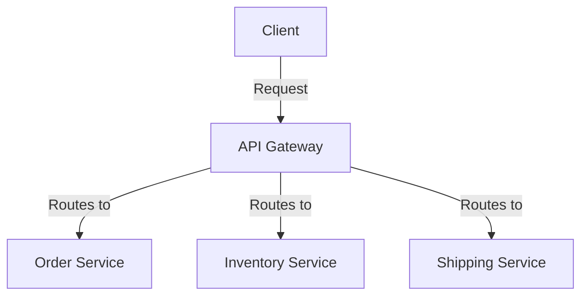

## Introduction

The **Microservices Decomposition** pattern is an essential architectural strategy for transforming monolithic applications into a collection of loosely coupled, independently deployable services. This decomposition enhances application scalability, flexibility, and resilience—key advantages in cloud environments. 

## Detailed Explanation

### Monolithic vs. Microservices Architecture

Monolithic applications are characterized by their unified architecture where all components are interwoven into a single system. This creates challenges such as limited scalability, difficulty in deploying updates, and complicated error isolation. Microservices architecture partitions an application into discrete, well-defined services that can be managed independently, improving overall system agility and scalability.

### Principles of Microservices Decomposition

1. **Domain-Driven Design (DDD)**: Utilize DDD to identify and define service boundaries. Microservices should align closely with business capabilities, ensuring that each service represents a specific domain function.

2. **Single Responsibility Principle**: Design services to accomplish a specific task, adhering to the single responsibility principle. This makes maintaining and scaling individual services simpler.

3. **Independent Deployability**: Each microservice should be independently deployable to facilitate frequent updates and releases without impacting other services.

4. **Loose Coupling and High Cohesion**: Ensure services are loosely coupled but internally cohesive, promoting independence while maintaining internal logic organization.

5. **Technology Diversity**: You can choose the best technology stack per service, thus allowing deployment of polyglot persistence solutions and fostering innovation.

### Example Code

```java
// Example of a simple microservice using Spring Boot
@RestController
public class OrderService {

    @GetMapping("/orders/{id}")
    public Order getOrder(@PathVariable String id) {
        // Logic to fetch order details
        return new Order(id, "Product1", 2, "Delivered");
    }

}
```

### Architectural Approaches

- **API Gateway**: Implement an API Gateway to manage service requests, routing them to appropriate microservices. This provides a single entry point for clients and manages cross-cutting concerns like logging and security.

- **Event-Driven Communication**: Utilize event-driven architectures to decouple services further. This allows services to react asynchronously to changes in other parts of the system, thereby improving responsiveness and flexibility.

## Best Practices

- **Versioning APIs**: Manage API versions carefully to ensure backwards compatibility, allowing clients to transition smoothly between versions.

- **Monitoring and Logging**: Implement comprehensive monitoring and logging for each service to quickly diagnose issues and optimize performance.

- **Automated Testing and CI/CD**: Employ automated test suites and CI/CD pipelines to enhance reliability and accelerate deployment cycles.

- **Data Management**: Employ strategies like eventual consistency, CQRS, or database per service for handling distributed data management.

## Diagrams



## Related Patterns

- **API Gateway**: Aggregates service requests and handles cross-cutting concerns.
- **Event Sourcing**: Ensures each action on data is logged as an event for rehydration.
- **Circuit Breaker**: Manages fault tolerance at the service level.

## Additional Resources

- [Building Microservices by Sam Newman](https://www.oreilly.com/library/view/building-microservices/9781491950340/)
- [Domain-Driven Design: Tackling Complexity in the Heart of Software](https://www.oreilly.com/library/view/domain-driven-design-tackling/9780137523568/)

## Summary

The Microservices Decomposition pattern is pivotal in transitioning from monolithic to modern cloud-native architectures. By breaking applications into microservices, organizations can achieve unprecedented scalability, flexibility, and agility, crucial for thriving in today's dynamic cloud environments. Implementing this pattern needs careful planning with Domain-Driven Design, embracing DevOps practices, and fostering a culture of continuous improvement.
