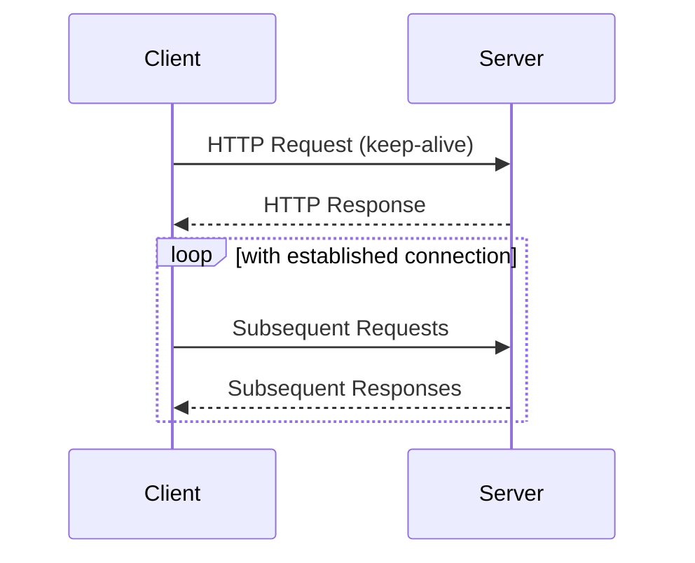

## Overview

The **Persistent Connections** pattern involves maintaining open connections between a client and server to mitigate the performance hit associated with establishing and closing connections frequently. In cloud environments, where latency and network performance are critical, this pattern is essential for optimizing data exchange efficiency.

Opposed to short-lived or non-persistent connections often associated with traditional HTTP/1.0 requests, persistent connections, like those enabled in HTTP/1.1 with `keep-alive` headers, allow multiple requests and responses to be sent over a single connection.

## Benefits

1. **Reduced Latency**: By reusing connections, the overhead caused by TCP handshake is minimized, reducing the delay in data transmission.
2. **Improved Resource Utilization**: Fewer resources are required for connection setup and teardown, thus optimizing server workload.
3. **Enhanced Throughput**: Sustaining open connections increases data transfer throughput by sending multiple requests in succession without delays for setup.
4. **Scalability**: By decreasing the load on establishing new connections, persistent connections work well with scalability features in cloud-based applications.

## Architectural Approaches

- **Keep-Alive Header in HTTP**: Employs HTTP/1.1 persistent connections by default with the use of `Connection: keep-alive` headers.
- **WebSocket Connections**: Establishes a persistent connection over TCP for full-duplex communication, suitable for real-time data transmission.
- **Pooling Techniques**: Connection pooling maintains a pool of open connections, reusing them as needed, which is particularly beneficial in database connections.
  
### Example Code

Here's an example in Node.js using HTTP/1.1 with Keep-Alive:

```javascript
const http = require('http');

const options = {
  hostname: 'example.com',
  port: 80,
  path: '/',
  method: 'GET',
  headers: {
    'Connection': 'keep-alive'
  }
};

const req = http.request(options, (res) => {
  console.log(`STATUS: ${res.statusCode}`);
  res.on('data', (chunk) => {
    console.log(`BODY: ${chunk}`);
  });
});

req.on('error', (e) => {
  console.log(`problem with request: ${e.message}`);
});

req.end();
```

### Diagram



## Related Patterns

- **Connection Pooling**: Utilizes a pool to manage and reuse multiple connections, enhancing performance in database systems.
- **Circuit Breaker**: Provides fault tolerance in failing networks by managing connection retries.
- **Load Balancer**: Ensures the distribution of requests across multiple servers while maintaining persistent connections to optimize server utilization.

## Best Practices

1. **Connection Management**: Properly manage idle connections to release resources.
2. **Timeout Configuration**: Implement timeouts to avoid hanging connections that can waste resources.
3. **Load Balancing**: Combine persistent connections with load balancing to evenly distribute traffic.

## Additional Resources

- [HTTP/1.1: Persistent Connections](https://httpwg.org/specs/rfc7230.html#persistent.connections)
- [Understanding WebSockets](https://developer.mozilla.org/en-US/docs/Web/API/WebSockets_API)
- [Networking in Cloud Configurations](https://cloud.google.com/architecture/best-practices-for-networking)

## Summary

The **Persistent Connections** pattern is instrumental in reducing network latency, improving throughput, and optimizing resource utilization in cloud-based applications. Through methods like HTTP 1.1 keep-alives, WebSockets, and connection pooling, systems can retain open communications, leading to enhanced performance and scalability. Proper connection management in cloud architectures is key to leveraging these benefits efficiently.
