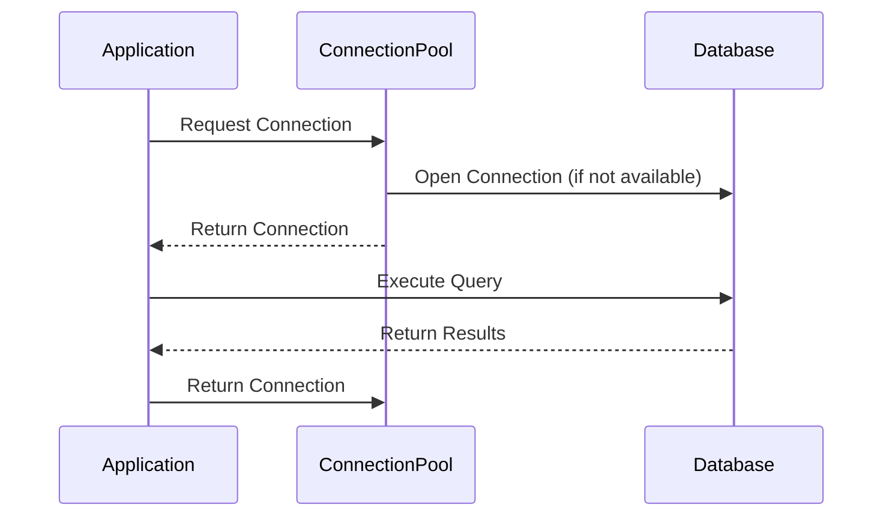

## Introduction

In cloud applications, efficiency and performance are critical, especially when interacting with databases. Establishing a new database connection is a resource-intensive operation that can introduce latency into an application. Database Connection Pooling is a design pattern that addresses this issue by reusing database connections, thereby reducing overhead and improving the responsiveness and scalability of applications.

## Design Pattern Explanation

### Overview

Database Connection Pooling maintains a pool of established database connections that can be reused by applications. Instead of opening and closing a new connection for each database request, an application borrows a connection from the pool, performs its operations, and then returns the connection to the pool. This reduces the time and resources spent establishing connections and allows better management of database connections across multiple requests.

### Architectural Approach

1. **Connection Pool Management**: The pool manager initializes a set number of connections at the start and manages the lifecycle of these connections. It can dynamically adjust the number of connections based on demand.

2. **Borrow and Return Protocol**: Applications borrow a connection from the pool when needed and return it once the database operation is complete. This protocol ensures that connections are effectively reused.

3. **Idle Connection Handling**: The pool manager may close idle connections after a certain time or shrink the pool during low demand, ensuring resource optimization.

4. **Concurrency Control**: To prevent contention and manage concurrent access, connection pools often employ synchronizations or locks.

### Best Practices

- **Tune Pool Size**: Determine the optimal size of the pool based on application workload and database capacity. Too few connections can lead to bottlenecks, whereas too many can incur overhead.

- **Connection Validation**: Periodically validate connections within the pool to ensure they remain valid and responsive.

- **Exception Handling**: Implement robust error handling to manage failed connections and prevent application crashes.

- **Monitoring and Logging**: Use monitoring tools to track connection pool usage statistics and adjust configurations as needed.

## Example Code

Here is an example of setting up a simple connection pool using Java and HikariCP, a high-performance JDBC connection pool.

```java
import com.zaxxer.hikari.HikariConfig;
import com.zaxxer.hikari.HikariDataSource;

import java.sql.Connection;
import java.sql.SQLException;

public class ConnectionPoolExample {

    private static HikariDataSource dataSource;

    static {
        HikariConfig config = new HikariConfig();
        config.setJdbcUrl("jdbc:mysql://localhost:3306/mydatabase");
        config.setUsername("user");
        config.setPassword("password");
        config.setMaximumPoolSize(10);
        dataSource = new HikariDataSource(config);
    }

    public static Connection getConnection() throws SQLException {
        return dataSource.getConnection();
    }

    public static void closeDataSource() {
        if (dataSource != null) {
            dataSource.close();
        }
    }
}
```

## Diagrams

### Connection Pooling Sequence Diagram



## Related Patterns

- **Circuit Breaker Pattern**: Prevents an application from trying to execute operations likely to fail, such as when the database is unavailable.

- **Retry Pattern**: Implements retry logic for transient failures, ensuring reliability in cloud environments.

- **Bulkhead Pattern**: Isolates different parts of an application to prevent cascading failures, aiding in resource optimization akin to connection pooling.

## Additional Resources

- [HikariCP Official Documentation](https://github.com/brettwooldridge/HikariCP)
- [Cloud Design Patterns Book by Microsoft](https://aka.ms/Cloud-Design-Patterns)

## Summary

Database Connection Pooling is an essential pattern for optimizing performance in cloud applications by minimizing connection overhead and improving responsiveness. By configuring and managing a pool of reusable connections, applications can efficiently handle database interactions, reduce latency, and scale seamlessly in cloud environments. It is a core practice for achieving high performance and reliability in cloud-based systems.
