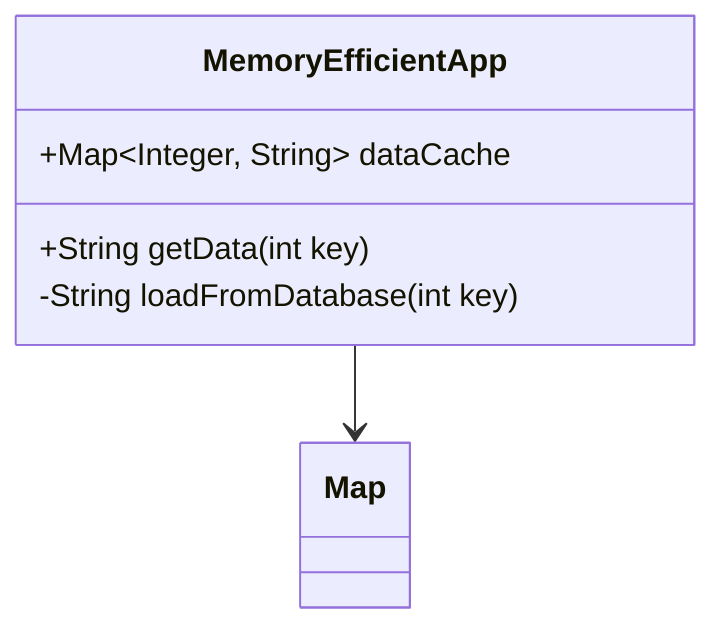

## Introduction

In cloud computing, memory management optimization is crucial for ensuring that applications perform efficiently, cost-effectively, and scalably. Optimized memory management involves strategies to minimize memory usage, reduce latency, and prevent bottlenecks. 

## Design Pattern Description

Memory Management Optimization is focused on reducing unnecessary memory consumption and improving the allocation efficiency within cloud-based applications. This pattern helps manage resources better, keeping costs low while maintaining high performance and reliability.

### Key Components

- **Garbage Collection Efficiency**: Use efficient garbage collection algorithms to minimize pauses and reduce memory footprint.
- **Data Structure Selection**: Choose appropriate data structures that optimize memory usage and access speed.
- **Memory Allocation Strategies**: Dynamic vs. static allocation strategies catering to application needs and resource availability.

### Architectural Approaches

- **Serverless Computing**: Automatically scale resources, optimizing memory usage to the precise needs at any time.
- **Containerization**: Isolates memory resources per container, ensuring no application oversaturates the host machine.
- **Microservices**: Allows independent scaling of services, allocating memory resources according to service demands.

## Best Practices

- **Profiling and Monitoring**: Continuously profile applications to understand memory usage patterns and identify optimization opportunities.
- **Lazy Loading**: Load data only when necessary to reduce initial memory allocation.
- **Optimize Cache Usage**: Use efficient caching mechanisms to strike the balance between speed and memory usage.

## Example Code

Here's a simple example in Java demonstrating efficient memory use with appropriate data structures and lazy loading:

```java
import java.util.Map;
import java.util.HashMap;

public class MemoryEfficientApp {
    private Map<Integer, String> dataCache = new HashMap<>();

    public String getData(int key) {
        return dataCache.computeIfAbsent(key, k -> loadFromDatabase(k));
    }

    private String loadFromDatabase(int key) {
        // Simulate database access
        return "Data for key " + key;
    }
}
```

## Diagram

Below is a UML Class Diagram illustrating a typical setup for memory-optimized applications:



## Related Patterns

- **Auto-Scaling**: Automatically adjusts the resources based on the current demand.
- **Circuit Breaker**: Prevents failure and delays, which can otherwise cause memory overuse by excessive retries.
- **Bulkhead Isolation**: Partitions memory resources to isolate faults and reduce risk of cascading failures.

## Additional Resources

- "Java Performance: The Definitive Guide" by Scott Oaks—provides insights into JVM performance tuning.
- Official AWS and Azure documentation on optimized resource practices.
- "Concurrency in Practice" by Brian Goetz—covers efficient handling of shared memory.

## Summary

Memory Management Optimization is integral to maintaining high-performance, cost-efficient, and scalable cloud applications. Through strategic architectural decisions and ongoing optimizations, developers can ensure their cloud solutions remain robust and reliable in diverse operating conditions.
