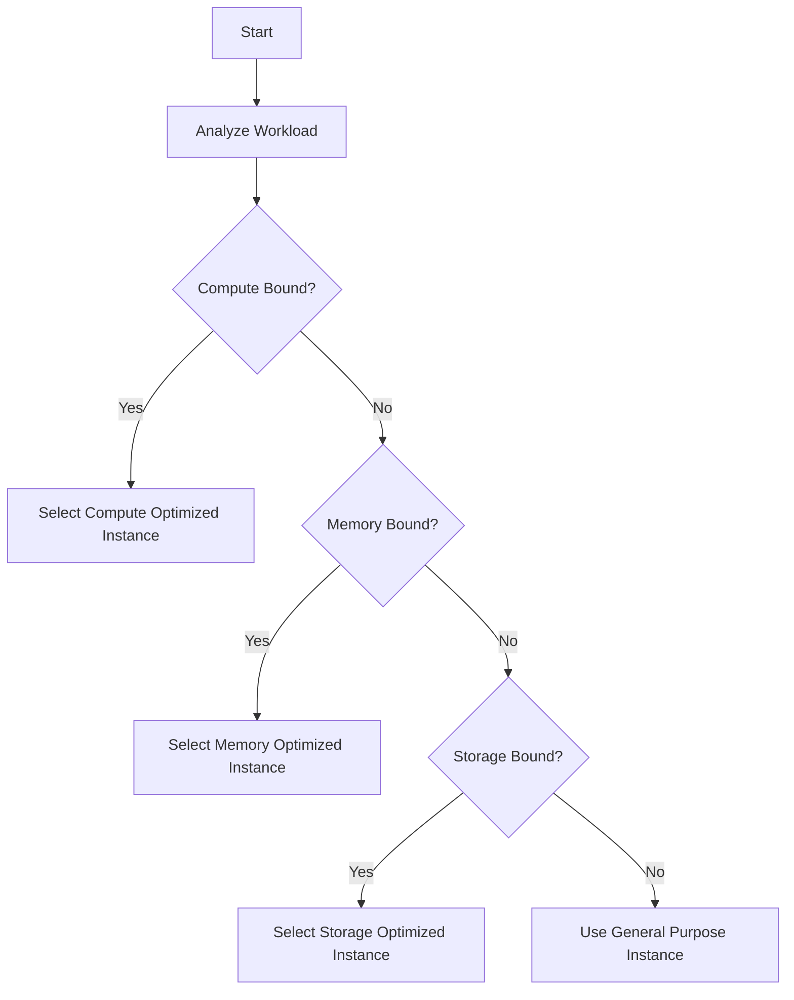

## Introduction

In the realm of cloud computing, organizations often face diverse workloads that vary significantly in their performance requirements. The **Use of Specialized Compute Instances** design pattern provides an approach to optimize both performance and cost. By leveraging instances specifically tailored for certain types of tasks (e.g., high CPU, memory optimization), organizations can achieve better resource utilization and operational efficiency.

## Detailed Explanation

### What are Specialized Compute Instances?

Specialized compute instances are pre-configured virtual machines offered by cloud providers. These instances are typically optimized for specific resource attributes such as CPU, memory, storage, or network throughput. Examples include:

- **Compute Optimized Instances**: Ideal for compute-bound applications that benefit from high-performance processors.
- **Memory Optimized Instances**: Designed for memory-intensive applications, such as caching and memory-based databases.
- **Storage Optimized Instances**: Provide high, sequential read/write access to large datasets on local instance storage, suitable for data-intensive applications.

### Benefits

1. **Performance Efficiency**: By selecting instances that align with workload characteristics, it reduces latency and enhances speed.
2. **Cost Reduction**: Avoid over-provisioning and reduce costs by matching resources to application needs.
3. **Scalability**: Easily scale vertically with specialized instances as your application demands grow.

### Use Cases

1. **High-Performance Computing (HPC)**: Scientific simulations, large-scale data processing applications utilize compute-optimized instances.
2. **In-Memory Databases**: Applications like SAP HANA and Redis can benefit from memory-optimized instances.
3. **Big Data Analytics**: Storage-optimized instances improve data processing performance in applications like Hadoop or NoSQL databases.

## Architectural Approach

- **Assessment of Workloads**: Analyze application workloads to determine the nature of resource demands (e.g., CPU, memory).
- **Selection of Appropriate Instances**: Based on the assessment, choose the right instance type from the cloud provider that best meets those demands.
- **Automation and Monitoring**: Use automation tools and monitoring services to dynamically adjust resources, ensuring optimal performance and cost-efficiency.

### Example Code

An example using AWS SDK in Python to launch an EC2 compute-optimized instance:

```python
import boto3

ec2 = boto3.resource('ec2')

instances = ec2.create_instances(
    ImageId='ami-0abcdef1234567890',  # Example AMI ID
    InstanceType='c5.large',          # Example compute-optimized instance
    MinCount=1,
    MaxCount=1
)
print("Instance launched: ", instances[0].id)
```

### Diagrams

#### Diagram for Instance Selection Process



## Related Patterns

- **Autoscaling**: Automatically adjust the number of active instances dynamically based on workload.
- **Burstable Instances**: Use burstable instances for workloads with irregular demand to manage costs.

## Additional Resources

- [AWS Instance Types](https://aws.amazon.com/ec2/instance-types/)
- [Azure Virtual Machine Sizes](https://azure.microsoft.com/en-us/pricing/details/virtual-machines/)
- [Google Compute Engine Machine Types](https://cloud.google.com/compute/docs/machine-types)

## Summary

The **Use of Specialized Compute Instances** pattern empowers organizations to optimize performance and manage costs by leveraging instances tailored for specific workloads. By carefully assessing application needs and aligning resources correspondingly, cloud users can significantly enhance their applications' efficiency and cost-effectiveness. This pattern is fundamental in achieving a balance between performance and budget within a cloud environment.
