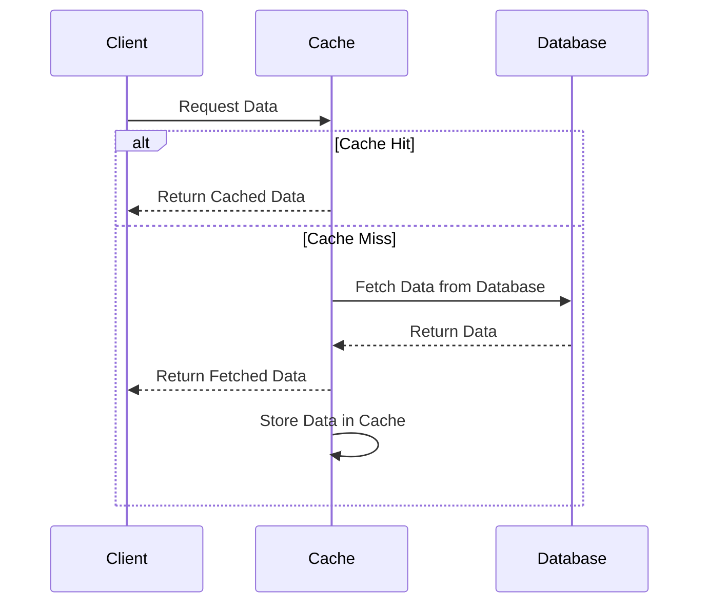

Caching strategies are pivotal in cloud architectures for optimizing data access times and reducing load on databases and backend services. By storing frequently accessed data temporarily, caches serve as a high-speed data storage layer that improves application performance and responsiveness.

## Design Patterns and Architectural Approaches

Caching can be implemented in several ways within cloud environments:

1. **Client-Side Caching**: This approach stores data on the client's device, often using browser storage technologies like cookies or local storage. It's effective for reducing server load and improving response times for the end-user.

2. **CDN Caching**: Content Delivery Networks (CDNs) cache static resources closer to the user, minimizing latency and bandwidth usage. This is ideal for serving static assets such as images and stylesheets in web applications.

3. **Server-Side Caching**: Implemented at the server or application level using technologies like Memcached or Redis. This approach caches data in-memory, providing rapid access compared to retrieving from a disk-based database.

4. **Database Caching**: Databases can also implement caching mechanisms internally. This might include query caching or the use of in-memory database solutions to store frequently accessed data.

5. **Edge Caching**: Similar to CDN caching, edge caching involves storing data at network edges, closer to user locations, ensuring minimal latency.

## Best Practices

- **Cache Invalidation**: Develop strategies for invalidating outdated cache data, such as TTL (time-to-live) or cache clearing upon specific events.
  
- **Granularity**: Be strategic about what data to cache. Caching too little might not improve performance significantly, whereas caching too much could lead to stale data.

- **Concurrency Management**: Manage concurrent data modifications and cache refreshes to ensure consistency across distributed caches.

- **Monitoring and Metrics**: Continuously monitor cache performance and hits/misses to optimize caching effectiveness and make necessary adjustments.

## Example Code

Here's a simple example using Redis in a Node.js application:

```javascript
const redis = require('redis');
const client = redis.createClient();

client.on('connect', () => {
  console.log('Connected to Redis...');
});

// Function to retrieve data, using cache if available
async function getData(key) {
  return new Promise((resolve, reject) => {
    client.get(key, (err, data) => {
      if (err) reject(err);
      if (data !== null) {
        console.log('Cache hit');
        resolve(JSON.parse(data));
      } else {
        console.log('Cache miss');
        // Fetch data from the database or API
        const fetchedData = fetchDataFromSource();
        // Cache the fetched data
        client.setex(key, 3600, JSON.stringify(fetchedData));
        resolve(fetchedData);
      }
    });
  });
}

// Example database fetch function
function fetchDataFromSource() {
  // Simulating a database call here
  return {
    id: 1,
    name: 'Example Data',
    timestamp: new Date().toISOString(),
  };
}
```

## Diagrams

Here is UML Sequence Diagram illustrating a cache read process:



## Related Patterns

- **Circuit Breaker Pattern**: Used to detect failures and encapsulate the logic of preventing a failure from constantly recurring during maintenance, temporary external system failure, or unexpected system difficulties.

- **Bulkhead Pattern**: Isolates elements of the system into pools so that if one fails, the others continue to function.

- **Load Balancing**: Distributes incoming network traffic across multiple servers to ensure no single server becomes overwhelmed.

## Additional Resources

- [Redis Official Documentation](https://redis.io/documentation)
- [AWS ElastiCache Documentation](https://aws.amazon.com/elasticache/)
- [Implementing Caching in Modern Web Applications](https://developer.mozilla.org/en-US/docs/Web/Performance/Caching)

## Summary

Incorporating caching strategies into your cloud architecture is essential for optimizing performance and scalability. By understanding the different caching mechanisms and best practices, you can design systems that are responsive and resilient. Strategically implementing cache invalidation policies, monitoring metrics, and ensuring data consistency are critical steps in achieving effective caching solutions.
