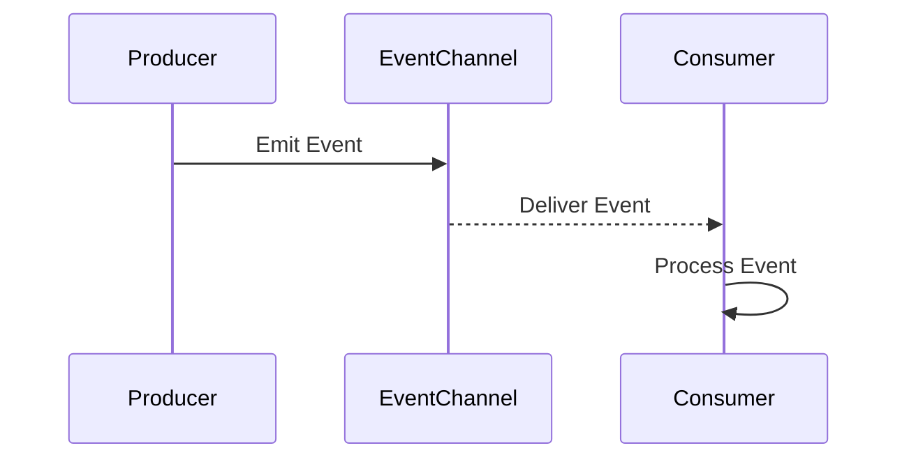

**Introduction**

Event-Driven Architecture (EDA) is a design paradigm in cloud computing that revolves around the production, detection, and consumption of events, allowing services to respond dynamically to changes. This approach effectively reduces the need for constant polling, thereby optimizing resource utilization and enhancing system responsiveness.

**Detailed Explanation**

In EDA, an event is a significant change in state that is communicated between services or components. The key components of an event-driven system are:

1. **Event Producers**: These are the sources of change, emitting events when significant actions occur.
2. **Event Consumers**: These subscribe to and act upon events, implementing business logic based on event data.
3. **Event Channels**: These facilitate communication between producers and consumers, often implemented using messaging systems or event brokers.

This architecture supports a decoupled communication model, enabling greater flexibility and scalability. It is particularly beneficial for systems with variable workload demands or real-time processing requirements.

**Architectural Approach**

EDA can be implemented using a variety of architectural styles and technologies, such as:

- **Publish/Subscribe**: Producers publish events to a channel, and consumers subscribe to relevant channels to receive events.
- **Event Streaming**: Utilizing platforms like Apache Kafka or AWS Kinesis, continuous streams of event data are processed.
- **Serverless Functions**: Functions as a Service (FaaS) platforms, such as AWS Lambda or Azure Functions, allow automatic scaling in response to incoming events.

**Example Code**

Here is a simple example using Node.js with AWS Lambda for an event-driven function:

```javascript
const AWS = require('aws-sdk');
const sns = new AWS.SNS();

exports.handler = async (event) => {
    console.log('Event received:', JSON.stringify(event));
    
    const message = {
        Message: 'Event processed',
        TopicArn: 'arn:aws:sns:us-east-1:123456789012:MyTopic'
    }

    await sns.publish(message).promise();
    
    return { statusCode: 200, body: 'Event handled successfully' };
};
```

**Diagram**

Below is a sequence diagram representing a simple event-driven flow:



**Related Patterns**

- **CQRS (Command Query Responsibility Segregation)**: Often used alongside EDA to separate command processing from query handling.
- **Saga Pattern**: Manages data consistency in distributed transactions by coordinating events and compensating transactions.
- **Reactive Systems**: Emphasizes responsiveness and scalability in event-driven environments.

**Best Practices**

- Use a robust messaging or event-streaming platform to handle varying loads and ensure delivery guarantees.
- Design for idempotency in event consumers to handle duplicate events.
- Keep event sizes small to reduce bandwidth usage and increase processing speed.

**Additional Resources**

- [Building Event-Driven Apps with Serverless Architecture](https://example.com/serverless-event-driven)
- [Introduction to Apache Kafka for Event Streaming](https://example.com/kafka-intro)
  
**Summary**

Event-Driven Architecture is a powerful pattern in cloud computing that enhances system responsiveness and optimizes resource utilization by reacting to state changes through events. Its decoupled nature allows for scalable, flexible service interactions, making it ideal for modern cloud architectures focused on high-performance and real-time processing.
