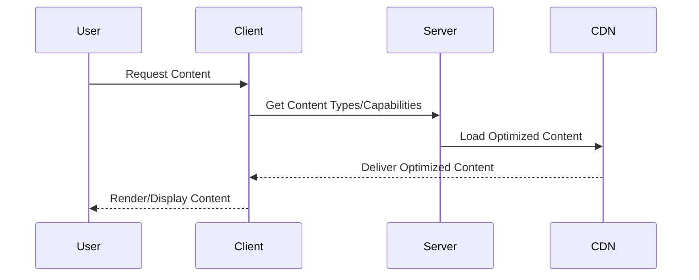

Adaptive Content Delivery is a critical design pattern in cloud computing focused on enhancing user experience by tailoring content based on the end user’s device capabilities, network conditions, and location. This pattern is often used in video streaming, web content delivery, and application distribution, where diversified devices and network conditions can impact user experience significantly.

## Detailed Explanation

### Concept

The Adaptive Content Delivery pattern ensures that content is served in an optimal format and quality that matches the specific conditions of each user's device. This includes considerations like screen resolution, processing power, available bandwidth, network latency, and even the user's geographical location.

### Key Benefits

- **Enhanced User Experience**: Users receive content that is well-suited to their device, providing a seamless viewing or interaction experience regardless of hardware limitations.
- **Efficient Resource Utilization**: By optimizing the content delivery, companies can reduce bandwidth costs and server load, while improving service delivery speed and quality.
- **Scalability**: Adapting content dynamically allows services to scale effectively to accommodate surging user numbers or varying device profiles.

## Architectural Approaches

### Content Negotiation

A server-side pattern where the server detects the client's capabilities and delivers the appropriate content type and quality. This can be achieved through HTTP headers, where the client specifies its capabilities or preferences.

### Client-Side Adaptation

Content is served in a generic format, and the client-side application determines the appropriate format or resolution to use, dynamically adjusting it based on current conditions like network speed.

### Hybrid Approach

Combines both server and client-side techniques for maximum flexibility and optimization. Initially, the server delivers content based on known parameters, while client-side scripts adjust for real-time changes in capability or conditions.

## Best Practices

- **Use Content Delivery Networks (CDNs)**: Leverage CDNs to cache and deliver content closer to the user, reducing latency and improving download speeds.
- **Implement Device Detection Libraries**: Use libraries or services that accurately identify device specifications to offer the most appropriate content format.
- **Regularly Update Content Formats**: Stay current with media formats and encoding to ensure compatibility and optimizations across modern devices.
- **A/B Testing**: Continuously test different delivery strategies against user analytics to optimize performance and satisfaction.

## Example Code

Here’s an example of a server-side implementation using Node.js to check device capabilities through headers:

```javascript
const express = require('express');
const useragent = require('express-useragent');

const app = express();
app.use(useragent.express());

app.get('/video', (req, res) => {
  const ua = req.useragent;
  let videoQuality;

  if (ua.isMobile) {
    videoQuality = '480p';
  } else if (ua.isTablet) {
    videoQuality = '720p';
  } else {
    videoQuality = '1080p';
  }

  res.send(`Serving video at ${videoQuality} quality.`);
});

app.listen(3000, () => {
  console.log('Server running on port 3000');
});
```

## Diagrams

### Sequence Diagram



## Related Patterns

- **Content Delivery Network (CDN)**: Utilizes distributed servers to cache and deliver content closer to users quickly and efficiently.
- **Edge Computing**: Moves memory and process-intensive activities to the edge of the network closer to users.
- **Bandwidth Throttling**: Dynamically manages and limits bandwidth usage based on current network conditions.

## Additional Resources

- [Responsive Design on the Web](https://developer.mozilla.org/en-US/docs/Learn/CSS/CSS_layout/Responsive_Design)
- [Understanding Adaptive Streaming](https://www.streamingmedia.com/Articles/Editorial/Featured-Articles/What-is-Adaptive-Bit-Rate-Video-Streaming-83820.aspx)
- [CloudFront Documentation](https://aws.amazon.com/cloudfront/)

## Summary

Adaptive Content Delivery plays an essential role in optimizing the user experience by ensuring that the content is appropriately tailored to each user's circumstances, whether they are using a flagship smartphone, a basic desktop, or any device in between. By leveraging this pattern, businesses can maintain user engagement and satisfaction while optimizing resource usage and delivery performance.
