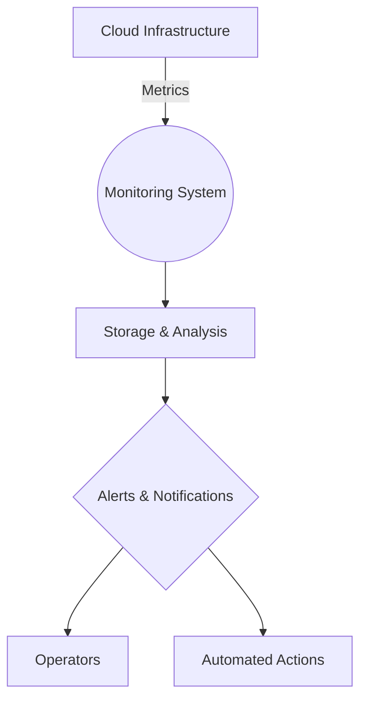

## Introduction

In the realm of cloud computing, where scaling and performance are paramount, the **Monitoring and Alerting** design pattern plays a crucial role. This pattern involves the continuous observation of system performance metrics, enabling the identification and resolution of issues before they escalate into significant problems. By implementing this pattern, organizations can ensure optimal performance, availability, and reliability of cloud-based applications and services.

## Design Pattern Explanation

The **Monitoring and Alerting** pattern revolves around the collection, analysis, and interpretation of data related to the performance of cloud resources and applications. This involves setting up monitoring tools to track key metrics such as CPU usage, memory consumption, network latency, and application response times. Alerts are configured based on predefined thresholds to notify system administrators or automated systems of any anomalies or potential issues.

### Key Concepts

- **Metric Collection**: Gathering data on system performance and behavior, often using agents or built-in cloud provider monitoring services.
- **Thresholds and Alerts**: Establishing conditions that, when met, trigger notifications or automated responses.
- **Dashboard Visualization**: Providing real-time insights through graphical representations of metrics for quick assessment of system health.

## Architectural Approaches

1. **Agent-Based Monitoring**:
   - Deploy agents on cloud infrastructure components to collect and send data to a centralized monitoring system.

2. **Agentless Monitoring**:
   - Leverage cloud provider APIs and services to retrieve performance metrics, removing the need for additional software installation.

3. **Centralized Logging**:
   - Aggregate logs from various components into a unified system for easier analysis and correlation.

4. **Automated Remediation**:
   - Implement scripts or workflows that automatically resolve detected issues without human intervention.

## Best Practices

- Define clear and realistic performance baselines and thresholds.
- Use distributed tracing to pinpoint the root causes of performance issues.
- Implement redundant notification paths to ensure alerts are received.
- Regularly update and test alerts to confirm their effectiveness.
- Integrate monitoring data with incident management systems for better coordination and communication during outages.

## Example Code

Below is a simple example using Prometheus and Grafana for monitoring and alerting:

```yaml
scrape_configs:
  - job_name: 'my_application'
    static_configs:
    - targets: ['localhost:9090']
```

```yaml
groups:
- name: alert.rules
  rules:
  - alert: HighCPUUsage
    expr: rate(cpu_usage[5m]) > 0.7
    for: 5m
    labels:
      severity: critical
    annotations:
      summary: "High CPU usage"
      description: "CPU usage is above 70% for more than 5 minutes."
```

## Diagrams

### Monitoring Architecture



## Related Patterns

- **Auto-Scaling**: Dynamically adjust resources based on monitoring data.
- **Health Endpoint Monitoring**: Periodically check application health using specific endpoints.
- **Circuit Breaker**: Prevent system overloads by breaking calls to services in distress.

## Additional Resources

- [Prometheus Documentation](https://prometheus.io/docs/introduction/overview/)
- [Grafana Documentation](https://grafana.com/docs/)
- [AWS CloudWatch](https://aws.amazon.com/cloudwatch/)
- [Azure Monitor](https://azure.microsoft.com/en-us/services/monitor/)
- [Google Cloud Operations Suite](https://cloud.google.com/products/operations)

## Summary

The **Monitoring and Alerting** design pattern is essential for maintaining the high availability and performance of cloud-based applications. By implementing robust monitoring systems and configuring precise alerts, organizations can enhance their responsiveness to potential failures and ensure the seamless operation of their services. This continuous observability allows for proactive performance management, resulting in improved user experiences and optimized resource utilization.
