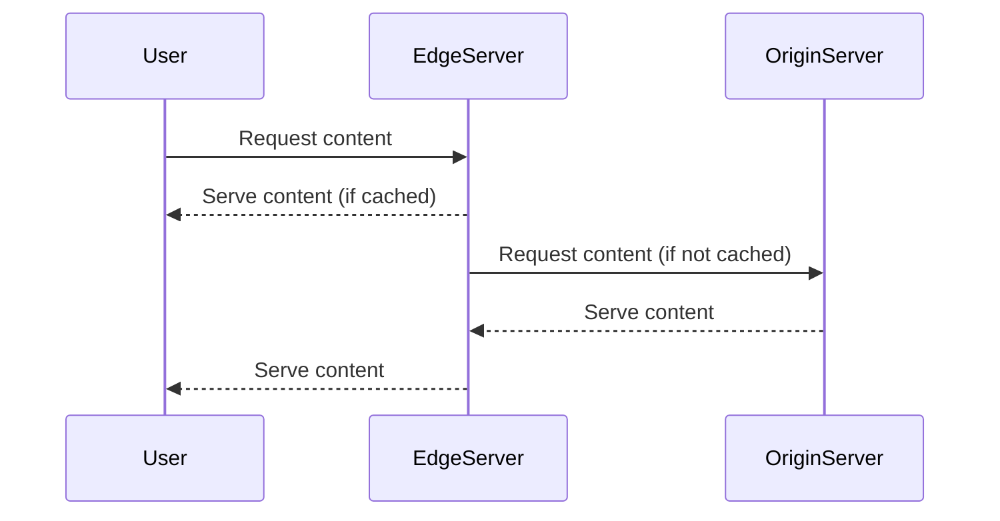

## Introduction

In today's digital age, delivering content quickly and reliably is paramount for businesses aiming to provide seamless user experiences. The **Content Delivery Network (CDN)** design pattern addresses this need by leveraging a geographically distributed network of servers. These servers deliver content to end-users based on their location, thereby optimizing content load times, reducing latency, ensuring content availability, and enhancing overall user experience.

## Architectural Approach

A CDN operates by caching static content such as images, videos, and HTML files on strategically placed servers worldwide. When a user requests this content, the CDN serves it from the nearest server, minimizing the time it takes for information to travel across the internet.

### Key Components

- **Origin Server**: The original content server where content is first uploaded and from which it is initially distributed to the various edge locations in the CDN.
- **Edge Servers**: These are the data centers in various geographic locations that store cached versions of the content. Edge servers are the primary points of contact with end-users.
- **Points of Presence (PoPs)**: Physical locations where groups of edge servers reside, strategically located to be as close as possible to users.
- **Content Delivery Policies**: Rules governing how content is cached and refreshed across the CDN.

### How It Works

1. **Content is Uploaded**: Content is uploaded to the origin server.
2. **Propagation**: The CDN propagates this content to edge servers at PoPs around the globe.
3. **User Request**: When a user requests content, the CDN identifies the nearest edge server.
4. **Content Delivery**: The edge server delivers the cached content to the user.
5. **Cache Refresh**: The CDN regularly checks back with the origin server to refresh the cached content based on predefined policies.

## Best Practices

- **Optimize Cache Invalidation**: Use cache invalidation strategies like time-to-live (TTL) to ensure content is always up-to-date while minimizing unnecessary data refreshes.
- **Implement Security Measures**: Ensure content security using HTTPS, encryption, and Access Control Lists (ACLs) to prevent unauthorized access to CDN resources.
- **Monitor Performance**: Continuously monitor CDN performance, edge server usage, and cache hit ratios to optimize resource allocation and server placement.
- **Leverage Serverless Functions**: Integrate serverless functions at the edge for specialized content manipulation and logic execution close to the user.

## Example Code

Here's a simple example of how you might configure a CDN using AWS CloudFront:

```bash
aws cloudfront create-distribution \
  --origin-domain-name example-bucket.s3.amazonaws.com \
  --default-root-object index.html \
  --cache-behavior '{"PathPattern": "images/*", "TargetOriginId": "S3-example-bucket"}' \
  --aliases '["example.com"]' \
  --comment "Example Distribution"
```

## Diagrams

Below is a simplified **Sequence Diagram** illustrating the request flow in a CDN:



## Related Patterns

- **Load Balancer Pattern**: Distributes incoming application traffic across multiple targets to ensure no single server is overwhelmed.
- **Geo-Distributed Storage Pattern**: Utilizes a network of storage systems located in different geographic areas to provide regionalized data access.
- **Redundancy and Replication Pattern**: Ensures data is duplicated and consistently available across multiple sites for increased resilience.

## Additional Resources

- [AWS CloudFront Documentation](https://docs.aws.amazon.com/AmazonCloudFront/latest/DeveloperGuide/Introduction.html)
- [Akamai CDN White Papers](https://www.akamai.com/us/en/resources/cdn/index.jsp)
- [Azure CDN Overview](https://docs.microsoft.com/en-us/azure/cdn/)

## Summary

The **Content Delivery Network (CDN)** is an essential pattern in cloud computing that leverages geographic server distribution to enhance content delivery efficiency. By minimizing latency, CDNs ensure faster load times and better user experiences worldwide. They are a critical component of modern cloud architectures, particularly for applications and services with a global reach. Implementing CDN strategies effectively can result in remarkable performance improvements and drive business success in a competitive digital landscape.
