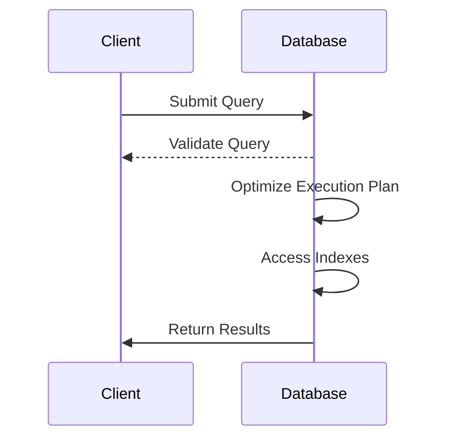

## Introduction

Database Query Optimization is crucial in ensuring that databases perform efficiently under high demand in cloud environments. As data volumes grow, the ability of an application to quickly and efficiently access and manipulate data determines its performance and user experience. Through the application of optimization principles, such as efficient query writing and strategic indexing, you can significantly enhance the responsiveness of your applications and reduce resource consumption.

## Design Pattern Classification

This pattern falls under the category of Performance Optimization within cloud architectures. It is a key consideration for applications relying heavily on data retrieval and manipulation, especially those deployed on distributed cloud platforms where latency and resource usage must be carefully managed.

## Related Patterns

- **Materialized View Pattern**: Precompute and cache results of complex queries.
- **CQRS (Command Query Responsibility Segregation) Pattern**: Separate read and write operations to optimize query performance.
- **Database Sharding Pattern**: Distribute data across multiple databases to enhance performance and scalability.

## Detailed Explanation

### Efficient Query Writing

Efficient query writing involves structuring SQL statements in a way that minimizes data retrieval time and optimizes execution paths. Key considerations include:

1. **Selective Data Retrieval**: Use the `SELECT` statement judiciously to only retrieve necessary columns instead of entire tables.
2. **Joins Optimization**: Choose appropriate join types and ensure join conditions are indexed.
3. **Avoiding Complex Conditions**: Break down complex conditions into simpler, indexed components.
4. **Utilizing Query Caching**: Utilize database caching mechanisms to store results of frequently run queries.

### Indexing Strategies

Indexes are used to quickly locate data without having to scan every row in a database table. Key strategies include:

1. **Single-Column Indexes**: Best for queries that filter or sort by a single field.
2. **Composite Indexes**: Ideal for queries that filter or sort on multiple fields.
3. **Index Maintenance**: Regularly analyze and reorganize indexes to maintain their performance.
4. **Use of Covering Indexes**: Ensure indexes include all columns used in SELECT, WHERE, and ORDER BY clauses to optimize query execution.

## Example Code

**SQL Efficient Query Example:**

```sql
SELECT name, age FROM customers 
WHERE age > 21 
AND EXISTS (
  SELECT 1 FROM orders WHERE orders.customer_id = customers.id
)
```

**Index Creation Example:**

```sql
CREATE INDEX idx_customers_age ON customers(age);
CREATE INDEX idx_orders_customer_id ON orders(customer_id);
```

## Diagrams

### Sequence Diagram



## Best Practices

- **Regular Index Analysis**: Use database-provided tools to analyze and adapt indexes for changing query patterns.
- **Monitor Query Performance**: Leverage cloud monitoring tools to identify slow queries and optimize them.
- **Apply Query Hints**: Use database-specific hints to guide the query optimizer in complex scenarios.
- **Partitioning Large Tables**: Consider partitioning options to enhance performance on large datasets.

## Additional Resources

- [Cloud Provider Documentation](https://cloudprovider.com)
- [SQL Optimization Tips](https://www.sqltips.com)
- [Indexing Best Practices Guide](https://www.indexingguide.com)

## Summary

Database Query Optimization is a critical pattern for enhancing application performance in cloud environments. By focusing on efficient query writing and strategic indexing, you can dramatically improve data retrieval times and system responsiveness. This pattern, when applied correctly, ensures your applications remain cost-effective and performant even under substantial load.
